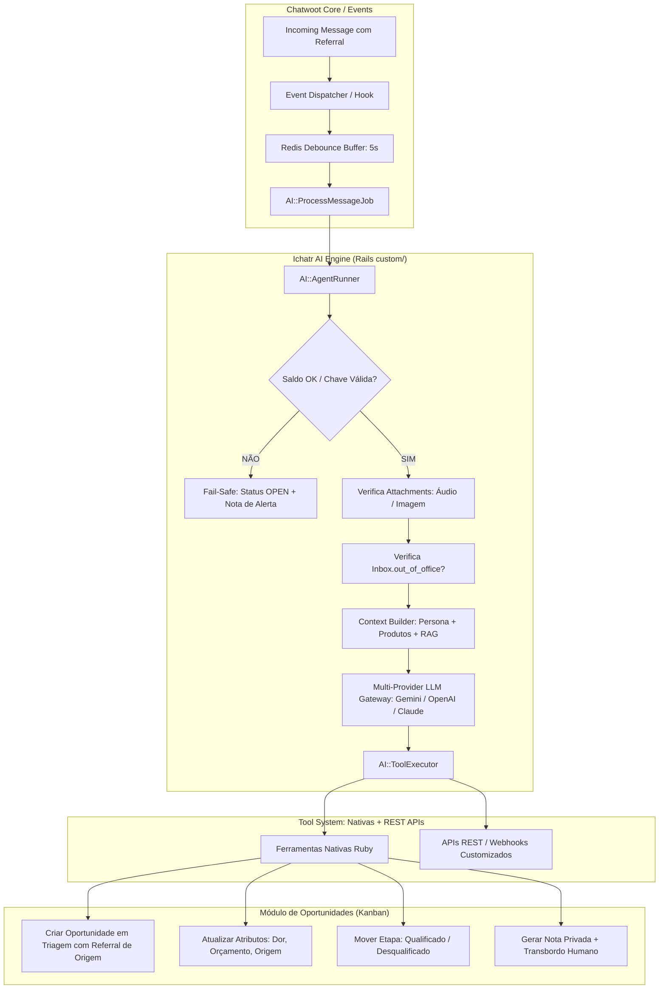

# Especificação Técnica: Motor de Agentes IA (Bot Comercial & Multiuso)

**Status**: Backlog / Especificação Consolidada  
**Data**: 2026-08-16  
**Contexto**: Implementação nativa de um motor de Inteligência Artificial / Agente autônomo para o Chatwoot, com suporte a múltiplos cenários, focado primariamente na qualificação comercial integrada ao funil de Oportunidades (Kanban), suporte a Tool Calling nativo, preservação de atribuição de anúncios (Meta CTWA / Referral), chamadas de APIs REST / Webhooks para máxima flexibilidade e convivência elegante com atendentes humanos.

---

## 1. Visão Geral e Propósito

O objetivo é criar uma alternativa nativa e robusta inspirada no conceito do Captain/Agentes do Chatwoot, porém:
1. **Focada no Funil Comercial**: Alinhamento direto com o módulo de Oportunidades (`Opportunity`, `Pipeline`, `PipelineStage`), capaz de realizar triagem de qualificação (dor, orçamento, autoridade, timing, interesse, origem de campanha) e avançar/desqualificar leads no Kanban.
2. **Preservação de Atribuição de Campanha & Anúncios (Meta CTWA / Referral)**: Garantia de que a origem do anúncio (criativo, thumbnail, headline, ID do anúncio) seja mantida intacta e vinculada à oportunidade no Kanban, mesmo após dezenas de mensagens trocadas com o bot.
3. **Não Limitada ao Comercial**: Arquitetura desacoplada e extensível para suportar múltiplos assistentes e cenários (suporte N1, triagem, agendamento de reuniões, onboarding).
4. **Orientada a Metas e Ferramentas (Goal-Driven + Tool Calling)**: Conversação fluida e natural, com capacidade de invocar ferramentas nativas em Ruby e APIs REST / Webhooks externas configuráveis de forma simples e rápida (com suporte futuro/opcional ao protocolo MCP).
5. **Interface Guiada ao Universo Comercial**: Telas de configuração direcionadas a produtos, serviços, tabelas de preços, base de conhecimento de vendas (site, landing pages, PDFs de propostas/catálogo) e tratamento de objeções.
6. **Human-in-the-Loop Elegante**: Transbordo suave com criação de Nota Privada estruturada (resumo da qualificação para o vendedor), pausa automática sob intervenção humana e controle manual por conversa.
7. **Mecanismos do Mundo Real**: Debounce no Redis (buffer de mensagens), suporte multimodal all-in-one (áudio e imagens com 1 única chave), respeito aos horários de atendimento e Fail-Safe imediato se o saldo/chave expirar.

---

## 2. Preservação de Atribuição Meta/WhatsApp (CTWA, Criativos e Campanhas)

Quando um lead entra via anúncio de WhatsApp (Click to WhatsApp - CTWA) ou post orgânico do Instagram/Facebook, a primeira mensagem recebida carrega o payload `referral` nos `content_attributes`.

```
Lead clica no Anúncio ──► Msg 1 com Referral (Criativo/Headline) ──► Bot assume a conversa
                                                                            │
                                    ┌───────────────────────────────────────┴──────────────────┐
                                    ▼                                                          ▼
                      (Triagem em 5-10 turnos)                                     (Oportunidade Criada/Movida)
                      Referral permanece imutável                                  Herda Criativo, Thumbnail
                      no histórico de mensagens                                    e Campanha da Msg 1
```

### 2.1. Requisitos de Atribuição Multi-Etapas:
1. **Persistência Imutável do Referral**:
   - Mensagens `incoming` preservam `content_attributes['referral']` no PostgreSQL indefinidamente.
   - O bot e as notas privadas apenas geram mensagens `outgoing` e `:activity`, garantindo que os metadados do lead nunca sejam corrompidos.
2. **Query Segura de Extração de Origem**:
   - Ao criar ou atualizar a `Opportunity` vinculada à conversa (`origin_conversation_id`), o serviço busca a mensagem original exata contendo o referral:
     ```ruby
     conversation.messages.incoming
                 .where("(content_attributes #>> '{}')::jsonb -> 'referral' IS NOT NULL")
                 .order(created_at: :asc)
                 .first || conversation.messages.incoming.order(created_at: :asc).first
     ```
   - O card da Oportunidade no Kanban exibe thumbnail do criativo, nome da campanha, headline e anúncio que gerou o lead.
3. **Herança Limpa de Responsável (Assignee)**:
   - Durante a triagem, a oportunidade permanece vinculada ao time comercial sem herdar o ID do bot como usuário comercial.
   - Ao executar o transbordo (`handoff`), o responsável é atribuído ao SDR/Vendedor humano definitivo.
4. **Disparo de Conversão Meta CAPI (Opcional)**:
   - Ao qualificar o lead com sucesso, o sistema pode enviar o evento de conversão Meta CAPI (ex: `LeadQualificado` ou `Contact`) usando o `ctwa_clid` da mensagem inicial.

---

## 3. Parecer de Licenciamento & Diretrizes de Conformidade (O que NÃO fazer)

### 3.1. Base Legal
- **Licença do Chatwoot Core (MIT Expat)**: Todo o código do Chatwoot fora da pasta `enterprise/` é licenciado sob a licença **MIT** (veja [`LICENSE`](file:///home/matias/dev/chatwoot/LICENSE)). A licença MIT garante total liberdade para modificar, criar novos recursos, comercializar e distribuir sem restrições.
- **Isolamento em `custom/`**: Todo o motor de IA e as ferramentas comerciais residem no diretório `custom/`, consumindo apenas interfaces e models abertos.

### 3.2. 🚫 Diretrizes Estritas: O que NÃO Fazer
1. **NÃO copiar código da pasta `enterprise/`**: Todo o motor de IA é escrito do zero de forma limpa na pasta `custom/`.
2. **NÃO tentar burlar verificações de licença da pasta `enterprise/`**: Não criar patches para burlar limites do Enterprise oficial da Chatwoot Cloud.
3. **NÃO remover avisos de Copyright**: Manter o cabeçalho original da Chatwoot Inc. nos arquivos base MIT.
4. **NÃO depender de servidores da Chatwoot Cloud**: Conexão direta e autônoma com os provedores de LLM via chaves próprias.

---

## 4. Gestão de Saldo, Ciclo de Status e Transbordo de Emergência (Fail-Safe)

### 4.1. Como o Capitão Oficial Trata Créditos (Mapeamento Upstream)
Conforme mapeado no código oficial do Chatwoot (`HookExecutionService`, `Inbox`, `PlanUsageAndLimits`):
- **Unidade de Medida**: Controlado por `captain_responses` (respostas geradas pelo bot) e `captain_documents` (limite de itens no RAG).
- **Validação em Tempo Real**: O Chatwoot verifica `inbox.captain_active?` (`account.usage_limits[:captain][:responses][:current_available].positive?`).
- **Ao esgotar o saldo (`current_available <= 0`)**: O Chatwoot dispara `perform_handoff`:
  1. Envia mensagem ao cliente: *"Transferring to another agent for further assistance."*
  2. Executa `conversation.bot_handoff!`, alterando o status de `pending` para **`open`** e abrindo a conversa na fila humana.
  3. Se fora do expediente, envia mensagem de ausência (`OutOfOffice`).

### 4.2. Nossa Abordagem de Fail-Safe Handoff (Ichatr Bot)
Garantimos que **nenhuma conversa jamais fique presa em `pending` ou seja perdida**:
1. **Detecção Imediata**: Se o saldo de respostas zerar ou a chave de API (BYOK) falhar (ex: erro 429 de cota/chave inválida).
2. **Abertura Imediata na Fila Humana**: Dispara `conversation.bot_handoff!`, alterando o status para **`open`** e acionando o alerta para os atendentes humanos.
3. **Nota Privada de Alerta (Amarela)**: Cria uma nota interna na conversa avisando a equipe comercial:
   > `⚠️ [IA Pausada]: A conversa foi transferida para atendimento humano devido a esgotamento de saldo/limite de API.`
4. **Preservação de Dados no Funil**: A Oportunidade criada na etapa de *Triagem* permanece salva no Kanban com todos os dados coletados até o momento.

---

## 5. Cruzamento com Upstream do Chatwoot & Soluções do Mundo Real

```
┌───────────────────────────────┬───────────────────────────────────┬───────────────────────────────────┐
│ Recurso do Mundo Real        │ O que o Chatwoot Upstream tem     │ Como nosso Motor se Conecta       │
├───────────────────────────────┼───────────────────────────────────┼───────────────────────────────────┤
│ 🛑 Debounce do WhatsApp       │ Sidekiq + Redis                   │ Enfileira Job com delay de 5s;    │
│    (Buffer de mensagens)      │                                   │ agrupa mensagens recebidas em lote│
│                               │                                   │ antes de chamar o LLM.            │
├───────────────────────────────┼───────────────────────────────────┼───────────────────────────────────┤
│ 🎙️ Áudios e Imagens           │ `Message#attachments`             │ Identifica `file_type: :audio` e  │
│    (Multimodalidade)          │ (`Attachment` + `ActiveStorage`)  │ `:image` e despacha para o gateway│
│                               │                                   │ multimodal com 1 única chave.     │
├───────────────────────────────┼───────────────────────────────────┼───────────────────────────────────┤
│ ⏰ Horário Comercial          │ Concern `OutOfOffisable`          │ Consulta `inbox.out_of_office?` e │
│    (Business Hours)           │ (`Inbox#working_hours_enabled?`)  │ instrui o prompt automaticamente. │
├───────────────────────────────┼───────────────────────────────────┼───────────────────────────────────┤
│ 🪃 Follow-up de Resgate       │ Jobs Agendados do Sidekiq         │ `FollowUpSchedulerJob` detecta    │
│    (Leads parados na triagem) │                                   │ oportunidades paradas e re-engaja.│
├───────────────────────────────┼───────────────────────────────────┼───────────────────────────────────┤
│ 🛡️ Fail-Safe sem Saldo        │ `conversation.bot_handoff!`       │ Força status para `open` e cria   │
│                               │                                   │ Nota Privada amarela de alerta.   │
├───────────────────────────────┼───────────────────────────────────┼───────────────────────────────────┤
│ 🧪 Playground de Teste        │ Padrão Vue 3 em `components-next` │ Endpoint `/playground` para simu- │
│                               │                                   │ lar e visualizar chamadas de tools│
└───────────────────────────────┴───────────────────────────────────┴───────────────────────────────────┘
```

---

## 6. Estratégia de Chaves & Modelo de Consumo (BYOK vs. Sistema)

Para evitar que o cliente final precise contratar múltiplos serviços separados (transcrição, visão, texto):

1. **Provedores All-in-One com 1 Única Chave**:
   - **Google Gemini (2.0 Flash / Pro)**: Processa texto, visão e áudio nativamente com custo baixíssimo.
   - **OpenAI (GPT-4o + Whisper)**: 1 chave resolve texto, imagens e áudio.
   - **OpenRouter**: Acesso a múltiplos modelos com 1 única conta.
2. **Modelo de Consumo**:
   - **Modo Padrão (BYOK - Bring Your Own Key)**: O cliente insere a chave na tela de configurações da conta. Sem custo ou risco para o operador.
   - **Modo Sistema (Managed / Opcional)**: Chave global no `.env` com contadores de telemetria (`tokens_consumed`, `messages_processed`) no Postgres.

---

## 7. Interface (UI) Especializada para o Universo Comercial

A interface do Assistente na Dashboard (Vue 3 + Tailwind) é projetada especificamente com os seguintes módulos:

### 7.1. Aba de Produtos, Serviços & Ofertas
- **Catálogo de Produtos/Planos**: Cadastro de itens comercializados, faixas de preços, planos recorrentes e regras de parcelamento.
- **Proposta de Valor e Diferenciais**: Resumo do "pitch" comercial para o bot usar nas argumentações de vendas.

### 7.2. Base de Conhecimento Comercial (RAG de Vendas)
- **Links de Sites & Landing Pages**: Crawling de URLs de páginas de vendas, cases de sucesso e páginas de produto.
- **Documentos & Catálogos (PDFs/Docs)**: Upload de manuais comerciais, catálogos técnicos, tabelas de preços e políticas de garantia.
- **FAQ Comercial & Tratamento de Objeções**: Perguntas e respostas focadas em objeções comuns (*"por que é mais caro que o concorrente X?"*, *"qual o prazo de entrega/implantação?"*).

### 7.3. Configuração do Funil & Critérios de Qualificação
- **Funil Vinculado**: Seleção do Pipeline de Vendas e da Etapa de Triagem inicial.
- **Campos de Qualificação Obrigatórios**: Seleção dos atributos a extrair (ex: Dor principal, Orçamento estimado, Prazo de decisão, Decisor final).
- **Regras de Descarte / Sucesso**: Para qual etapa mover quando qualificado vs. qual etapa mover quando sem fit (com motivo de perda).

---

## 8. Diagrama de Arquitetura



---

## 9. Modelagem de Dados Proposta

### 9.1. `Ai::Assistant` (`ichatr_ai_assistants`)
- `account_id` (integer, indexed)
- `name` (string): Ex: "SDR Qualificador Comercial"
- `description` (text)
- `system_prompt` (text): Instruções da persona, regras de qualificação.
- `provider` (string): `gemini`, `openai`, `anthropic`, `openrouter`, `ollama`
- `model_name` (string): `gemini-2.0-flash`, `gpt-4o-mini`, `claude-3-5-sonnet`, etc.
- `api_key_override` (string, encrypted): Suporte a BYOK por assistente/conta.
- `temperature` (float, default: 0.2)
- `pipeline_id` (bigint, optional): Funil comercial vinculado.
- `default_pipeline_stage_id` (bigint, optional): Etapa inicial de triagem.
- `qualified_stage_id` (bigint, optional): Etapa para onde mover lead qualificado.
- `unqualified_stage_id` (bigint, optional): Etapa de descarte (Perdido).
- `product_catalog` (jsonb): Catálogo de produtos, preços e ofertas.
- `knowledge_sources` (jsonb): URLs rastreadas, documentos e FAQs comerciais.
- `enabled_tools` (jsonb): Lista de ferramentas nativas e APIs ativas.
- `handover_team_id` (bigint, optional): Time padrão para transbordo.
- `debounce_delay_seconds` (integer, default: 5): Janela de buffer de mensagens.
- `follow_up_delay_hours` (integer, default: 24): Horas para disparo de re-engajamento.
- `auto_pause_on_human_message` (boolean, default: true)
- `active` (boolean, default: true)

### 9.2. `Ai::AssistantInbox` (`ichatr_ai_assistant_inboxes`)
- Tabela pivô associando `ai_assistant_id` com `inbox_id`.

### 9.3. `Ai::CustomApiTool` (`ichatr_ai_custom_api_tools`)
- `account_id` (integer)
- `name` (string): Ex: "Consultar Estoque / ERP"
- `description` (text): Descrição para o LLM saber quando chamar a ferramenta.
- `endpoint_url` (string): URL da API REST.
- `http_method` (string, default: `'POST'`): `GET`, `POST`, `PUT`.
- `auth_headers` (jsonb, encrypted): Headers HTTP de autenticação.
- `parameters_schema` (jsonb): Schema JSON dos parâmetros extraídos pelo LLM.
- `enabled` (boolean, default: true)

---

## 10. Catálogo de Ferramentas Nativas

1. `manage_opportunity(action, title, stage_id, estimated_value, custom_attributes)`:
   - Cria ou atualiza os campos comerciais da oportunidade no funil, preservando o `origin_conversation_id` e os metadados de anúncio/referral.
2. `move_opportunity_stage(stage_id, lost_reason)`:
   - Move o card no Kanban e preenche motivo de descarte caso movido para perdido.
3. `update_contact(name, email, phone, custom_attributes)`:
   - Atualiza o perfil do contato.
4. `create_private_note(content)`:
   - Registra a nota interna amarela com a síntese de qualificação comercial para o vendedor.
5. `handover_to_human(assignee_id, team_id, reason)`:
   - Pausa a IA e transfere a conversa para o time ou atendente.
6. `call_custom_api(tool_id, payload)`:
   - Despacha chamada HTTP REST para qualquer serviço ou webhook externo configurado.

---

## 11. Roadmap de Implementação

- [ ] **Fase 1**: Backend Core, Migrations sob `custom/` & LLM Gateway All-in-One com Tool Calling (Gemini, OpenAI, Claude, Ollama).
- [ ] **Fase 2**: Debounce no Redis (`ProcessMessageJob`), suporte a áudio/visão, Business Hours e Fail-Safe Handoff.
- [ ] **Fase 3**: Implementação das Ferramentas Nativas Ruby para Oportunidades (`Opportunity`) com garantia de Atribuição Meta/Referral, Contatos e Notas Privadas.
- [ ] **Fase 4**: Executor de Ferramentas Externas REST / Webhooks.
- [ ] **Fase 5**: Interface Web (Vue 3 + Tailwind) para gestão de Assistentes, catálogo de produtos/ofertas, RAG comercial, configuração do Funil e Playground de teste.
- [ ] **Fase 6**: Componentes de UI na Conversa (Badge de Status da IA, botão Pausar/Retomar e link para o card no Kanban).
- [ ] **Fase 7**: Job de Follow-up / Re-engajamento, telemetria de tokens e testes ponta a ponta.
