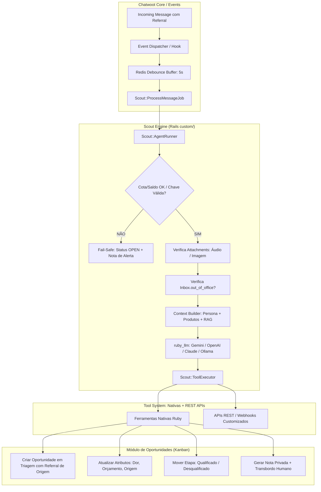

# Especificação Técnica: Scout — Motor de Agentes IA (Qualificação Comercial & Multiuso)

**Status**: Backlog / Especificação Consolidada — **revisada** contra o código real do fork  
**Data**: 2026-08-16 (revisão técnica em 2026-08-17)  
**Contexto**: Implementação nativa de um motor de Inteligência Artificial / Agente autônomo para o Chatwoot, batizado **Scout** ("o batedor que vai na frente qualificando os potenciais clientes"), com suporte a múltiplos cenários, focado primariamente na qualificação comercial integrada ao funil de Oportunidades (Kanban), suporte a Tool Calling nativo, preservação de atribuição de anúncios (Meta CTWA / Referral), chamadas de APIs REST / Webhooks para máxima flexibilidade e convivência elegante com atendentes humanos.

> **Nota de revisão**: este documento foi confrontado linha a linha com o código atual do fork. Pontos corrigidos ou reavaliados estão marcados com `> ⚠️ Revisão:`. A premissa de arquitetura que rege todas as correções é **minimizar a superfície de acoplamento com o upstream** — o fork não pode se desacoplar 100%, mas cada decisão de design deve reduzir os pontos de contato com `enterprise/` e evitar modificar arquivos core quando uma extensão em `custom/` resolve o mesmo problema.

---

## 1. Visão Geral e Propósito

O objetivo é criar uma alternativa nativa e robusta inspirada no conceito do Captain/Agentes do Chatwoot, porém:
1. **Focada no Funil Comercial**: Alinhamento direto com o módulo de Oportunidades (`Opportunity`, `PipelineStage` — não existe model `Pipeline` separado neste fork, o funil é modelado apenas pelas etapas posicionais de `PipelineStage`), capaz de realizar triagem de qualificação (dor, orçamento, autoridade, timing, interesse, origem de campanha) e avançar/desqualificar leads no Kanban.
2. **Preservação de Atribuição de Campanha & Anúncios (Meta CTWA / Referral)**: Garantia de que a origem do anúncio (criativo, thumbnail, headline, ID do anúncio) seja mantida intacta e vinculada à oportunidade no Kanban, mesmo após dezenas de mensagens trocadas com o bot.
3. **Não Limitada ao Comercial**: Arquitetura desacoplada e extensível para suportar múltiplos assistentes e cenários (suporte N1, triagem, agendamento de reuniões, onboarding).
4. **Orientada a Metas e Ferramentas (Goal-Driven + Tool Calling)**: Conversação fluida e natural, com capacidade de invocar ferramentas nativas em Ruby e APIs REST / Webhooks externas configuráveis de forma simples e rápida (com suporte futuro/opcional ao protocolo MCP).
5. **Interface Guiada ao Universo Comercial**: Telas de configuração direcionadas a produtos, serviços, tabelas de preços, base de conhecimento de vendas (site, landing pages, PDFs de propostas/catálogo) e tratamento de objeções.
6. **Human-in-the-Loop Elegante**: Transbordo suave com criação de Nota Privada estruturada (resumo da qualificação para o vendedor), pausa automática sob intervenção humana e controle manual por conversa.
7. **Mecanismos do Mundo Real**: Debounce no Redis (buffer de mensagens), suporte multimodal all-in-one (áudio e imagens com 1 única chave), respeito aos horários de atendimento e Fail-Safe imediato se o saldo/chave expirar.

---

## 2. Preservação de Atribuição Meta/WhatsApp (CTWA, Criativos e Campanhas)

> ⚠️ **Revisão**: esta seção descreve um pipeline que **já está implementado e em produção** neste fork — `Custom::ReferralAttributionService` (`custom/app/services/custom/referral_attribution_service.rb`) e `Custom::AutomationRules::ActionService#find_referral_message` / `#create_opportunity` (`custom/app/services/custom/automation_rules/action_service.rb:10-42`) já extraem plataforma, `campaign_source_id`, `ad_id`, headline, body e thumbnail do referral, distinguem tráfego orgânico de pago (`organic_referral?`) e persistem tudo na `Opportunity`, com idempotência por `origin_conversation_id`. **O Scout não deve reimplementar esta lógica.** A ferramenta nativa `manage_opportunity` (seção 10) deve chamar esses serviços existentes, não recriar a query SQL abaixo.

Quando um lead entra via anúncio de WhatsApp (Click to WhatsApp - CTWA) ou post orgânico do Instagram/Facebook, a primeira mensagem recebida carrega o payload `referral` nos `content_attributes`.

```
Lead clica no Anúncio ──► Msg 1 com Referral (Criativo/Headline) ──► Bot assume a conversa
                                                                            │
                                    ┌───────────────────────────────────────┴──────────────────┐
                                    ▼                                                          ▼
                      (Triagem em 5-10 turnos)                                     (Oportunidade Criada/Movida)
                      Referral permanece imutável                                  Herda Criativo, Thumbnail
                      no histórico de mensagens                                    e Campanha da Msg 1
```

### 2.1. Requisitos de Atribuição Multi-Etapas:
1. **Persistência Imutável do Referral**:
   - Mensagens `incoming` preservam `content_attributes['referral']` no PostgreSQL indefinidamente.
   - O bot e as notas privadas apenas geram mensagens `outgoing` e `:activity`, garantindo que os metadados do lead nunca sejam corrompidos.
2. **Query Segura de Extração de Origem**:
   - Ao criar ou atualizar a `Opportunity` vinculada à conversa (`origin_conversation_id`), o serviço busca a mensagem original exata contendo o referral:
     ```ruby
     conversation.messages.incoming
                 .where("(content_attributes #>> '{}')::jsonb -> 'referral' IS NOT NULL")
                 .order(created_at: :asc)
                 .first || conversation.messages.incoming.order(created_at: :asc).first
     ```
   - O card da Oportunidade no Kanban exibe thumbnail do criativo, nome da campanha, headline e anúncio que gerou o lead.
3. **Herança Limpa de Responsável (Assignee)**:
   - Durante a triagem, a oportunidade permanece vinculada ao time comercial sem herdar o ID do bot como usuário comercial.
   - Ao executar o transbordo (`handoff`), o responsável é atribuído ao SDR/Vendedor humano definitivo.
4. **Disparo de Conversão Meta CAPI (Opcional)**:
   - Ao qualificar o lead com sucesso, o sistema pode enviar o evento de conversão Meta CAPI (ex: `LeadQualificado` ou `Contact`) usando o `ctwa_clid` da mensagem inicial.

---

## 3. Parecer de Licenciamento & Diretrizes de Conformidade (O que NÃO fazer)

### 3.1. Base Legal
- **Licença do Chatwoot Core (MIT Expat)**: Todo o código do Chatwoot fora da pasta `enterprise/` é licenciado sob a licença **MIT** (veja [`LICENSE`](file:///home/matias/dev/chatwoot/LICENSE)). A licença MIT garante total liberdade para modificar, criar novos recursos, comercializar e distribuir sem restrições.
- **Isolamento em `custom/`**: Todo o motor de IA e as ferramentas comerciais residem no diretório `custom/`, consumindo apenas interfaces e models abertos.

> ⚠️ **Revisão — Minimização de acoplamento com upstream**: além de não copiar código de `enterprise/`, o Scout deve minimizar a superfície de contato com o core sempre que uma alternativa em `custom/` resolver o mesmo problema, mesmo sabendo que o desacoplamento total não é possível:
> - **Não adicionar colunas em tabelas core** (`inboxes`, `conversations`, `accounts`) para necessidades do Scout — usar tabelas próprias (`ichatr_scouts`, `ichatr_scout_inboxes`) com FKs para as tabelas core, como já é o padrão de `Opportunity`/`PipelineStage`.
> - **Consumir apenas interfaces públicas e estáveis do core**, como `conversation.bot_handoff!` (`app/models/conversation.rb:175-180`, método genérico e não específico do Captain) e o dispatcher de eventos — nunca herdar de/depender de classes de `enterprise/` (`HookExecutionService`, `Llm::BaseAiService`, `Captain::Tools::*`), que são referência de leitura, não base de código.
> - **Preferir dependências já vendorizadas e públicas** (ex: gem `ruby_llm`, ver seção 6) a reimplementar integrações que o core/Gemfile já resolve.
> - Isso reduz o risco de quebra em cada sync com o upstream (`git merge --no-ff <tag>`) e mantém o Scout auditável/removível de forma isolada.

### 3.2. 🚫 Diretrizes Estritas: O que NÃO Fazer
1. **NÃO copiar código da pasta `enterprise/`**: Todo o motor de IA é escrito do zero de forma limpa na pasta `custom/`.
2. **NÃO tentar burlar verificações de licença da pasta `enterprise/`**: Não criar patches para burlar limites do Enterprise oficial da Chatwoot Cloud.
3. **NÃO remover avisos de Copyright**: Manter o cabeçalho original da Chatwoot Inc. nos arquivos base MIT.
4. **NÃO depender de servidores da Chatwoot Cloud**: Conexão direta e autônoma com os provedores de LLM via chaves próprias.

---

## 4. Gestão de Saldo, Ciclo de Status e Transbordo de Emergência (Fail-Safe)

### 4.1. Como o Capitão Oficial Trata Créditos (Mapeamento Upstream)
Conforme mapeado no código oficial do Chatwoot (`HookExecutionService`, `Inbox`, `PlanUsageAndLimits`):
- **Unidade de Medida**: Controlado por `captain_responses` (respostas geradas pelo bot) e `captain_documents` (limite de itens no RAG).
- **Validação em Tempo Real**: O Chatwoot verifica `inbox.captain_active?` (`account.usage_limits[:captain][:responses][:current_available].positive?`).
- **Ao esgotar o saldo (`current_available <= 0`)**: O Chatwoot dispara `perform_handoff` (`enterprise/app/services/enterprise/message_templates/hook_execution_service.rb:56-68`):
  1. Envia mensagem ao cliente: *"Transferring to another agent for further assistance."*
  2. Executa `conversation.bot_handoff!`, abrindo a conversa na fila humana.
  3. Se fora do expediente, envia mensagem de ausência (`OutOfOffice`).

> ⚠️ **Revisão**: `bot_handoff!` (`app/models/conversation.rb:175-180`) é um método **genérico do core**, sem guarda de status `pending` embutida — ele apenas seta `waiting_since` se vazio, limpa `assignee_agent_bot`, chama `open!` e dispara o evento `CONVERSATION_BOT_HANDOFF`. A checagem de `conversation.pending?` acontece em `perform_handoff` (código Enterprise), antes de chamar o método. O Scout deve replicar essa checagem no seu próprio fluxo (seção 4.2), não assumir que `bot_handoff!` a faz.

### 4.2. Nossa Abordagem de Fail-Safe Handoff (Ichatr Bot)
Garantimos que **nenhuma conversa jamais fique presa em `pending` ou seja perdida**:
1. **Detecção Imediata**: Se o saldo de respostas zerar ou a chave de API (BYOK) falhar (ex: erro 429 de cota/chave inválida).
2. **Abertura Imediata na Fila Humana**: Dispara `conversation.bot_handoff!`, alterando o status para **`open`** e acionando o alerta para os atendentes humanos.
3. **Nota Privada de Alerta (Amarela)**: Cria uma nota interna na conversa avisando a equipe comercial:
   > `⚠️ [IA Pausada]: A conversa foi transferida para atendimento humano devido a esgotamento de saldo/limite de API.`
4. **Preservação de Dados no Funil**: A Oportunidade criada na etapa de *Triagem* permanece salva no Kanban com todos os dados coletados até o momento.

---

## 5. Cruzamento com Upstream do Chatwoot & Soluções do Mundo Real

```
┌───────────────────────────────┬───────────────────────────────────┬───────────────────────────────────┐
│ Recurso do Mundo Real        │ O que o Chatwoot Upstream tem     │ Como nosso Motor se Conecta       │
├───────────────────────────────┼───────────────────────────────────┼───────────────────────────────────┤
│ 🛑 Debounce do WhatsApp       │ Sidekiq + Redis                   │ Enfileira Job com delay de 5s;    │
│    (Buffer de mensagens)      │                                   │ agrupa mensagens recebidas em lote│
│                               │                                   │ antes de chamar o LLM.            │
├───────────────────────────────┼───────────────────────────────────┼───────────────────────────────────┤
│ 🎙️ Áudios e Imagens           │ `Message#attachments`             │ Identifica `file_type: :audio` e  │
│    (Multimodalidade)          │ (`Attachment` + `ActiveStorage`)  │ `:image` e despacha para o gateway│
│                               │                                   │ multimodal com 1 única chave.     │
├───────────────────────────────┼───────────────────────────────────┼───────────────────────────────────┤
│ ⏰ Horário Comercial          │ Concern `OutOfOffisable`          │ Consulta `inbox.out_of_office?` e │
│    (Business Hours)           │ (`Inbox#working_hours_enabled?`)  │ instrui o prompt automaticamente. │
├───────────────────────────────┼───────────────────────────────────┼───────────────────────────────────┤
│ 🪃 Follow-up de Resgate       │ Sidekiq (infra genérica de jobs   │ Novo job `Scout::FollowUpJob`     │
│    (Leads parados na triagem) │ agendados, sem job pronto p/ isso)│ (a criar do zero) detecta         │
│                               │                                   │ oportunidades paradas e re-engaja.│
├───────────────────────────────┼───────────────────────────────────┼───────────────────────────────────┤
│ 🛡️ Fail-Safe sem Saldo        │ `conversation.bot_handoff!`       │ Força status para `open` e cria   │
│                               │                                   │ Nota Privada amarela de alerta.   │
├───────────────────────────────┼───────────────────────────────────┼───────────────────────────────────┤
│ 🧪 Playground de Teste        │ Padrão Vue 3 em `components-next` │ Endpoint `/playground` para simu- │
│                               │                                   │ lar e visualizar chamadas de tools│
└───────────────────────────────┴───────────────────────────────────┴───────────────────────────────────┘
```

---

## 6. Estratégia de Chaves & Modelo de Consumo (BYOK vs. Sistema)

> ⚠️ **Revisão — Gateway LLM**: o `Gemfile` já declara `gem 'ruby_llm', '>= 1.14.1'` (resolvido em `1.15.0`, `Gemfile.lock:855`) e `ruby_llm-schema`, uma gem **pública/MIT multi-provider** (OpenAI, Anthropic, Gemini, Ollama, OpenRouter) com tool-calling nativo e suporte a anexos multimodais já unificado. **Isso elimina a necessidade de construir um "LLM Gateway All-in-One" do zero** (como planejado originalmente na Fase 1 do roadmap, seção 11) — o Scout deve consumir `ruby_llm` diretamente para chamadas de provedor, e reservar código próprio apenas para orquestração (Context Builder, Tool Executor, debounce, fail-safe), que é onde está o valor real deste motor. Isso também reduz a superfície de acoplamento com o upstream: menos código próprio para manter, mais uma dependência pública já auditada pelo ecossistema Rails.

Para evitar que o cliente final precise contratar múltiplos serviços separados (transcrição, visão, texto):

1. **Provedores All-in-One com 1 Única Chave**:
   - **Google Gemini (2.0 Flash / Pro)**: Processa texto, visão e áudio nativamente com custo baixíssimo.
   - **OpenAI (GPT-4o + Whisper)**: 1 chave resolve texto, imagens e áudio.
   - **OpenRouter**: Acesso a múltiplos modelos com 1 única conta.
2. **Modelo de Consumo**:
   - **Modo Padrão (BYOK - Bring Your Own Key)**: O cliente insere a chave na tela de configurações da conta. Sem custo ou risco para o operador.
   - **Modo Sistema (Managed / Opcional)**: Chave global no `.env` com contadores de telemetria (`tokens_consumed`, `messages_processed`) no Postgres.

---

## 7. Interface (UI) Especializada para o Universo Comercial

A interface do Assistente na Dashboard (Vue 3 + Tailwind) é projetada especificamente com os seguintes módulos:

### 7.1. Aba de Produtos, Serviços & Ofertas
- **Catálogo de Produtos/Planos**: Cadastro de itens comercializados, faixas de preços, planos recorrentes e regras de parcelamento.
- **Proposta de Valor e Diferenciais**: Resumo do "pitch" comercial para o bot usar nas argumentações de vendas.

### 7.2. Base de Conhecimento Comercial (RAG de Vendas)
- **Links de Sites & Landing Pages**: Crawling de URLs de páginas de vendas, cases de sucesso e páginas de produto.
- **Documentos & Catálogos (PDFs/Docs)**: Upload de manuais comerciais, catálogos técnicos, tabelas de preços e políticas de garantia.
- **FAQ Comercial & Tratamento de Objeções**: Perguntas e respostas focadas em objeções comuns (*"por que é mais caro que o concorrente X?"*, *"qual o prazo de entrega/implantação?"*).

### 7.3. Configuração do Funil & Critérios de Qualificação
- **Etapas Vinculadas**: Seleção da Etapa de Triagem inicial, Etapa de Qualificado e Etapa de Descarte (não há seleção de "Pipeline" separado — este fork modela o funil apenas via `PipelineStage`).
- **Campos de Qualificação Obrigatórios**: Seleção dos atributos a extrair (ex: Dor principal, Orçamento estimado, Prazo de decisão, Decisor final).
- **Regras de Descarte / Sucesso**: Para qual etapa mover quando qualificado vs. qual etapa mover quando sem fit (com motivo de perda).

---

## 8. Diagrama de Arquitetura



---

## 9. Modelagem de Dados Proposta

> ⚠️ **Revisão**: namespace `Ai::` trocado por classes flat (`Scout`, `ScoutInbox`, `ScoutTool`), alinhado à branding do produto e à convenção já usada por `Opportunity`/`PipelineStage` (sem módulo aninhado). `pipeline_id` removido — **não existe model `Pipeline`** neste fork; o funil é modelado apenas por `PipelineStage` (posicional, sem conceito de "funil" separado) e `Opportunity.status` (`open/won/lost`). Campos de cota/crédito adicionados (ver seção 4.3, nova). Migrations seguem o padrão do fork: timestamp `21260...`, tabelas prefixadas `ichatr_`.

### 9.1. `Scout` (`ichatr_scouts`)
- `account_id` (integer, indexed)
- `name` (string): Ex: "SDR Qualificador Comercial"
- `description` (text)
- `system_prompt` (text): Instruções da persona, regras de qualificação.
- `provider` (string): `gemini`, `openai`, `anthropic`, `openrouter`, `ollama`
- `model_name` (string): `gemini-2.0-flash`, `gpt-4o-mini`, `claude-3-5-sonnet`, etc.
- `api_key_override` (string, **`encrypts`, obrigatório** — ver seção 4.3): Suporte a BYOK por assistente/conta.
- `temperature` (float, default: 0.2)
- `default_pipeline_stage_id` (bigint, optional): Etapa inicial de triagem.
- `qualified_stage_id` (bigint, optional): Etapa para onde mover lead qualificado.
- `unqualified_stage_id` (bigint, optional): Etapa de descarte (Perdido).
- `product_catalog` (jsonb): Catálogo de produtos, preços e ofertas.
- `knowledge_sources` (jsonb): URLs rastreadas, documentos e FAQs comerciais.
- `enabled_tools` (jsonb): Lista de ferramentas nativas e APIs ativas.
- `handover_team_id` (bigint, optional): Time padrão para transbordo.
- `debounce_delay_seconds` (integer, default: 5): Janela de buffer de mensagens.
- `follow_up_delay_hours` (integer, default: 24): Horas para disparo de re-engajamento.
- `auto_pause_on_human_message` (boolean, default: true)
- `active` (boolean, default: true)
- `responses_quota` (integer, default: `-1`): Cota de respostas geradas. `-1` = ilimitado (override para testes/planos sem billing). Ver seção 4.3.
- `responses_consumed` (integer, default: `0`): Contador incremental de respostas geradas pelo Scout.
- `feature_memory` (boolean, default: `true`): Espelha `assistant.config['feature_memory']` do
  Captain (`enterprise/app/listeners/captain_listener.rb`) — quando ativo, gera notas de contato ao
  final de uma qualificação/handoff, reaproveitando o mesmo mecanismo de memória do Captain
  (`Captain::Llm::ContactNotesService` → `contact.notes` → `LlmFormatter::ContactLlmFormatter`).
  Ver Fase 02.

### 9.2. `ScoutInbox` (`ichatr_scout_inboxes`)
- Tabela pivô associando `scout_id` com `inbox_id`. Evita adicionar coluna em `inboxes` (core) — ver princípio de minimização de acoplamento, seção 3.2.

### 9.3. `ScoutTool` (`ichatr_scout_tools`)
- `account_id` (integer)
- `name` (string): Ex: "Consultar Estoque / ERP"
- `description` (text): Descrição para o LLM saber quando chamar a ferramenta.
- `endpoint_url` (string): URL da API REST.
- `http_method` (string, default: `'POST'`): `GET`, `POST`, `PUT`.
- `auth_headers` (jsonb, **`encrypts`, obrigatório** — ver seção 4.3): Headers HTTP de autenticação.
- `parameters_schema` (jsonb): Schema JSON dos parâmetros extraídos pelo LLM.
- `enabled` (boolean, default: true)
- `response_template` (text, opcional, Liquid — Fase 13): quando preenchido, molda o corpo da resposta antes de chegar à LLM (`{{ r.campo }}`); vazio preserva o comportamento atual (JSON parseado ou corpo cru).

### 9.4. Migration adicional em `Opportunity` (core do Kanban, tabela custom já existente)
- `lost_reason` (string, optional): necessário para a ferramenta nativa `move_opportunity_stage` (seção 10) registrar o motivo de descarte. Não existe hoje em `custom/app/models/opportunity.rb` — nova migration `ichatr_` sob `custom/`, sem tocar em tabelas core.

## 4.3. Cota de Respostas (Groundwork para Billing Futuro)

> Estrutura rudimentar e deliberadamente simples — **sem validação de assinatura/cobrança nesta fase**. O objetivo é ter o campo de dados e o ponto de checagem prontos para quando uma fase de billing for introduzida, sem bloquear o lançamento do Scout.

- `Scout#quota_available?` — `responses_quota == -1 || responses_consumed < responses_quota`.
- Checado no `BalanceCheck` do fluxo Fail-Safe (seção 4.2, diagrama seção 8) junto com a validação de chave de API.
- `responses_consumed` incrementado a cada resposta gerada pelo `Scout::AgentRunner` (uma unidade por turno de resposta do LLM, análogo a `captain_responses` do Captain oficial — ver seção 4.1).
- `-1` é o valor usado para desbloquear cota ilimitada em ambientes de teste/desenvolvimento e para contas sem controle de billing ativo.
- Fase futura de billing (fora de escopo aqui) consome os mesmos campos: validação de plano/assinatura passa a decidir o valor de `responses_quota`, sem mudança de schema.

---

## 10. Catálogo de Ferramentas Nativas

1. `manage_opportunity(action, title, stage_id, estimated_value, custom_attributes)`:
   - Cria ou atualiza os campos comerciais da oportunidade no funil, preservando o `origin_conversation_id` e os metadados de anúncio/referral.
2. `move_opportunity_stage(stage_id, lost_reason)`:
   - Move o card no Kanban e preenche motivo de descarte caso movido para perdido.
3. `update_contact(name, email, phone, custom_attributes)`:
   - Atualiza o perfil do contato.
4. `create_private_note(content)`:
   - Registra a nota interna amarela com a síntese de qualificação comercial para o vendedor.
5. `handover_to_human(assignee_id, team_id, reason)`:
   - Pausa a IA e transfere a conversa para o time ou atendente.
6. `call_custom_api(tool_id, payload)`:
   - Despacha chamada HTTP REST para qualquer serviço ou webhook externo configurado.

---

## 11. Roadmap de Implementação

> ⚠️ **Revisão**: fases reordenadas e escopo ajustado após a revisão técnica desta seção. A Fase 1 não inclui mais um "LLM Gateway All-in-One" (a gem `ruby_llm` já resolve isso — seção 6), e uma nova Fase 3 de Hardening de Produção foi inserida antes de qualquer fase que grave campos criptografados (`api_key_override`, `auth_headers`) em produção, por depender do item de backlog [`11-production-secrets-encryption-hardening`](../11-production-secrets-encryption-hardening/spec61.md) (chaves de `ActiveRecord::Encryption` ausentes no Swarm de produção).

- [ ] **[Fase 1 — Core & Modelo de Dados](01-core-and-data-model/spec62.md)**: Migrations sob `custom/` (`Scout`, `ScoutInbox`, `ScoutTool`, `lost_reason` em `Opportunity`), integração com `ruby_llm` para chamadas multi-provider e tool-calling (Gemini, OpenAI, Claude, Ollama), campos de cota (`responses_quota`/`responses_consumed`, seção 4.3).
- [ ] **[Fase 2 — Ferramentas Nativas & Pipeline](02-native-tools-and-pipeline/spec63.md)**: Implementação das ferramentas Ruby para Oportunidades (`manage_opportunity`, `move_opportunity_stage`, `update_contact`, `create_private_note`, `handover_to_human`), reutilizando `Custom::ReferralAttributionService` para atribuição Meta/Referral (seção 2) e o Fail-Safe Handoff (seção 4.2/4.3).
- [ ] **[Fase 3 — Hardening de Produção](03-production-hardening/spec64.md)** *(bloqueante para dados sensíveis)*: Resolver `ActiveRecord::Encryption` em produção (Docker Swarm secrets ou `environment:`) antes de habilitar `api_key_override`/`auth_headers` em ambiente real — depende do backlog [`11-production-secrets-encryption-hardening`](../11-production-secrets-encryption-hardening/spec61.md).
- [ ] **[Fase 4 — Tool REST/Webhook Externa](04-external-rest-webhook-tool/spec65.md)**: Executor de Ferramentas Externas REST / Webhooks (`call_custom_api`, `ScoutTool`).
- [ ] **[Fase 5 — UI Comercial](05-commercial-ui/spec66.md)**: Interface Web (Vue 3 + Tailwind) para gestão de Scouts, catálogo de produtos/ofertas, RAG comercial, configuração do Funil e Playground de teste.
- [ ] **[Fase 6 — Configuração de LLM em Nível de Conta](06-account-llm-config/spec70.md)**: Substitui o BYOK por Scout (`Scout#provider`/`model_name`/`api_key_override`) por uma configuração única em nível de conta (`ScoutAccountConfig`), compartilhada por todos os Scouts — uma conta usa um único provedor (Gemini/OpenAI/Anthropic). Move a tela de configuração para fora do módulo Settings, para um submenu dedicado em Scout ("Configurações").
- [ ] **[Fase 7 — Busca Vetorial na Base de Conhecimento (RAG)](07-rag-knowledge-search/spec67.md)**: Refatora a injeção cega de conteúdo (`AgentRunner#build_knowledge_instructions`) por recuperação sob demanda via embeddings — reaproveita o pipeline de extração já existente (`ScoutKnowledgeSource`/`ProcessJob`, Fase 1), inspirado na solução do Captain (`pgvector`/`neighbor`, já presentes no `Gemfile` base). Lê provedor/modelo/chave da `ScoutAccountConfig` da Fase 6; contas com provedor Anthropic não têm a ferramenta de busca registrada (sem suporte a embeddings).
- [ ] **[Fase 8 — Arquitetura de Guardrails do System Prompt](08-system-prompt-guardrails/spec71.md)**: Camada fixa de guardrails do system prompt do Scout (escopo, anti-alucinação, anti-falsa-promessa, fallback de handoff, saída JSON estruturada), inspirada na arquitetura do Captain (`Captain::Llm::SystemPromptsService#assistant_response_generator`, `Captain::Llm::AssistantChatService`), aditiva às instruções configuráveis pelo operador em `Scout#system_prompt`. Estabelece o ponto único de interceptação da resposta final (`AgentRunner#process_response`) necessário para a Fase 12.
- [ ] **[Fase 9 — Inteligência de Funil: Estágios & Campos de Qualificação](09-required-qualification-attributes/spec74.md)**: Injeção dos estágios configurados do Funil (qualificado/desqualificado), dos campos obrigatórios por estágio (`PipelineStageRequiredField`) e dos campos globais de qualificação do Scout (`ScoutRequiredField`) no system prompt, com enforcement centralizado em `Custom::Scout::OpportunityStageTransitionService` (usado por `move_opportunity_stage` e `manage_opportunity`) e handoff automático ao atingir o estágio qualificado.
- [ ] **[Fase 10 — Handoff Automático em Intervenção Humana](10-in-conversation-ui/spec68.md)**:
  quando um humano responde publicamente numa conversa `pending` de uma inbox com Scout, a conversa
  é reaberta de forma síncrona (mesmo mecanismo do Captain,
  `Message#mark_pending_conversation_as_open_for_human_response`), evitando resposta colidente do
  Scout. Sem nenhum elemento visual — ver Fase 15.
  > ⚠️ **Revisão**: escopo reduzido em duas passadas de brainstorming. Primeira: o botão manual de
  > Pausar/Retomar e o campo `auto_pause_on_human_message` (seção 9.1, nunca implementado) foram
  > cortados, substituídos pelo mecanismo do Captain. Segunda: todo o escopo visual (badge de
  > status, link para o Kanban) foi movido para a Fase 15, para destravar o teste do MVP sem
  > bloquear em decisões de UI. Ver nota de revisão em `10-in-conversation-ui/spec68.md`.
- [ ] **[Fase 11 — Follow-up, Telemetria & E2E](11-follow-up-telemetry-e2e/spec69.md)**: Job de Follow-up / Re-engajamento (`Scout::FollowUpJob`, a criar do zero — seção 5), telemetria de tokens/cota e testes ponta a ponta.
- [ ] **[Fase 12 — Auditor de Resposta (pós-v1)](12-response-auditor/spec-preview.md)** *(condicional a métricas do v1)*: Segunda chamada de LLM que audita a resposta final antes da persistência (classificador de ação e/ou detector de falsa-promessa), inspirada em `Captain::Conversation::V1ActionClassifier`/`V1FalsePromiseHandler`. Só entra em implementação se a telemetria da Fase 11 mostrar handoffs perdidos ou promessas futuras não cumpridas no v1; depende do ponto único de interceptação da resposta final estabelecido na Fase 8 (ver nota nesse spec).
- [ ] **[Fase 13 — Teste de Requisição & Formato de Saída das Ferramentas Externas](13-tool-testing-and-response-shaping/spec73.md)**: Botão de teste de requisição (com payload de exemplo) na configuração de `ScoutTool`, suporte a path params (`{{param}}` na URL, Liquid estrito) e querystring automática para `GET` (corrige descarte silencioso do payload em GET), e `response_template` (Liquid) para moldar o corpo da resposta antes de chegar à LLM — inspirado em `Captain::CustomTool`/`Toolable`. Depende da Fase 4.
- [ ] **[Fase 14 — Detecção de Continuidade de Oportunidade](14-opportunity-continuity-detection/spec75.md)** *(problema registrado durante a Fase 10; especificação completa após brainstorming dedicado — sem precedente no Captain, que não tem noção de Oportunidade/Kanban)*: busca de Oportunidades abertas escopada por contato (`contact_id` + `status: open`), exposta como contexto estruturado no system prompt ao lado da memória de contato já existente (`contact.notes`); `manage_opportunity` passa a exigir declaração explícita de `opportunity_id` quando há candidatos, validada deterministicamente no backend; sem declaração válida, não decide sozinho — registra nota privada e deixa para revisão humana. Preview original (problema + exemplos) em `14-opportunity-continuity-detection/spec-preview.md`. **Implementada**; ajuste pontual aplicado depois (`manage_opportunity#update_opportunity` agora chama `opp.attach_conversation!(conversation)` no caso `:reuse`, para que a conversa de continuidade fique corretamente vinculada via `OpportunityConversation`).
- [ ] **[Fase 15 — Indicadores Visuais do Scout (preview)](15-scout-visibility-indicators/spec-preview.md)** *(escopo visual da Fase 10 movido pra cá, sem especificação completa ainda)*: badge de status na conversa, indicador/link para a Oportunidade associada (reavaliando a seção "Oportunidades" já existente no painel de contato — recolhida por padrão, sem navegação direta pro Kanban), e uma ideia nova ainda não desenvolvida — indicador comparando resultado do Scout com desempenho de SDRs humanos.
- [ ] **[Fase 16 — Ativação do Scout em Qualquer Canal](16-cross-channel-activation/spec76.md)** *(bug encontrado ao testar o MVP ponta a ponta — WhatsApp nunca foi requisito de restrição de canal)*: remove o gate de `channel_type == 'Channel::Whatsapp'` em `Custom::ScoutListener`; novo `Custom::Inbox#active_bot?` (`super || scout_active?`, mesmo padrão de `Enterprise::Inbox#active_bot?`/Captain) para que conversas em qualquer inbox com Scout habilitado nasçam `pending` — hoje nenhuma nasce, em nenhum canal, porque `active_bot?` só considera o mecanismo legado `agent_bot_inbox`/Dialogflow.
