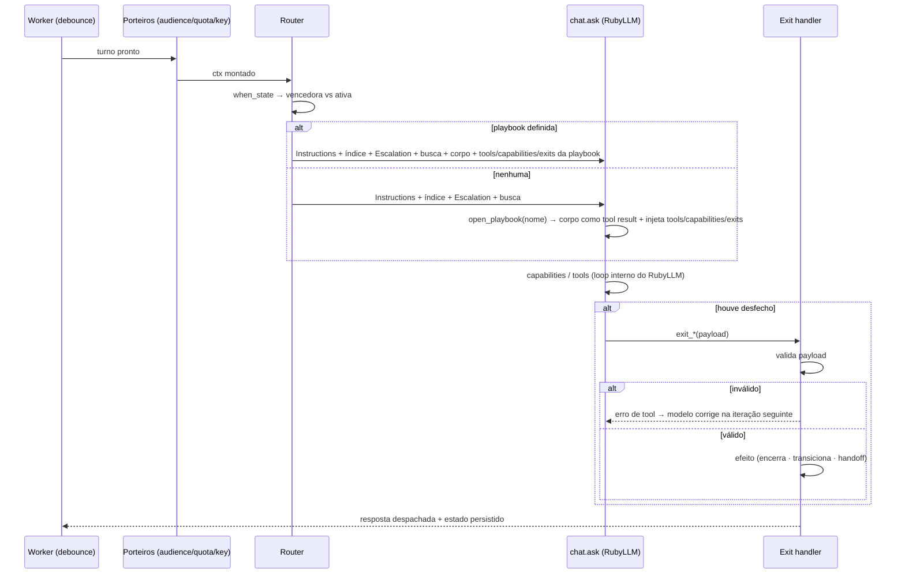

# ScoutV2 — Playbooks, Capabilities e Memória Tipada

**Status:** revisado de ponta a ponta (ver `revisao.md`) e fechado para implementação
**Data:** 2026-09-24 · revisão incorporada em 2026-09-24
**Escopo:** reescrita da camada de comportamento do módulo Scout, em namespace próprio, com os
serviços de comportamento do v1 intocados em produção e depreciados depois.

---

## 1. Contexto e problema

O Scout v1 resolve comportamento com **um prompt monolítico**: `SystemPromptsService#build`
concatena 8 seções, das quais 6 são incondicionais (`system_prompts_service.rb:19-28`). O bloco
central de diretrizes tem **11 bullets e 6.076 caracteres, enviados em todo turno**
(`:68-79`), somados a ~2.151 caracteres de diretrizes de funil (`funnel_section_builder.rb:31-51`),
523 de identidade, 567 de data/hora e 910 de instruções da conta. Piso estático em torno de
11 mil caracteres por turno, independente do que a conversa precisa.

Pelo menos 5 dos 11 bullets são **situacionais por natureza** e mesmo assim estão sempre
presentes:

| Bullet | Linha | Quando de fato importa |
|---|---|---|
| Identidade do contato | `:74` | só quando o nome é placeholder |
| Respeito ao ritmo do lead | `:76` | só quando o lead sinalizou pausa |
| Fallback para humano | `:77` | só quando o turno termina em transferência |
| Intenção fora de prospecção | `:78` | só quando há sinal de cliente existente/reclamação |
| Confirmação de ação | `:71` | só depois de uma tool de escrita bem-sucedida |

### 1.1 As consequências, medidas no próprio código

**Regra escrita três vezes.** "Não faça perguntas ao transferir" aparece no bullet global
(`:77`), é repetida em `handoff_closing_reminder_section` (`:190-195`) e é injetada de novo
no resultado da tool (`opportunity_stage_transition_service.rb:9-11`, aplicada em `:47`). O
comentário do próprio código explica o motivo: *"a static system-prompt bullet read many
messages earlier is not salient enough on its own"* (`system_prompts_service.rb:185-189`). O
mesmo padrão reaparece em `base_tool.rb:62-73` (`scoped_confirmation_reminder`).

**Tools sem escopo.** As 7 tools são enviadas sempre, incondicionalmente
(`agent_runner.rb:145-155`).

**Correção estocástica empilhada.** Com o auditor ligado, um turno custa: chamada principal +
classificador a `0.0` (`response_auditor.rb:61`) + confirmação independente a `0.7` (`:77-82`) +
consistência de claims (`:29`) + reparo (`:87`) + reclassificação (`:90`) + reverificação
(`:93`). Piso de 3 chamadas LLM, pior caso ~8. A dupla confirmação existe porque o próprio
classificador alucina: *"a customer picking one of several offered options … gets misread as
'accepted a human-handoff offer' — confirmed 5/5 times"* (`:46-56`).

**Churn.** 12 commits em `system_prompts_service.rb`, 5 nos auditores, 24 no módulo — o ciclo
de "cada conversa simulada vira uma regra global nova" que motivou este trabalho.

### 1.2 Diagnóstico

O problema não é a redação do prompt; é a **ausência de escopo**. Toda regra é global, logo toda
regra compete e interfere. O remédio adotado foi um auditor posterior, que por alucinar precisou
de confirmação dupla, que custa latência e dinheiro. É uma escada de compensações cuja base é
uma única decisão arquitetural: *um prompt, todas as regras, todas as tools, todo turno*.

### 1.3 Herança do Captain

O Scout v1 foi construído sobre o Captain v1 do Enterprise. Confrontando os dois arquivo a
arquivo, quatro das falhas acima vieram de cima e duas foram criadas aqui:

| Falha | Herdada? | Evidência |
|---|---|---|
| Prompt monolítico | sim | `enterprise/.../captain/llm/system_prompts_service.rb:263-314` — heredoc único; `[Response Guideline]` com 16 bullets incondicionais (`:275-290`). O Scout copiou o formato de seções em colchetes e o campo `reasoning` do schema |
| Tools sem escopo | sim | `assistant_chat_service.rb:32-38` — busca + todas as custom tools da conta, sem condicional |
| Classificador pós-hoc | sim | o `assistant_action_classifier` do Captain tem o enum `action_reason` com `human_offer_accepted` — exatamente o reason que aluciona 5/5 aqui. **A dupla confirmação a `0.7` é invenção do fork**: o Captain chama o classificador uma vez |
| Notas contaminando o prompt | **não** | o Captain injeta contato por whitelist de campos (`:428-435`; em V2, `snippets/contact.liquid`) e **nunca** inclui notas. O Scout trocou por `@contact.to_llm_text`, que despeja `notes.all` sem filtro (`LlmFormatter::ContactLlmFormatter`) |
| Corte cego em 12.000 chars | **não** | `Captain::Llm::FaqGeneratorService:12-23` não trunca nada; `MAX_CONTENT_LENGTH` é exclusivo do fork. O prompt do Captain ainda exige cobertura explícita (*"When combined, the FAQs should reconstruct the substantive source content entirely"*), instrução que o do Scout não tem |

Isso reposiciona duas seções: o §4.8 deixa de ser "consertar memória" e passa a ser "parar de
despejar notas e tipar o que o Scout escreve"; o §4.7 herda um problema real (uma chamada por
documento, sem granularidade) mas não o truncamento, que é regressão local.

---

## 2. Referências: Botpress e Captain V2

### 2.1 Semântica (documentação)

- **Instructions** são regras sempre-on: identidade, comunicação, memória, segurança
  (`llms-full.txt:9813-9822`).
- **Playbook** é procedimento para uma situação específica: passos ordenados, condições,
  *reusável, testável e melhorável independentemente* (`:9828-9836`).
- Regra de corte: *"Keep Instructions focused on durable rules. If a behavior depends on an
  ordered series of steps, branching conditions, or a reusable procedure, model it as a
  Playbook instead"* (`:9826`).
- **Escopo de tools:** tool referenciada em Instructions está sempre disponível; **tools da
  playbook entram no conjunto quando ela está ativa** (`:9844-9845`).
- **Escalation** é camada própria, com procedimento opcional antes do handoff (`:9855-9859`).
- **Flow test:** cenário multi-turno contra **uma** playbook, com tools mockadas, avaliando
  resposta, timeline, tool calls e eventos de playbook (`:10116-10123`).
- Conectar integração não basta: *"Add the action to the relevant Instructions or Playbook and
  explain the condition for using it"* (`:9847`).

### 2.2 Mecanismo (código real, ISC — pacote `llmz`)

A implementação de Playbooks é fechada (não existe em `@botpress/adk@2.0.5` nem em
`@botpress/runtime@2.0.5`), mas o substrato de execução é público:

```js
// llmz/dist/custom-client-C-WXvLD9.js:1428-1440
async _refreshIterationParameters() {
  const instructions = await getValue(this.instructions, this);
  const configuredTools = await getValue(this.tools, this) ?? [];
  const exits    = [...await getValue(this.exits, this) ?? []];
  const model    = await getValue(this.model, this) ?? "best";
```

`ValueOrGetter<T,I> = T | ((ctx) => T) | ((ctx) => Promise<T>)` (`dist/getter.d.ts`): instruções,
tools, exits, modelo e temperatura são **recalculados a cada iteração** — confirmado na doc do
pacote: *"Dynamic tools, objects, exits, instructions, and model configuration can be supplied
as getters evaluated for each iteration"* (`DOCS.md:149`).

O prompt montado tem um **único slot de instrução**:

```js
// llmz/dist/native-n_718Z-T.js:157-174
content: [ protocol, "# JavaScript API", …, tools, "# Task instructions", instructions ]
parts:   { instructions, tools, protocol }
```

E mesmo o `protocol` é condicional ao que está registrado (`runtimeRules`, `:101-127`: só emite
regras de exit se `hasExits`, de componentes se `components.size`, etc.). `Exit` tem schema
validado e hook que pode bloquear a saída (`dist/exit.d.ts`); `ContextTokens` mede o orçamento
de contexto por categoria — `framework`, `instructions`, `tools`, `protocol`, `iterations`
(`dist/context.d.ts`).

**Tradução:** playbook = *(instrução situacional + tools adicionais + exits tipados)* resolvido
por turno.

### 2.3 Painel (evidência de produto)

Do painel de um agente real (cenário Dens Odontologia, mesmo domínio do nosso):

- Blocos distintos: `Instructions` (Identity/Communication/Memory/Safety) · `Knowledge` ·
  `Escalation` · `Playbooks` · `Tools`.
- `Instructions > Identity` são campos nomeados (`Role`, `Scope`); `Communication` usa **enums**
  (`Tone`: Friendly/Neutral/Matter-of-fact/Professional/Humorous/Custom; `Response length`:
  Concise/Standard/Thorough) e `Greeting` próprio. Estilo é config tipada, não prosa.
- Playbook tem `Trigger` em linguagem natural e `Steps` em prosa, e **roteia para outras
  playbooks** (`Intent Triage → Lead Scoring | Team Routing`).
- **Flags de pendência** anexadas a passos específicos, de dois tipos: capability ausente
  (*"Connect a CRM or database integration…"*) e **fato de negócio ausente** (*"Confirm the
  SLA/standard response time…"*, *"Confirmar quais são as opções e limites reais de
  parcelamento"*). O passo degrada em texto; não estoura.
- `Tools` tem três fontes: `Integrations`, `MCP`, `HTTP`. O HTTP tool separa `Params/Body/Auth/
  Headers` (config fixa) de `Inputs` (*"Variables the LLM must provide"*) — distinção que o
  `ScoutTool` hoje não faz.
- Conhecimento é exibido: a página indexada mostra conteúdo, `Origin: Web Sync`,
  `Uploaded by: Bot`, `Status: Indexed`, `Last Updated`, `vDraft: true`. É artefato de build:
  a única ação é `Delete page`, não editar.

### 2.4 Convergência independente: o Captain V2

A base do fork (upstream 4.18.0) já traz o **Captain V2**, que chegou à mesma arquitetura sem
passar pelo Botpress. Não é referência a copiar — é confirmação de que o diagnóstico do §1.2 não
é idiossincrasia nossa.

- Gem `ai-agents 0.12.0` sobre RubyLLM. `Concerns::Agentable#agent` monta
  `Agents::Agent.new(instructions: ->(context) { … }, tools:, model:, temperature:, response_schema:)`
  — **instruções como lambda por execução**, o getter-por-iteração do §2.2 já disponível em Ruby.
- **`Captain::Scenario` é a playbook**: `title`, `description` (≤500 chars — é o trigger),
  `instruction` (os passos), `tools` (jsonb), `enabled`. As tools são **derivadas do corpo**:
  `resolve_tool_references` extrai referências `tool://` da instrução e `validate_instruction_tools`
  rejeita referência inexistente no `save` (`scenario.rb:146-178`) — equivalente à nossa validação
  de boot.
- Orquestrador + um sub-agente por scenario, ligados por `register_handoffs` bidirecional
  (`agent_runner_service.rb:136-141`). O índice entra no prompt do orquestrador como
  `- {title}: {description}, use handoff_to_{key}` (`assistant.liquid:82-84`).
- Prompt é **template Liquid com condicionais** (`assistant.liquid` 6 KB, `scenario.liquid` 2 KB,
  snippets renderizados por ``), não heredoc em Ruby.
- **Os classificadores pós-hoc rodam só no caminho V1.** `response_builder_job.rb:22` bifurca por
  `captain_integration_v2`; `:45-46` roda classificador de ação + reparo de falsa promessa,
  `:50-61` (V2) não roda nenhum dos dois. Handoff passa a ser tool declarada pelo modelo.
- `HandoffTool#perform` **retorna string, nunca `Halt`**, e devolve `failure_result` quando a
  conversa mudou sob ele — mesma regra que o §4.6 prescreve.
- `AssistantMigration::InstructionClassifier` decompõe o prompt monolítico V1 em
  `description` + `response_guidelines` + `guardrails` + **scenario candidates** + FAQ candidates
  + `needs_review`, com regra de corte própria: *"Create a scenario candidate only for a distinct
  multi-step workflow… Do not create scenarios for tone, formatting, generic escalation, a simple
  handoff trigger, or a one-step factual answer."*

Divergências relevantes: o Captain V2 roteia **100% por LLM** (sem estado), guarda o scenario como
**linha de banco por assistant** com UI, **não tem exit tipado** (o desfecho é handoff de volta ao
orquestrador) e **não dá a tool de busca aos sub-agentes** — cada scenario só recebe o que sua
instrução referencia. O `HandoffTool`, porém, é **sempre-on no agente raiz**
(`assistant.rb:210-216`), o que sustenta a escalação sempre alcançável do §4.1.

---

## 3. Decisões

| # | Decisão | Justificativa |
|---|---|---|
| 1 | **Ativação híbrida**: `when_state` determinístico tem precedência sobre `trigger` textual | Estado já existe e é confiável; trigger cobre o resíduo de intenção ("prestes a oferecer horários") que nenhum estado expressa. Trigger puro reintroduz a estocasticidade que causou o dobro-classificador. |
| 2 | **Playbook é arquivo versionado no fork** (frontmatter + corpo), autoria do fork | Banco exigiria UI; UI só se paga com edição por conta, que é não-objetivo explícito. O ciclo de deploy já existe hoje para qualquer mudança de comportamento (regras são heredoc em Ruby), então arquivo não adiciona fricção — reduz, por isolar cada regra num `.md`. Correção propaga para todas as contas num deploy. |
| 3 | **Capability é contrato do fork**, satisfeita por integração | Arquivo compartilhado não pode nomear linha de banco de uma conta (decorrência direta da decisão 2). Contrato **duro na entrada** (a playbook escreve a chamada), **mole na saída** (texto/JSON ao modelo, validação não-bloqueante). Exit é onde o rigor compra determinismo, porque decide fluxo. |
| 4 | **`ScoutTool` sempre declara capability**; `call_custom_api` morre no v2 | Sem capability, a tool é pano para manga: superfície de prompt crescendo com configuração de cliente e contrato instável para a playbook. *No primeiro corte não existe provider HTTP — o `ScoutTool` simplesmente não participa do v2 (ver §6, fase 6.1 e checklist de promoção).* |
| 5 | **Namespace `Custom::ScoutV2::*`**, playground primeiro, `engine` por scout, serviços de comportamento do v1 intocados e depreciados depois | v1 vai ao ar e continua recebendo correções enquanto o v2 é construído; rollback é flipar uma coluna. `AgentRunner`, `ResponseAuditor` e `SystemPromptsService` não recebem uma linha de diff; `Scout` e `ProcessMessageJob` (ambos arquivos do fork) ganham a coluna `engine` e o branch de despacho — não há diff upstream. |
| 6 | **Instructions tipadas** (`Role`, `Scope`, `Tone` enum, `Response length` enum, `Greeting`) | Tira estilo do balde de prosa que compete por atenção. |
| 7 | **Escalation é camada própria** | Consolida as três cópias atuais da regra de handoff num único lugar, entregue no instante do exit. |
| 8 | **Frontmatter com `requires:` (capability) e `needs:` (fato de negócio)** | As duas espécies de pendência observadas no produto de referência. |
| 9 | **V2 nasce sem auditor pós-hoc** | Não é remoção de verificação: é **troca de verificação estocástica por verificação estrutural**. O que ocupa o lugar do auditor é a decisão 12 — sem tool de mutação livre, o desfecho só acontece por exit com payload validado em Ruby, antes de qualquer coisa chegar ao cliente. Carregar também a compensação estocástica contraria o `AGENTS.md` (*"Do not add speculative guards … unless production has proven it necessary"*). Volta com evidência, se voltar. |
| 10 | **Memória tipada em dois tipos** (`fato`/`episodio`), com **gate por origem**: só nota escrita pelo Scout e classificada `fato` entra no prompt | Elimina estruturalmente o caso "transferido em 12/08 lido como preferência atual", hoje combatido com um parágrafo sempre-on (`:134-141`). Nota humana é sinal misto por natureza ("cliente chato, manda pro humano" é instrução acidental) e fica fora do prompt por padrão — entra só por promoção explícita do atendente (§6.6). O gate por origem dispensa classificar nota que ninguém vai ler. |
| 11 | **Conhecimento: extração determinística, sem edição de derivado** | Reprocessar o mesmo site hoje gera 15, 20 ou 30 pares — casamento por identidade de par seria código morto. Artefato de build se regenera, não se conserta. |
| 12 | **Toda tool de mutação é escopada**; `move_opportunity_stage` e `handover_to_human` deixam de existir como tool | É o vício do v1 em miniatura: num turno de dúvida ou de pausa, dar ao modelo a chave do CRM é superfície de efeito colateral sem contrapartida. Transição e transferência são **desfecho**, e desfecho é exit decidido em Ruby — manter a tool ao lado do exit seria manter dois caminhos para o mesmo efeito, escolhidos por sorteio. Sempre-on ficam só a leitura (`search_knowledge_base`) e a saída de emergência (`exit_handoff`, §4.1). |

---

## 4. Arquitetura

### 4.1 Camadas

| Camada | Conteúdo | Sempre no prompt? |
|---|---|---|
| **Instructions** | `Identity` (role, scope) · `Communication` (tone, response_length, greeting) · `Memory` (política de retenção) · `Safety` (anti-alucinação, anti-falsa-promessa, idioma, escopo comercial) | sim |
| **Índice de playbooks** | 1 linha por playbook: nome + trigger | sim |
| **Escalation** | `when_to_escalate` + `procedure_before_handoff` | sim |
| **Playbook ativa** | corpo (passos) | só quando ativa |
| **Tool de leitura** | `search_knowledge_base` | sim |
| **Exit de escalação** | `exit_handoff` | sim |
| **Tools de mutação** | `update_contact` · `manage_opportunity` · demais tools nativas | só quando a playbook ativa as declara |
| **Capabilities** | resolvidas por adapter, via registry | só quando a playbook ativa as declara |
| **Demais exits** | assinaturas da playbook ativa | só quando ativa |

O `guardrails_section` atual se parte em três destinos: o inegociável vira `Safety`; o estilo
vira enum em `Communication`; o situacional sai do prompt global e vira playbook ou Escalation.

`move_opportunity_stage` e `handover_to_human` não aparecem em nenhuma linha da tabela: viraram
efeito de exit (§4.6).

**Por que `exit_handoff` é sempre-on.** `Escalation` é camada sempre presente e `Safety` mantém a
diretriz anti-falsa-promessa, que hoje termina em *"utilize a ferramenta de transferência"*
(`guardrails:70,77`). Se o exit só existisse junto com a playbook ativa, no estado sem playbook o
modelo teria instrução de escalar e nenhum mecanismo para escalar — o pedido mais literal que um
cliente faz ("quero falar com uma pessoa") dependeria de dois saltos estocásticos
(`open_playbook` → `exit_handoff`). Instrução sempre-on exige mecanismo sempre-on. O Captain V2
faz o mesmo (`assistant.rb:213`). Decisão 12 continua valendo: escalação é desfecho em Ruby, não
mutação de CRM.

### 4.2 Ciclo do turno



Runtime, verificado no gem (`ruby_llm-1.15.0/lib/ruby_llm/chat.rb`): o Scout usa **RubyLLM**
(`scout.rb:55-71`), montado com `with_schema(...).with_instructions(...)` e tools encadeadas
(`agent_runner.rb:71-74`). `Chat#complete` passa `@messages` e `@tools` **por referência a cada
iteração**, e `handle_tool_calls` termina em `halt_result || complete(&)` — o loop de tools
reentra em `complete` e relê o estado do chat. `with_tool` escreve em `@tools`;
`with_instructions` sobrescreve o conteúdo da mensagem de sistema no lugar. **Temos, na prática,
o equivalente ao getter-por-iteração do llmz**: uma tool que segura a referência do chat troca
instruções e catálogo no meio do `chat.ask`, e a iteração seguinte já sai com o estado novo.

É esse o mecanismo de `open_playbook`: ela devolve o corpo como resultado de tool — canal já
validado no v1 por `NO_QUESTION_CLOSING_INSTRUCTION` e `scoped_confirmation_reminder`, e atestado
como mais saliente que o prompt no comentário de `:185-189` — **e injeta no mesmo turno as tools,
capabilities e exits da playbook aberta**. Não é preciso pré-registrar as tools de todas as
playbooks do índice (seria o tool bloat do v1 com outro nome) nem adiar a ativação para o turno
seguinte (um turno morto no meio da conversa).

### 4.3 Formato do playbook

```
custom/playbooks/agendamento.md
custom/app/services/custom/scout_v2/
  capabilities/registry.rb · capabilities/scheduling.rb
  predicates/opportunity_in_stage.rb · …
  playbook/loader.rb
```

```yaml
---
name: agendamento
title: Agendamento de avaliação
priority: 50
when_state:
  - opportunity_in_stage: qualificado
  - contact_has_phone
trigger: >
  O lead confirmou interesse e quer marcar horário, ou perguntou
  sobre disponibilidade de agenda.
requires: [scheduling, customer_registry]
needs:   [politica_reagendamento]
tools:   [update_contact]
exits:
  agendado:    { opportunity_id: integer, starts_at: datetime }
  sem_horario: { motivo: string }
  handoff:     { reason: string }
---

## Passos

1. Se o paciente ainda não tem cadastro, localize por telefone com
   `customer_registry.find_by_phone`; não encontrando, crie com
   `customer_registry.create`.
2. Pergunte o melhor dia. Com a data, consulte `scheduling.list_slots` e
   ofereça no máximo três horários em linguagem natural.
3. Com o horário escolhido, marque com `scheduling.book`, confirme apenas o
   que ele acabou de escolher e encerre com `exit_agendado`.
4. Sem horário na janela pedida, ofereça a próxima data disponível. Recusando
   todas, `exit_sem_horario`.
5. Pedido de atendente, urgência clínica ou duas falhas de cadastro:
   `exit_handoff`.
```

**Redação do `trigger`:** a linha do índice é o único sinal que o modelo tem para escolher entre
playbooks. Quando duas são semanticamente vizinhas (`duvida_comercial` × `fora_de_prospeccao`), o
trigger declara a exclusão: *"…; não usar se o contato já é cliente reclamando de atendimento"*.
Não é validável no boot — é convenção de escrita, revisada em PR.

**Idioma:** o corpo é escrito em pt-BR (é instrução ao modelo, não texto ao cliente); a resposta
ao lead segue o idioma detectado, como hoje. Playbook fica fora do ciclo de i18n de
`en.json`/`pt_BR.json`.

### 4.4 Roteador

Substitui `build_system_instructions` + `build_tools` (`agent_runner.rb:145-163`). O que vem
antes — debounce, `AudienceMatcherService`, quota e API key (`:20-23,43-45`) — é porteiro de
execução, não de comportamento, e fica como está.

**Contexto de roteamento**, montado uma vez por turno: `conversation`, `contact`, `inbox`,
`scout`, `opportunity` (com `stage_role`), `pending_fields`, `active_playbook`, `transitions`,
`satisfied_capabilities`.

**`when_state` sem DSL:** cada entrada é o nome de um **predicado registrado em Ruby**, com
argumento opcional; a lista é um **E lógico**. Sem `or`, sem aninhamento — disjunção vira duas
playbooks ou um predicado novo, que é código com spec.

```ruby
class Custom::ScoutV2::Predicates::OpportunityInStage < Base
  def call(ctx, stage_role) = ctx.opportunity&.stage_role == stage_role.to_sym
end
```

**Regra de decisão:**

```
1. avalia when_state de todas as playbooks
2. entre as que casam, vence a de maior priority
3. é a ativa            → continua
   não há ativa         → ativa a vencedora
   supera a ativa       → interrompe e troca   (priority ESTRITAMENTE maior)
   não supera           → a ativa permanece
4. nenhuma casa e sem ativa → só índice; o modelo abre por trigger
```

Daí caem duas propriedades sem conceito novo: **continuidade** (dentro de `agendamento`, "terça
de manhã" não re-roteia) e **interrupção** (uma playbook de `priority` alta atropela o
procedimento em curso quando seu `when_state` casa).

**Limite conhecido do `when_state`: ele só enxerga o que o banco sabe.** Estágio, campos
pendentes, telefone, nome-placeholder — nada disso expressa intenção. "Quero remarcar", "já sou
cliente reclamando", "quanto custa", "quero falar com gente" não têm assinatura de estado, e é
por isso que 3 das 6 playbooks do primeiro corte (`fora_de_prospeccao`, `duvida_comercial`,
`pausa`) nascem sem `when_state`. **O roteamento já é híbrido por necessidade, não por
preferência.**

Disso decorre uma **inversão que o desenho assume conscientemente**: `fora_de_prospeccao` tem a
`priority` máxima e ativação só por trigger — a regra de maior precedência do sistema é a de
ativação menos determinística. `priority` só arbitra entre playbooks que já casaram por estado;
não acelera a que depende do modelo. Mitigação no primeiro corte: escrever o trigger dela com
exclusão explícita (§4.3) e observar `activation_reason` em produção. Se a taxa de não-ativação
aparecer no Langfuse, o caminho é dar-lhe predicados parciais (contato com oportunidade
ganha/perdida, conversa anterior resolvida), não afrouxar a precedência.

**A metade por-trigger é um componente substituível.** O roteador expõe uma interface única —
`ctx → (playbook | nil, confidence)` — e hoje tem duas implementações por trás: `when_state`
(confiança 1.0) e `open_playbook` (confiança indefinida, o modelo decide dentro da chamada
generativa). Trocar a segunda por um classificador de saída tipada com probabilidades por chave e
limiar em Ruby (a forma de decision models como o `jev`, ou de um classificador próprio com
schema) passa a ser substituição de componente, não reescrita. Não entra no primeiro corte: custa
a chamada extra por turno e não há evidência de que `open_playbook` erre. O que entra agora é só
a costura.

**Persistência** — `ichatr_scout_conversation_states`: `conversation_id`, `active_playbook`,
`activated_at`, `activation_reason` (`:state | :trigger | :transition`), `transition_count`,
`last_exit`, `unsatisfied_flags`. `activation_reason` é o que torna a depuração possível: hoje
não há como saber *por que* o modelo fez o que fez.

**Limites:** máximo 2 transições **por turno** — o contador vive no `TurnRunner` e nasce zerado a
cada execução; estourou, encerra e registra. O `transition_count` da tabela é acumulado histórico,
para observabilidade: reaproveitá-lo como limite faria um retry do Sidekiq herdar o saldo do turno
que falhou e matar o roteamento na segunda tentativa. `open_playbook` só quando não há playbook
forçada por estado; exit terminal zera a ativa.

**Validação no boot** (falha alto, conforme `AGENTS.md`): predicado inexistente · capability fora
do catálogo · exit citado no corpo e não declarado · playbook de destino inexistente · `priority`
ausente, não-inteira ou duplicada. Referência quebrada morre no CI, não numa conversa.

### 4.5 Capabilities

Contrato declarado no fork; entrada dura, saída com forma declarada e validação não-bloqueante:

```ruby
class Custom::ScoutV2::Capabilities::Scheduling < Base
  capability :list_slots do
    input  :date,    type: :date,   required: true
    input  :service, type: :string, required: false
    output required: %i[slot_id starts_at], shape: :list
  end

  capability :book do
    input :slot_id, type: :string, required: true
    input :notes,   type: :string, required: false
    output required: %i[appointment_id]
  end
end
```

**Resolução por registro, não por factory de vendor:** o código da playbook chama
`CapabilityRegistry.resolve(:scheduling, account:)`. Quem satisfaz é detalhe de implementação —
é o que mantém a porta aberta para provedores futuros sem tocar playbook nem adapter.

**O problema que isso resolve, medido.** As 4 tools configuradas hoje apontam todas para
`wfh.ichatr.com.br/webhook/*` — o mesmo backend do `Erp::Younus::Client`
(`client.rb:6,9-19,29-30`):

| Tool | Endpoint | Parâmetros exigidos do modelo |
|---|---|---|
| `pesquisar_cliente` | `GET /webhook/pesquisar-pessoa` | `idEmpresa`, `nrTelcelpessoa` |
| `cadastrar_pessoa` | `POST /webhook/incluir-cliente` | `nmPessoa`, **`idEmpresa`, `idUsuario`, `idConvenio`, `nrConvenio`, `idOrigempessoa`**, `nrTelcelpessoa` |
| `obter_horarios_livres` | `GET /webhook/horarios-livres` | `data`, **`idAgenda`, `idEmpresa`, `idServico`** |
| `agendar` | `POST /webhook/incluir-agendamento` | **`idAgenda`, `idEmpresa`, `idServico`, `idUsuario`, `idConvenio`**, `idPessoa`, `nmTitulo`, `dtIniAgenda`, `observacoes` |

Em negrito: configuração, não conversa. `idEmpresa` já está nas settings do hook
(`apps.yml:348` para `category: erp`, `:350` para `visible_properties: ['id_empresa','token']`) e
mesmo assim o modelo é obrigado a produzi-lo — superfície de alucinação projetada. Com
capability, o adapter injeta credencial e IDs; o modelo vê só `date`, `service`, `slot_id`.

A camada de contrato já existe no fork e só não estava exposta ao Scout: `Erp::BaseAdapter`
(`base_adapter.rb:9-25`), `Erp::AdapterFactory` (`adapter_factory.rb:5-10`), catálogo por
categoria em `apps.yml`, e `erp_controller.rb:20` já resolvendo por categoria
(`h.app&.params&.dig(:category) == 'erp'`), mantido um fallback por vendor para compatibilidade.

### 4.6 Exits e o desmonte do auditor

**Mecanismo:** cada exit é uma tool injetada com a playbook ativa (`exit_agendado(...)`,
`exit_handoff(...)`). A validação do payload roda no handler Ruby; payload inválido volta como
erro de tool e o modelo corrige **dentro do mesmo `chat.ask`**, sem chamada de topo extra.

**Espécies:** terminal (encerra o turno) · transição (ativa outra playbook) · escalação (dispara
`HandoffService`). **Turno sem exit é o caso normal** — responder e aguardar o cliente é o
`ListenExit` implícito; exit só existe onde há desfecho.

**O handler devolve texto, nunca `Tool::Halt`.** Em `chat.rb`, `handle_tool_calls` faz
`halt_result || complete(&)`: um `RubyLLM::Tool::Halt` corta o loop e `ask` devolve o próprio
Halt, sem nova iteração — o modelo nunca escreve a mensagem final e o cliente fica sem resposta.
O `ExitHandler` persiste o efeito (transiciona, dispara `HandoffService`) e retorna a instrução
de encerramento como resultado de tool; a mensagem sai da iteração seguinte, dentro do
`ResponseSchema`. É também por aí que a regra de handoff é entregue, uma única vez.

**O que morre:**

- **`ActionClassifierService` inteiro.** Handoff deixa de ser inferido da transcrição e passa a
  ser declarado pelo assistente ou decidido em Ruby. O modo de falha documentado — cliente
  escolhendo uma opção lido como "aceitou transferência", 5/5 vezes (`response_auditor.rb:46-56`)
  — torna-se estruturalmente impossível: mensagem de cliente não produz exit. Saem 2 chamadas
  LLM/turno e a heurística de temperatura 0.7.
- **`ClaimConsistencyService` em parte.** `exit_agendado` exige `opportunity_id`/`starts_at`, que
  só existem se `scheduling.book` rodou. Não coberto: promessa futura sem ação ("te aviso
  amanhã") — continua sendo a diretriz *Anti-falsa-promessa*, genuinamente global, em `Safety`.
- **O loop de reparo.** Correção acontece antes de qualquer coisa chegar ao cliente; some o caso
  de reparo disparando handoff e enviando duas mensagens (`:96-103`).
- **As três cópias da regra de handoff.** Com escalação tipada, o Ruby sabe que o turno termina
  em transferência e entrega a instrução **uma vez**, no resultado do exit.
- **`move_opportunity_stage` e `handover_to_human` como tools.** Transição e transferência são
  desfecho: o efeito roda em Ruby, com campos obrigatórios validados antes da escrita. Junto com
  a tool some `OpportunityStageTransitionService::NO_QUESTION_CLOSING_INSTRUCTION`, que existia só
  para reforçar a regra no resultado dela.

| | v1 (auditor ligado) | v2 |
|---|---|---|
| Chamadas LLM/turno | 3 no piso, ~8 no pior caso | **1** |
| Detecção de handoff | estocástica, dupla confirmação | declarada ou determinística |
| Correção | regenerar resposta inteira | payload rejeitado no loop de tools |

**Permanecem** os fail-safes de infraestrutura (quota, API key ausente, falha de parse →
`perform_fail_safe_handoff`): são falha de sistema, não compensação de comportamento.
`ResponseSchema` perde `reasoning`, que hoje só alimenta log (`agent_runner.rb:133`).

### 4.7 Conhecimento

**Migra inteiro, sem mudança:** `ScoutKnowledgeSource` (url/document/faq) → `ProcessJob` →
`FaqGeneratorService` → `ScoutKnowledgeEmbedding(question, answer, embedding)` → `EmbedEntryJob`
→ `search_knowledge_base` (cosine, top 5). Site, PDF e FAQ manual funcionam day 1 porque são os
mesmos objetos.

**Muda a injeção:** hoje um bullet global manda "consulte a base sempre que necessário"
(`:159-162`). Em v2 o *quando* vai para o passo da playbook e o global só declara que a base
existe — a regra explícita de `llms-full.txt:9847`. Efeito colateral: o contra-bullet que hoje
pede ao modelo para **não** inventar perguntas por causa da base (`funnel_section_builder.rb:46-49`)
perde a razão de existir.

**Extração determinística (novo).** A extração atual não é reprodutível: o mesmo site processado
várias vezes gerou 15, 20 e 30 pares. Duas causas no código, com `temperature: 0.0` já setada
(`faq_generator_service.rb:18-19`):

- corte cego em 12.000 caracteres (`:4`, aplicado em `:17`) — regressão local do fork, que o
  Captain não tem (`Captain::Llm::FaqGeneratorService:12-23` não trunca): a cauda se perde em
  silêncio e a fronteira do corte se move quando o crawler varia;
- uma única chamada sobre o documento inteiro, **sem instrução de granularidade ou cobertura**
  (`:33-43`) — o mesmo parágrafo pode virar 1 ou 4 pares. O prompt do Captain ataca isso por
  redação (*"Extract ALL substantive information… When combined, the FAQs should reconstruct the
  substantive source content entirely"*); o do Scout tem 8 linhas e nenhuma regra de cobertura.

Passa a: quebra em blocos de tamanho fixo respeitando fronteira de parágrafo, com sobreposição
pequena; uma chamada por bloco; `MAX_CONTENT_LENGTH` eliminado; instrução de cobertura explícita
no prompt, no modelo do Captain; dedupe de perguntas quase idênticas entre blocos vizinhos por
similaridade de embedding. **Parâmetros internos, não expostos ao usuário** — versionados no
código, ajustáveis só por deploy. O `PaginatedFaqGeneratorService` do Captain (10 páginas por
bloco, iterativo, para quando o modelo devolve `has_content: false`) é o precedente upstream do
mesmo movimento.

**Visualização (novo).** Lista dos pares por fonte, com `origin`, `last_extracted_at`, status,
tamanho capturado e contagem — substituindo o contador solitário de hoje. Editável apenas
para fonte `kind: faq` (autoral). Derivado é **somente leitura**: artefato de build se regenera,
não se conserta — e com a extração estável, a contagem vira instrumento de diagnóstico
("caiu de 40 para 22: o site mudou ou o crawler falhou?").

**Correção de conteúdo derivado errado** já tem caminho, sem código novo: criar uma fonte
`kind: faq` com a pergunta e a resposta corretas (`scout_knowledge_source.rb:13,23`) — autoral,
estável, sobrevive a qualquer reprocessamento.

### 4.8 Memória

**Situação atual:** `ContactNotesService` gera notas por LLM ao fim da conversa, sem esquema
(`:44-51`), grava em `notes` com prefixo de data (`:20,65-70`), e o prompt injeta
`@contact.to_llm_text` (`contact_context_section:96-102`), que por
`LlmFormatter::ContactLlmFormatter` despeja `notes.all` — **todas as notas, sem limite, sem
filtro de origem**. Daí o parágrafo sempre-on contra o caso "transferido no passado lido como
preferência atual" (`memory_notes_warning:134-141`), e daí um "cliente chato, manda direto pro
humano" escrito por atendente virar instrução ao modelo.

Nada disso vem do Captain: ele monta contato por whitelist de campos (`:428-435`; em V2,
`snippets/contact.liquid`) e **nunca** injeta notas. A regressão é do fork, e o conserto mínimo é
parar de usar `to_llm_text` no prompt. O desenho abaixo é o que se constrói **em cima** desse
conserto, porque memória de contato é capacidade desejada, não dívida.

**Desenho:**

- O conteúdo mora **uma vez só**, em `notes` (tabela upstream). A tabela do fork guarda apenas o
  que é do Scout:

```
ichatr_scout_note_attributes
  note_id (FK → notes, ON DELETE CASCADE) · kind (fato | episodio)
```

- **Gate por origem, não por classificação universal.** Entra no prompt apenas nota que (a) foi
  escrita pelo Scout e (b) está classificada `fato`. Nota humana **não entra por padrão** — é
  sinal genuinamente misto e não existe classificador que separe "prefere contato por WhatsApp"
  de "manda direto pro humano" sem errar na direção cara. A porta de entrada para nota humana é
  a promoção explícita do atendente (§6.6), ação auditável e opt-in.
- **Origem sem coluna nova e sem parsing de prefixo:** `user_id` é opcional em `Note`
  (`note.rb:27`) e o Scout cria sem usuário, então `notes.user_id IS NULL` já identifica autoria
  do Scout. A promoção manual grava a linha de atributo com `kind: fato` para uma nota que tem
  `user_id`, que é exatamente o registro da exceção.
- **`kind` é classificado no ato da escrita, não por job separado.** `ContactNotesService` hoje
  pede ao LLM `{ notes: ['…'] }`; passa a pedir `{ notes: [{ kind: 'fato'|'episodio', content:
  '…' }] }`. Mesma chamada, schema tipado, **zero LLM adicional e zero job de classificação**.
  Como só o Scout escreve nota classificável, não é preciso gancho nenhum no ciclo de vida de
  `Note` — `app/models/note.rb` continua intocado, sem entrada de MANIFEST em
  `bin/sync-custom-module-hooks`.
- **Só `fato` entra no contexto** do turno, top N por recência. `episodio` fica visível ao
  atendente e fora do prompt — é o que torna impossível o caso que motivou a mudança, e permite
  apagar `memory_notes_warning` por inteiro.
- Toda nota do Scout é nota do Chatwoot e vice-versa. **Editar** no Chatwoot altera o que o Scout
  lê, porque é o mesmo registro — sem código de sincronização; o `kind` gravado permanece, e a
  edição é do atendente, que sabe o que está fazendo. **Excluir** remove o atributo por cascade no
  banco.
- Conflito entre notas resolve-se por recência, com uma linha em `Instructions > Memory`
  (*a mais recente prevalece*) — regra durável, na camada certa.
- **Sem migração.** Nota antiga não tem linha em `ichatr_scout_note_attributes`, logo não entra no
  prompt. Não há backfill, não há job one-off, não há registro reescrito. O histórico volta a
  alimentar o modelo à medida que o Scout escreve notas novas — e nesse meio-tempo o
  comportamento é o do Captain, que nunca leu nota nenhuma.
- `CreatePrivateNote` é nota de conversa, não memória de contato — outra coisa. Fica como tool
  escopada, não global; no primeiro corte nenhuma das seis playbooks a declara, porque os dois
  usos reais viraram efeito de Ruby (o exit de escalação escreve a nota de transferência, o
  `ContactNotesService` escreve o resumo de fim de conversa). Volta numa linha de frontmatter se
  aparecer necessidade concreta.

**Referência.** O Botpress não oferece mais que isso: no produto dos Playbooks, `Memory` é uma
aba de `Instructions` — *"What the agent can retain about a user across conversations"* — ou seja
uma **política de retenção em prosa**. As estruturas persistentes (Tables, `user.*`) pertencem ao
Studio legado, o produto de fluxos, não ao agente. A tipagem `fato`/`episodio` vai além do
Botpress e segue Letta/MemGPT (core vs recall) e Zep (subgrafo semântico vs episódico).

### 4.9 Observabilidade

Nada a construir: `Integrations::LlmInstrumentation` (OpenTelemetry → Langfuse) já existe e o v1
já o usa em `AgentRunner` (`:182-183`) e em toda tool (`base_tool.rb:16`). O v2 herda desde a
fase 0 — `TurnRunner` com `instrument_agent_session` + `instrument_llm_call`; capability e exit
handler com `instrument_tool_call`.

O que muda é o conteúdo. `metadata:` em `instrumentation_params` vira atributo Langfuse
arbitrário (`llm_instrumentation_helpers.rb:67-73`), então o trace de cada turno passa a carregar
`playbook`, `activation_reason`, `exit_action` e `unsatisfied_flags`. É a contrapartida em
produção do `activation_reason` persistido: o trace responde *por que esta playbook*, *qual
desfecho*, *que pendência* — contra o trace de hoje, com 3 a 8 gerações aninhadas e o laço de
reparo no meio.

### 4.10 Alternativas consideradas

**Condicionais dentro do v1, sem arquitetura nova.** Para a metade *state-driven* do roteamento
— `identificacao`, `qualificacao`, `agendamento` — daria para chegar perto envolvendo
`guardrails_section` e `build_tools` (`agent_runner.rb:145-163`) em `if`s sobre o mesmo contexto
que o roteador usa. Custo estimado: 200-300 linhas, sem tabela nova, sem YAML, sem predicados.
Foi descartado por três razões, nesta ordem:

1. **Não cobre a metade trigger-driven.** `fora_de_prospeccao`, `duvida_comercial` e `pausa` só
   ficam claras depois que o turno começou. Decidir "abre esta playbook e já ativa as tools dela"
   com um `build_tools` calculado uma vez antes do `chat.ask` é impossível: ou se reinventa
   dentro do `AgentRunner` o mesmo mecanismo de tool-que-muta-`@tools`/`@messages` do §4.2, ou se
   adia a ativação para o turno seguinte — o turno morto no meio da conversa. Como o mecanismo
   mid-turn é necessário para 3 das 6 playbooks do primeiro corte, usá-lo também para as outras 3
   é mais barato que manter **dois** mecanismos de ativação em paralelo.
2. **Não compra testabilidade.** Condicional dentro do montador de prompt continua só testável
   por substring, como hoje (`system_prompts_service_spec.rb` inteiro). O roteador separado é o
   que permite spec estado → playbook sem LLM (§7), que é a razão principal do trabalho.
3. **Não contém o churn.** A regra nova continuaria caindo no mesmo arquivo — 12 commits em
   `system_prompts_service.rb` é o sintoma que se quer tratar.

**Manter o auditor como rede.** Descartado pela decisão 9: a verificação estrutural (exit com
payload validado, sem tool de mutação livre) ocupa o lugar, e a literatura é explícita sobre
auto-crítica sem oráculo externo degradar em vez de melhorar (Huang et al., ICLR 2024; Stechly et
al., arXiv:2402.08115). O que **não** foi descartado é a rede fora do turno: o Captain roda um
`InboxPendingConversationsResolutionJob` que varre conversas `pending` inativas e decide
resolver-ou-transferir de forma assíncrona. É o formato certo para o caso "o modelo deveria ter
escalado e não escalou", e é o que a fase 6.7 deve considerar antes de qualquer reintrodução de
auditoria por turno.

---

## 5. Divergências conscientes do Botpress

| Tema | Botpress | ScoutV2 | Motivo |
|---|---|---|---|
| Referência a tool | pelo nome, namespace plano, qualquer fonte (`:9850`) | por capability | Playbook é arquivo compartilhado (decisão 2) e não pode nomear linha de banco de uma conta. Se um dia a playbook virar dado por conta, `capability` pode morrer. |
| Roteamento | playbook de triagem no LLM (`Intent Triage`) | Ruby decide quando há estado, modelo decide o resíduo | Estado já existe e é confiável; o histórico do v1 mostra o custo de classificar por LLM. O Captain V2 (§2.4) roteia 100% por LLM via `handoff_to_*` — divergimos dos dois porque só nós temos o modo de falha medido em produção. Limite e costura de substituição em §4.4. |
| Exit | `Exit` com schema validado e hook que pode vetar a saída | igual | — |
| Escalação | camada própria, com procedimento opcional | igual, e o `exit_handoff` é sempre-on | Instrução sempre-on exige mecanismo sempre-on (§4.1). |
| Memória | aba de política em `Instructions` | política em `Instructions` **mais** tipagem `fato`/`episodio` com gate por origem | O Botpress não tipa memória; a tipagem vem de Letta/Zep e resolve um caso medido aqui (§4.8). |
| Autoria | Vibe edita conversacionalmente | fork escreve, em PR | Correção precisa propagar num deploy; prosa de terceiro viraria superfície de suporte. |
| Conhecimento | exibe a fonte indexada | exibe o derivado (pares Q/A) | O derivado é o que chega ao modelo. |
| Armazenamento | cloud, com working/published | arquivo versionado | Deploy já é o mecanismo de promoção. |

---

## 6. Escopo e fases

### Fase 0 — Fundação
Loader + validação no boot · router + predicados · estado por conversa
(`ichatr_scout_conversation_states`) · `TurnRunner` no playground, já instrumentado com os
metadados de playbook (§4.9) · **uma** playbook (`qualificacao`), zero capability.
**Prova:** specs de router sem LLM nenhum + conversa de playground qualificando um lead.
*Critério de corte: se o roteador não passar nas specs sem LLM, o resto não vale a pena.*

### Fase 1 — Comportamento
Instructions tipadas · Escalation como camada · exits · v2 sem auditor. Cinco das seis playbooks
do primeiro corte — `agendamento` depende de capability e só fecha na fase 2, mas já entra aqui
com `requires` insatisfeito, exercitando o caminho de degradação:

| Playbook | Ativação | `tools` | `requires` | Exits | Origem no v1 |
|---|---|---|---|---|---|
| `fora_de_prospeccao` | `priority` máxima · trigger | — | — | `handoff` | `guardrails:78` |
| `identificacao` | `when_state: contact_identity_incomplete` | `update_contact` | — | → `qualificacao` | `identity_warning:105-115` + `phone_request_warning:118-131` |
| `qualificacao` | `opportunity_open` + `pending_required_fields` | `manage_opportunity` | — | `qualificado` · `desqualificado` · `handoff` | `FunnelSectionBuilder` |
| `agendamento` | `opportunity_in_stage(qualificado)` + `contact_has_phone` | — | `scheduling`, `customer_registry` | `agendado` · `sem_horario` · `handoff` | — (novo) |
| `duvida_comercial` | trigger | — | — | → playbook anterior | `knowledge_tool_instruction:159-162` |
| `pausa` | trigger | — | — | terminal | `guardrails:76` |

Coluna `tools` vazia é literal: naquela playbook o modelo **não tem nenhuma tool de mutação**.
`search_knowledge_base` não aparece porque é sempre-on (§4.1).

**Prova:** as cinco playbooks operando no playground; handoff declarado, não inferido;
`agendamento` degradando com pendência visível em vez de estourar.

### Fase 2 — Integração
`CapabilityRegistry` · contratos `scheduling` e `customer_registry` · 4 métodos novos em
`Erp::Younus::Client`/`Adapter` · playbook `agendamento`.
**Prova:** agendamento ponta a ponta no playground, com IDs vindos do hook.

### Fase 3 — Memória
Remover `to_llm_text` do prompt (conserto imediato, independente do resto) · schema tipado
`{kind, content}` no `ContactNotesService` · `ichatr_scout_note_attributes` · filtro de contexto
por `notes.user_id IS NULL` + `kind: fato` · ação de promoção manual de nota humana.
Sem job classificador, sem migração, sem gancho em `Note` (§4.8).
**Prova:** episódio fora do prompt, fato presente, nota de atendente ausente até ser promovida.

### Fase 4 — Conhecimento
Chunking determinístico · visualização dos pares com metadados.
**Prova:** mesma fonte reprocessada duas vezes → mesma contagem.

### Fase 5 — Produção
`engine: v2` por scout · observabilidade de ativação · depreciação do v1.
**Prova:** primeiro scout real em v2, com `activation_reason` legível em toda conversa.

Fases 3 e 4 são independentes entre si e das anteriores.

**Checklist obrigatório de promoção por scout:** ligar `engine: v2` **desativa as `ScoutTool`
daquele scout** (no primeiro corte não existe provider HTTP de capability). Verificar se alguma
delas cobre necessidade não atendida pelas capabilities antes de promover. Verificar também que
`exit_handoff` responde no playground a um pedido explícito de atendente **sem playbook ativa** —
é o caminho crítico do §4.1.

### Fase 6 — Investigação futura (placeholders)

Itens retirados do primeiro corte deliberadamente. Cada um vira spec própria quando houver
demanda real; nenhum é pré-requisito dos anteriores.

- **6.1 `ScoutTool` como provider de capability** — coluna `capability` + separação
  `Params`/`Inputs` (modelo da imagem 10 do painel de referência) + provider HTTP no registro.
  Gatilho: primeiro cliente sem adapter para a capability de que precisa.
- **6.2 Packs de playbook por vertical** — `playbook_pack: odontologia | vendas_generico`,
  curados no repo, escolhidos por scout. Gatilho: segundo vertical com funil estruturalmente
  diferente.
- **6.3 Materialização das playbooks em banco** — arquivo como fonte, linhas sincronizadas no
  deploy, UI no super admin. Gatilho: necessidade de enable/disable por conta ou de UI.
- **6.4 Re-sync periódico de fonte de conhecimento** — equivalente ao `Web Sync` do painel de
  referência, com data de atualização.
- **6.5 Priorização de par autoral na busca** — desempate favorecendo `kind: faq` sobre derivado
  no top-5. Gatilho: par derivado errado atrapalhando na prática.
- **6.6 Promoção de nota humana pelo atendente** — ação explícita "usar como fato", opt-in e
  auditável. **Promovido de placeholder a parte da fase 3**: é a única porta de entrada de nota
  humana no prompt (§4.8), então não é investigação futura e sim requisito do corte de memória.
- **6.7 Reintrodução seletiva de auditoria** — só com classe de erro observada em produção que o
  escopo não resolva, e cirúrgica. Avaliar antes a rede **fora do turno**, no formato do
  `InboxPendingConversationsResolutionJob` do Captain (§4.10), que não recoloca chamada no
  caminho quente.

**Continuam funcionando sem mudança** (ortogonais ao turno): gate de audiência, quota, debounce,
follow-up/rescue, estimativa de valor, classificador de referral, continuidade de oportunidade.

---

## 7. Testabilidade

O ganho estrutural do desenho, e a razão principal para fazê-lo:

- **Spec de roteador** — estado → playbook esperada. Sem LLM, sem rede, determinístico. Cobre a
  classe de bug que hoje só aparece simulando conversa.
- **Spec de predicado** — unidade pequena e isolada.
- **Flow test por playbook** — conversa multi-turno com capabilities mockadas, verificando exits
  e transições (o `flow test` de `llms-full.txt:10116-10123`), viável porque a capability tem
  forma declarada.
- **Validação de boot** — referência quebrada falha no CI.

Hoje o equivalente não existe: `system_prompts_service_spec.rb` só consegue afirmar que certo
texto aparece numa string, o que é testar implementação, não comportamento.

---

## 8. Riscos

| Risco | Mitigação |
|---|---|
| Trigger textual ativa a playbook errada | Estado tem precedência sempre; trigger só no resíduo. `activation_reason` registra a causa em toda conversa, tornando o erro observável. |
| `fora_de_prospeccao` tem `priority` máxima mas ativação só por trigger | Inversão assumida e documentada em §4.4; trigger redigido com exclusão explícita, taxa de não-ativação observável por `activation_reason`. Correção, se necessária: predicados parciais, não afrouxar a precedência. |
| Duas bases (v1 e v2) convivendo | Namespace separado; serviços de comportamento do v1 sem diff; depreciação explícita na fase 5. |
| Remover o auditor expõe erro que ele cobria | Verificação estrutural substitui a estocástica (decisões 9 + 12); instrumentação desde a fase 1; reintrodução cirúrgica é a fase 6.7, com evidência. |
| Playbook curada não cobre especificidade de um cliente | Parametrização por dado (estágios, campos, catálogo, persona) primeiro; packs por vertical (6.2) quando houver segundo vertical. |
| `engine: v2` desativa `ScoutTool` do scout | Checklist obrigatório de promoção; 6.1 quando houver demanda. |
| Nota humana útil fica invisível ao modelo | Consequência aceita do gate por origem (§4.8): o custo de ignorar um fato é menor que o de obedecer a uma instrução acidental. Promoção manual cobre o caso real. |
| Histórico de conversa sem janela infla o contexto | **Pré-existente ao v2 e ortogonal a ele**: `agent_runner.rb:165-167` carrega todas as mensagens não-privadas sem limite, e o v2 herda isso intacto. Não entra neste corte; vira spec própria se conversa longa aparecer no Langfuse estourando orçamento. |
| Exit devolvendo `Tool::Halt` deixa o cliente sem resposta | Regra explícita em §4.6 (handler retorna texto — o `HandoffTool` do Captain V2 faz o mesmo); coberto por flow test de cada exit, que verifica mensagem final além do efeito. |
| `exit_handoff` sempre-on aumenta a superfície de handoff indevido | Escalação é desfecho reversível por atendente; o custo oposto (cliente pedindo humano e o modelo sem mecanismo) é pior e não observável. `exit_action` no trace mede a taxa. |

---

## 9. Apêndice — evidências

**v1 (este repo):** `system_prompts_service.rb:19-28,68-79,96-102,105-131,134-141,159-167,185-195,197-208` ·
`funnel_section_builder.rb:31-51,46-49` · `agent_runner.rb:20-23,43-45,71-74,115-117,133,145-163,193-201` ·
`response_auditor.rb:29,46-56,61,71-82,84-93,96-103` · `opportunity_stage_transition_service.rb:9-11,47` ·
`base_tool.rb:62-73` · `scout.rb:55-71` · `scout_tool.rb:14,82-89` · `call_custom_api.rb:6-21` ·
`faq_generator_service.rb:4,17,18-19,33-43` · `search_knowledge_base.rb:18-24` ·
`scout_knowledge_source.rb:13,23,29-33` · `scout_knowledge_embedding.rb:12,15` ·
`contact_notes_service.rb:20,44-51,65-70` · `note.rb:27` ·
`app/services/llm_formatter/contact_llm_formatter.rb` (`build_notes` → `notes.all`, sem limite)

**Runtime RubyLLM (`ruby_llm-1.15.0`, lido no container):** `lib/ruby_llm/chat.rb` —
`complete` (tools e messages passados por referência a cada iteração) · `handle_tool_calls`
(`halt_result || complete(&)`) · `with_tool` / `with_instructions` (mutação in-place).

**Observabilidade (este repo):** `lib/integrations/llm_instrumentation.rb:10-64`
(`instrument_llm_call`, `instrument_agent_session`, `instrument_tool_call`) ·
`llm_instrumentation_helpers.rb:54-74` (metadata → atributo Langfuse) ·
`agent_runner.rb:180-186,203-212` · `base_tool.rb:16`

**Integração ERP (este repo):** `base_adapter.rb:9-25` · `adapter_factory.rb:5-10` ·
`younus/client.rb:6,9-19,24-73` · `config/integration/apps.yml:341-350` (`category: erp` em
`:348`, `visible_properties` em `:350`) · `erp_controller.rb:19-22`

**Captain (upstream, base 4.18.0 — lido neste repo):**
`enterprise/app/services/captain/llm/system_prompts_service.rb:263-314` (prompt monolítico V1),
`:275-290` (16 bullets incondicionais), `:428-435` (contato por whitelist, sem notas),
`assistant_action_classifier` (enum com `human_offer_accepted`) ·
`assistant_chat_service.rb:32-38` (tools incondicionais) ·
`llm/faq_generator_service.rb:12-23` (uma chamada, sem truncamento) ·
`llm/paginated_faq_generator_service.rb:5-6,27-42` (chunking iterativo) ·
`jobs/captain/conversation/response_builder_job.rb:22,40-48,50-61,137` (bifurcação V1/V2) ·
`models/captain/scenario.rb:42-74,103-130,146-178` · `models/captain/assistant.rb:210-234` ·
`models/concerns/agentable.rb:6-33` · `services/captain/assistant/agent_runner_service.rb:113-167` ·
`lib/captain/prompts/assistant.liquid`, `scenario.liquid`, `snippets/{core_rules,contact}.liquid` ·
`lib/captain/prompts/instruction_classifier.liquid:1-13,71-80` ·
`lib/captain/tools/handoff_tool.rb:26-40` · `lib/captain/prompt_renderer.rb` ·
`jobs/captain/inbox_pending_conversations_resolution_job.rb:6-19,37-57` · `Gemfile:201`
(`ai-agents >= 0.12.0`). Commits upstream após 4.18.0 tocando Captain: `9ae63601ce` (escopa
custom tools por assistant, teto de 50), `70c69e5781`, `5f37921810`.

**Botpress — doc (`llms-full.txt`):** `9789` (playbook ≠ workflow) · `9813-9822` (Instructions) ·
`9826` (regra de corte) · `9828-9836` (playbook) · `9844-9845` (escopo de tools) · `9847`
(integração não diz quando usar) · `9850` (slash picker) · `9855-9859` (escalation) ·
`10116-10123` (flow test)

**Botpress — código (`llmz@1.0.2`, ISC):** `DOCS.md:149,180` · `dist/getter.d.ts` ·
`dist/context.d.ts` (`IterationParameters`, `ContextTokens`) · `dist/exit.d.ts` ·
`dist/custom-client-C-WXvLD9.js:1413-1440` · `dist/native-n_718Z-T.js:101-127,143-175`.
Ausência verificada de `playbook` em `@botpress/adk@2.0.5` e `@botpress/runtime@2.0.5`.

**Botpress — painel e docs:** estrutura de camadas · `Instructions > Identity/Communication`
(campos e enums) · `Instructions > Memory` = política de retenção, *"What the agent can retain
about a user across conversations"* (`botpress.com/docs/viber/build/behavior`) · `Escalation`
(toggle, when, procedure) · 5 playbooks do cenário Dens (trigger, steps, transições, flags de
pendência) · `Tools` (Integrations/MCP/HTTP) · `New HTTP tool` (Params vs Inputs) · página
indexada (`Origin: Web Sync`, `Uploaded by: Bot`, `vDraft`). Tables e `user.*` pertencem ao
Studio legado, não ao agente de Playbooks.

**Dados do ambiente de dev:** 4 `ScoutTool` ativas apontando para `wfh.ichatr.com.br/webhook/*`
(`pesquisar_cliente`, `cadastrar_pessoa`, `obter_horarios_livres`, `agendar`), com os parâmetros
listados em §4.5.

**Churn do v1:** 12 commits em `system_prompts_service.rb`, 5 nos auditores, 24 no módulo Scout.
