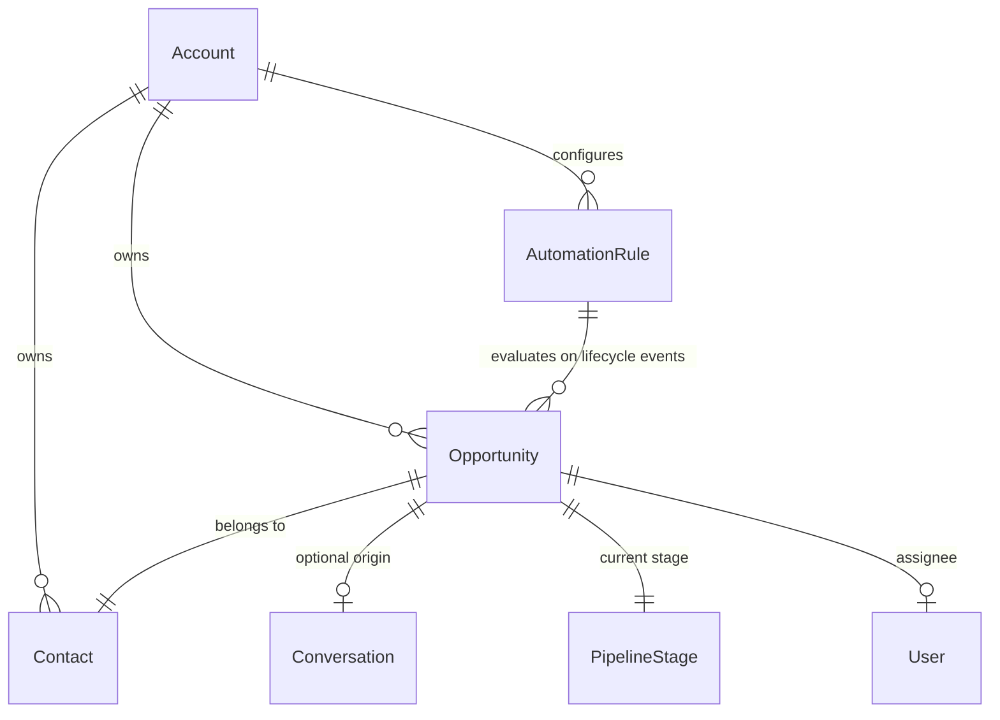

# Data Model: Opportunity-Triggered Automations

## Entities & Relationships



---

## 1. AutomationRule (`automation_rules` table)

No new database schema/columns required. Reuses existing `AutomationRule` JSONB structure for `conditions` and `actions`.

### Event Name / Triggers (`event_name` column)

| Event Key | Display (EN) | Display (pt-BR) | Trigger Moment |
|:---|:---|:---|:---|
| `opportunity_created` | Opportunity Created | Oportunidade Criada | Immediately after opportunity creation |
| `opportunity_updated` | Opportunity Updated | Oportunidade Atualizada | On general opportunity attributes update |
| `opportunity_stage_changed` | Opportunity Stage Changed | Etapa Alterada | Specifically when `pipeline_stage_id` changes |
| `opportunity_won` | Opportunity Won | Oportunidade Ganha | When status transitions to `won` |
| `opportunity_lost` | Opportunity Lost | Oportunidade Perdida | When status transitions to `lost` |
| `opportunity_reopened` | Opportunity Reopened | Oportunidade Reaberta | When status transitions from won/lost back to `open` |

### Condition Structure (`conditions` jsonb)

Example condition array:
```json
[
  {
    "attribute_key": "pipeline_stage_id",
    "filter_operator": "equal_to",
    "values": ["12"],
    "query_operator": "and"
  },
  {
    "attribute_key": "from_pipeline_stage_id",
    "filter_operator": "equal_to",
    "values": ["10"],
    "query_operator": "and"
  },
  {
    "attribute_key": "value",
    "filter_operator": "greater_than",
    "values": ["5000"],
    "query_operator": "and"
  },
  {
    "attribute_key": "custom_attribute_segment",
    "filter_operator": "equal_to",
    "values": ["enterprise"],
    "query_operator": "and"
  }
]
```

### Action Structure (`actions` jsonb)

Example actions array:
```json
[
  {
    "action_name": "update_opportunity_stage",
    "action_params": ["14"]
  },
  {
    "action_name": "update_opportunity_assignee",
    "action_params": ["5"]
  },
  {
    "action_name": "update_contact_custom_attribute",
    "action_params": [
      {
        "attribute_key": "vip_status",
        "attribute_value": "tier_1"
      }
    ]
  },
  {
    "action_name": "add_private_note",
    "action_params": ["Opportunity moved automatically to Negotiation by System Automation."]
  }
]
```

---

## 2. Supported Conditions Taxonomy

### A. Opportunity Conditions

| Field Key | Type | Operators | Description |
|:---|:---|:---|:---|
| `pipeline_id` | Select / Number | `equal_to`, `not_equal_to` | ID of the pipeline |
| `pipeline_stage_id` | Select / Number | `equal_to`, `not_equal_to` | Current/destination stage ID |
| `from_pipeline_stage_id` | Select / Number | `equal_to`, `not_equal_to` | Source stage ID before transition |
| `status` | Select / Text | `equal_to`, `not_equal_to` | `open`, `won`, `lost` |
| `value` | Number | `equal_to`, `not_equal_to`, `greater_than`, `less_than` | Opportunity monetary value |
| `assignee_id` | Select / Number | `equal_to`, `not_equal_to`, `is_present`, `is_not_present` | Assigned user ID |
| `loss_reason` | Text | `equal_to`, `not_equal_to`, `contains`, `is_present`, `is_not_present` | Stated reason for loss |
| `opportunity_custom_attributes` | Dynamic | `equal_to`, `not_equal_to`, `contains`, `is_present`, `is_not_present` | Account opportunity custom attributes |

### B. Contact Conditions

| Field Key | Type | Operators | Description |
|:---|:---|:---|:---|
| `contact_name` / `name` | Text | `equal_to`, `not_equal_to`, `contains` | Contact display name |
| `contact_email` / `email` | Text | `equal_to`, `not_equal_to`, `contains` | Contact email |
| `contact_phone_number` / `phone_number`| Text | `equal_to`, `not_equal_to`, `contains` | Contact phone number |
| `contact_company_name` / `company_name`| Text | `equal_to`, `not_equal_to`, `contains` | Contact company |
| `contact_custom_attributes` | Dynamic | `equal_to`, `not_equal_to`, `contains`, `is_present`, `is_not_present` | Contact custom attributes |

### C. Linked Conversation Conditions (evaluated only when conversation exists)

| Field Key | Type | Operators | Description |
|:---|:---|:---|:---|
| `inbox_id` | Select / Number | `equal_to`, `not_equal_to` | Linked conversation inbox |
| `conversation_status` / `status` | Select | `equal_to`, `not_equal_to` | `open`, `resolved`, `pending`, `snoozed` |
| `conversation_priority` / `priority` | Select | `equal_to`, `not_equal_to` | `urgent`, `high`, `medium`, `low` |
| `labels` | Multi-select | `equal_to`, `not_equal_to`, `is_present`, `is_not_present` | Conversation labels |
| `conversation_custom_attributes` | Dynamic | `equal_to`, `not_equal_to`, `contains`, `is_present`, `is_not_present` | Conversation custom attributes |

---

## 3. Supported Actions Taxonomy

| Action Key | Target Entity | Parameters Format | Description |
|:---|:---|:---|:---|
| `update_opportunity_stage` | Opportunity | `[stage_id]` | Moves opportunity to specified stage |
| `update_opportunity_assignee` | Opportunity | `[user_id]` | Assigns opportunity to user (or unassigns if nil) |
| `update_opportunity_status` | Opportunity | `[status]` | Updates status (`open`, `won`, `lost`) |
| `update_opportunity_value` | Opportunity | `[value]` | Updates deal monetary value |
| `update_opportunity_custom_attribute` | Opportunity | `[{ attribute_key, attribute_value }]` | Sets custom attribute value |
| `update_contact_attribute` | Contact | `[{ attribute_name, attribute_value }]` | Updates standard contact field |
| `update_contact_custom_attribute` | Contact | `[{ attribute_key, attribute_value }]` | Sets contact custom attribute |
| `send_message` | Conversation | `[message_text]` | Sends text message (System / Bot author) |
| `add_private_note` | Conversation | `[note_text]` | Adds private note (System / Bot author) |
| `add_label` | Conversation | `[[label1, label2]]` | Adds labels to conversation |
| `remove_label` | Conversation | `[[label1, label2]]` | Removes labels from conversation |
| `assign_agent` | Conversation | `[user_id]` | Assigns conversation to agent |
| `assign_team` | Conversation | `[team_id]` | Assigns conversation to team |
| `change_priority` | Conversation | `[priority]` | Changes conversation priority |
| `send_webhook_event` | Integration | `[webhook_url]` | Dispatches automation webhook |
| `send_email_to_team` | Team / Mailer | `[{ team_ids, message }]` | Dispatches team notification email |
