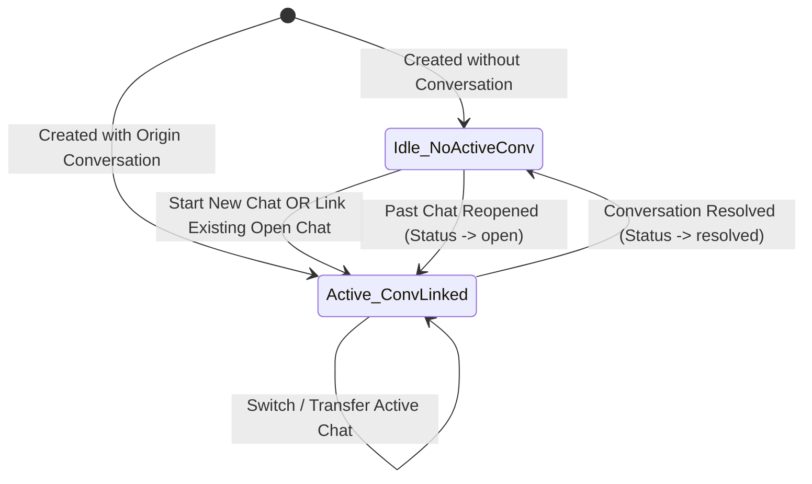

# Data Model: Multi-Conversation Opportunity Lifecycle

## Schema Changes

### 1. New Table: `ichatr_opportunity_conversations`

Stores the historical and ongoing association between opportunities and conversations.

| Column | Type | Nullable | Default | Description |
|---|---|---|---|---|
| `id` | `bigint` | No | Auto | Primary key |
| `account_id` | `bigint` | No | - | Foreign key to `accounts(id)` |
| `opportunity_id` | `bigint` | No | - | Foreign key to `ichatr_opportunities(id)` |
| `conversation_id` | `bigint` | No | - | Foreign key to `conversations(id)` |
| `is_origin` | `boolean` | No | `false` | True if this conversation originated the deal |
| `created_at` | `datetime` | No | - | Association timestamp |
| `updated_at` | `datetime` | No | - | Last update timestamp |

**Indexes**:
- `index_ichatr_opp_convs_on_opp_and_conv` (unique): `[:opportunity_id, :conversation_id]`
- `index_ichatr_opp_convs_on_account_and_conv`: `[:account_id, :conversation_id]`
- `index_ichatr_opp_convs_on_conversation_id`: `[:conversation_id]`

---

### 2. Table Modification: `ichatr_opportunities`

Adds explicit tracking for the single currently active open conversation slot.

| Column | Type | Nullable | Default | Description |
|---|---|---|---|---|
| `active_conversation_id` | `bigint` | Yes | `null` | Foreign key to `conversations(id)`. Set when conversation is open; cleared (`null`) when conversation is resolved. |

**Indexes**:
- `index_ichatr_opportunities_on_active_conversation_id`: `[:active_conversation_id]`, `where: "active_conversation_id IS NOT NULL"`

---

## Model Associations & Validations

### `OpportunityConversation` (`custom/app/models/opportunity_conversation.rb`)

```ruby
class OpportunityConversation < ApplicationRecord
  self.table_name = 'ichatr_opportunity_conversations'

  belongs_to :account
  belongs_to :opportunity, class_name: 'Opportunity'
  belongs_to :conversation, class_name: 'Conversation'

  validates :account_id, :opportunity_id, :conversation_id, presence: true
  validates :conversation_id, uniqueness: { scope: :opportunity_id }
end
```

### `Opportunity` (`custom/app/models/opportunity.rb`)

```ruby
class Opportunity < ApplicationRecord
  # ... existing belongs_to ...
  belongs_to :origin_conversation, class_name: 'Conversation', optional: true
  belongs_to :active_conversation, class_name: 'Conversation', optional: true
  
  has_many :opportunity_conversations, class_name: 'OpportunityConversation', dependent: :destroy
  has_many :conversations, through: :opportunity_conversations

  after_create :record_origin_conversation_link
  
  def attach_conversation!(conversation, set_active: true)
    transaction do
      opportunity_conversations.find_or_create_by!(
        account_id: account_id,
        conversation_id: conversation.id,
        is_origin: (conversation.id == origin_conversation_id)
      )
      update!(active_conversation: conversation) if set_active
    end
  end

  def detach_active_conversation!
    update!(active_conversation: nil)
  end

  def associated_conversations_json
    opportunity_conversations.includes(:conversation).order(created_at: :desc).map do |oc|
      conv = oc.conversation
      next unless conv

      {
        'id' => conv.id,
        'display_id' => conv.display_id,
        'status' => conv.status,
        'inbox_id' => conv.inbox_id,
        'inbox_name' => conv.inbox&.name,
        'channel_type' => conv.inbox&.channel_type,
        'created_at' => conv.created_at.to_i,
        'is_active' => (conv.id == active_conversation_id),
        'is_origin' => oc.is_origin
      }
    end.compact
  end
end
```

---

## State Transitions


