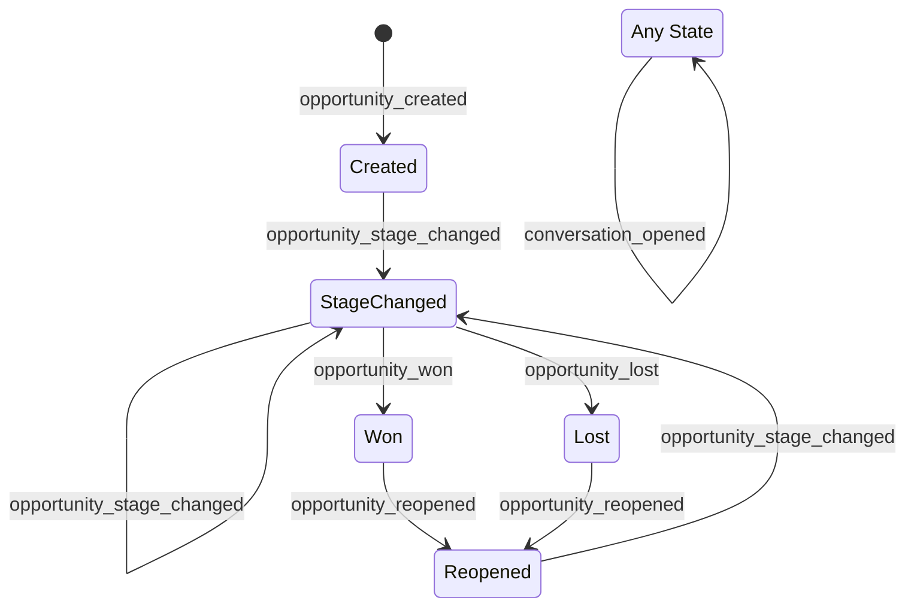

# Phase 1: Data Model & Schema Specification

**Feature**: Opportunity Activity Log  
**Branch**: `040-opportunity-activity-log`  
**Date**: 2026-08-17  

---

## 1. Database Table: `ichatr_opportunity_activities`

### Schema Definition

```sql
CREATE TABLE ichatr_opportunity_activities (
    id BIGSERIAL PRIMARY KEY,
    account_id BIGINT NOT NULL,
    opportunity_id BIGINT NOT NULL,
    event_type VARCHAR NOT NULL,
    actor_type VARCHAR,
    actor_id BIGINT,
    metadata JSONB NOT NULL DEFAULT '{}'::jsonb,
    occurred_at TIMESTAMP WITHOUT TIME ZONE NOT NULL,
    created_at TIMESTAMP WITHOUT TIME ZONE NOT NULL,
    updated_at TIMESTAMP WITHOUT TIME ZONE NOT NULL,
    CONSTRAINT fk_rails_ichatr_opp_act_account FOREIGN KEY (account_id) REFERENCES accounts(id) ON DELETE CASCADE,
    CONSTRAINT fk_rails_ichatr_opp_act_opportunity FOREIGN KEY (opportunity_id) REFERENCES ichatr_opportunities(id) ON DELETE CASCADE
);
```

### Table Indexes

| Index Name | Columns | Purpose |
|---|---|---|
| `index_ichatr_opp_activities_on_acc_and_opp_and_occurred` | `[account_id, opportunity_id, occurred_at DESC]` | Primary timeline retrieval query for an opportunity |
| `index_ichatr_opportunity_activities_on_account_id` | `[account_id]` | Tenant-level operations and cascade scoping |
| `index_ichatr_opportunity_activities_on_actor` | `[actor_type, actor_id]` | Polymorphic lookup for actor audits |

---

## 2. Domain Model: `OpportunityActivity`

**File**: `custom/app/models/opportunity_activity.rb`

```ruby
class OpportunityActivity < ApplicationRecord
  self.table_name = 'ichatr_opportunity_activities'

  belongs_to :account
  belongs_to :opportunity, class_name: 'Opportunity'
  belongs_to :actor, polymorphic: true, optional: true

  validates :account_id, :opportunity_id, :event_type, :occurred_at, presence: true

  enum event_type: {
    opportunity_created: 'opportunity_created',
    opportunity_stage_changed: 'opportunity_stage_changed',
    opportunity_won: 'opportunity_won',
    opportunity_lost: 'opportunity_lost',
    opportunity_reopened: 'opportunity_reopened',
    conversation_opened: 'conversation_opened'
  }

  def as_json(options = {})
    {
      id: id,
      event_type: event_type,
      metadata: metadata,
      occurred_at: occurred_at.to_i,
      actor: actor_json
    }
  end

  private

  def actor_json
    if actor.is_a?(User)
      { id: actor.id, type: 'user', name: actor.name }
    elsif actor.is_a?(AutomationRule)
      { id: actor.id, type: 'automation_rule', name: actor.name }
    else
      { type: 'system', name: 'System' }
    end
  end
end
```

---

## 3. Model Associations

### `Opportunity` (`custom/app/models/opportunity.rb`)
- Adds association:
  ```ruby
  has_many :activities, class_name: 'OpportunityActivity', dependent: :destroy
  ```

### `OpportunityConversation` (`custom/app/models/opportunity_conversation.rb`)
- Adds callback:
  ```ruby
  after_create :record_activity

  private

  def record_activity
    opportunity.activities.create!(
      account_id: account_id,
      event_type: 'conversation_opened',
      actor: Current.user,
      metadata: {
        conversation_id: conversation_id,
        conversation_display_id: conversation&.display_id,
        is_origin: (conversation_id == opportunity.origin_conversation_id)
      },
      occurred_at: Time.current
    )
  end
  ```

---

## 4. Metadata Payload Definitions per `event_type`

| `event_type` | `metadata` JSON Structure | Description |
|---|---|---|
| `opportunity_created` | `{}` | Initial deal creation |
| `opportunity_stage_changed` | `{"from_stage_id": 1, "to_stage_id": 2}` | Transition between pipeline stages |
| `opportunity_won` | `{"from_stage_id": 2, "approximate": false}` | Deal marked as won |
| `opportunity_lost` | `{"from_stage_id": 2, "lost_reason": "Price", "approximate": false}` | Deal marked as lost |
| `opportunity_reopened` | `{}` | Reopened from a closed state |
| `conversation_opened` | `{"conversation_id": 123, "conversation_display_id": 45, "is_origin": true}` | New conversation linked or opened |

---

## 5. State Transition & Event Capture Matrix


