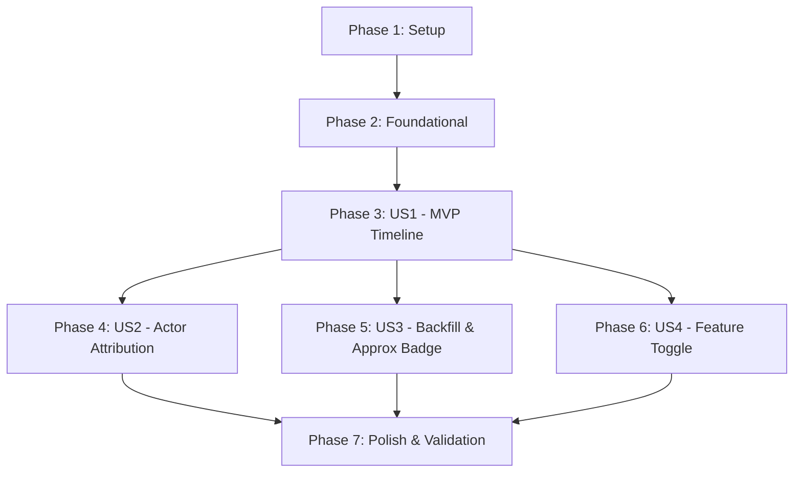

# Tasks: Opportunity Activity Log

**Input**: Design documents from `specs/040-opportunity-activity-log/`  
**Prerequisites**: `plan.md`, `spec.md`, `data-model.md`, `contracts/`, `research.md`, `quickstart.md`  

## Format: `- [ ] [ID] [P?] [Story?] Description with file path`

- **[P]**: Can run in parallel (different files, no blocking dependencies)
- **[Story]**: User story identifier (`[US1]`, `[US2]`, `[US3]`, `[US4]`)
- Every task includes explicit file paths

---

## Phase 1: Setup (Shared Infrastructure)

**Purpose**: Database migration and wiring infrastructure for the Opportunity Activity Log feature.

- [x] T001 Create database migration for `ichatr_opportunity_activities` table with composite indexes and foreign keys in `db/migrate/21260817140000_create_ichatr_opportunity_activities.rb`
- [x] T002 [P] Update route manifest in `bin/sync-custom-module-hooks` to include nested `activities` resource under `opportunities` in `config/routes.rb`
- [x] T003 Apply route manifest sync by running `bin/sync-custom-module-hooks` to update `config/routes.rb`

---

## Phase 2: Foundational (Blocking Prerequisites)

**Purpose**: Core model and event listening infrastructure required by all user stories.

**⚠️ CRITICAL**: Must complete before user story UI and lifecycle integrations begin.

- [x] T004 Create `OpportunityActivity` model with validations, enum, and `as_json` serialization in `custom/app/models/opportunity_activity.rb`
- [x] T005 [P] Add `has_many :activities, class_name: 'OpportunityActivity', dependent: :destroy` association to `custom/app/models/opportunity.rb`
- [x] T006 [P] Create `Custom::OpportunityActivityListener` handling `opportunity_created`, `opportunity_stage_changed`, `opportunity_won`, `opportunity_lost`, and `opportunity_reopened` in `custom/app/listeners/custom/opportunity_activity_listener.rb`
- [x] T007 Create `Custom::AsyncDispatcher` prepended module registering `Custom::OpportunityActivityListener` in `custom/app/dispatchers/custom/async_dispatcher.rb`
- [x] T008 Add `after_create :record_activity` callback to `custom/app/models/opportunity_conversation.rb` for conversation linkage capture
- [x] T009 Create `Api::V1::Accounts::Opportunities::ActivitiesController` with read-only `index` action scoped to account and opportunity in `custom/app/controllers/api/v1/accounts/opportunities/activities_controller.rb`

**Checkpoint**: Core data model, listener hooks, dispatcher registration, and API endpoint are functional.

---

## Phase 3: User Story 1 - Viewing Opportunity Activity Timeline in Conversation Drawer (Priority: P1) 🎯 MVP

**Goal**: Enable agents to view a chronological activity timeline for an opportunity inside the Kanban conversation drawer, seeing creation, stage moves, win/loss state, and conversation links.

**Independent Test**: Open conversation drawer for an opportunity on the Kanban board, click the activity toggle button, and verify the timeline renders all recorded lifecycle events in reverse chronological order with relative timestamps.

### Implementation for User Story 1

- [x] T010 [P] [US1] Add `getActivities(opportunityId)` API client method in `app/javascript/dashboard/api/opportunities.js`
- [x] T011 [P] [US1] Add `opportunityByConversationId` getter in `app/javascript/dashboard/store/modules/opportunities/getters.js`
- [x] T012 [P] [US1] Add `fetchActivities` action in `app/javascript/dashboard/store/modules/opportunities/actions.js`
- [x] T013 [P] [US1] Add base localization keys for activity timeline, event types, and empty state in `app/javascript/dashboard/i18n/locale/en/opportunities.json`
- [x] T014 [P] [US1] Add base localization keys for activity timeline, event types, and empty state in `app/javascript/dashboard/i18n/locale/pt_BR/opportunities.json`
- [x] T015 [US1] Create `OpportunityActivityLog.vue` timeline component with vertical scroll, event icons, stage names, and relative timestamps in `app/javascript/dashboard/components-next/Opportunities/OpportunityActivityLog.vue` (depends on T010, T012, T013, T014)
- [x] T016 [US1] Update `OpportunityConversationDrawer.vue` to add activity toggle button in `ButtonGroup`, manage `activeTab` state, and swap drawer body between conversation and `OpportunityActivityLog.vue` (depends on T011, T015)

**Checkpoint**: User Story 1 is fully functional — agents can toggle between conversation and activity log in the drawer.

---

## Phase 4: User Story 2 - Actor Attribution & Automated Action Identification (Priority: P2)

**Goal**: Transparently attribute events to the human user, automation rule, or system task that triggered them.

**Independent Test**: Perform actions as an agent, via an automation rule, and via a system job; verify timeline items display the user's name, rule's name, or "System" / "Sistema" fallback.

### Implementation for User Story 2

- [x] T017 [P] [US2] Add actor attribution localization strings ("by {name}", "System" fallback) in `app/javascript/dashboard/i18n/locale/en/opportunities.json`
- [x] T018 [P] [US2] Add actor attribution localization strings ("por {name}", "Sistema" fallback) in `app/javascript/dashboard/i18n/locale/pt_BR/opportunities.json`
- [x] T019 [US2] Update `OpportunityActivityLog.vue` to render localized actor name and actor type badge (user, automation rule, or system) (depends on T017, T018)

**Checkpoint**: User Stories 1 and 2 are functional — all timeline events clearly display who or what initiated each action.

---

## Phase 5: User Story 3 - Historical Data Backfill & Approximation Transparency (Priority: P3)

**Goal**: Backfill pre-existing opportunities with accurate creation, stage change, and conversation link history, and approximate terminal won/lost state timestamps with a visible caveat badge.

**Independent Test**: Run database migration; verify pre-existing opportunities have historical entries, and won/lost entries display an "(approximate)" / "(aproximado)" badge with tooltip.

### Implementation for User Story 3

- [x] T020 [US3] Implement SQL backfill logic in `up` method of `db/migrate/21260817140000_create_ichatr_opportunity_activities.rb` for creation, stage changes, conversation links, and approximate won/lost events
- [x] T021 [P] [US3] Add approximate caveat translation strings in `app/javascript/dashboard/i18n/locale/en/opportunities.json`
- [x] T022 [P] [US3] Add approximate caveat translation strings in `app/javascript/dashboard/i18n/locale/pt_BR/opportunities.json`
- [x] T023 [US3] Add caveat badge and tooltip in `OpportunityActivityLog.vue` when `metadata.approximate === true` (depends on T021, T022)

**Checkpoint**: Historical data is populated on migration and approximate entries render explicit honesty caveats in the UI.

---

## Phase 6: User Story 4 - Feature Toggle & Drawer Interface Integration (Priority: P4)

**Goal**: Cleanly gate the activity log toggle in the conversation drawer behind the account's Opportunities feature flag.

**Independent Test**: Disable Opportunities feature flag on account; verify activity toggle button does not render in the conversation drawer. Enable flag; verify button appears.

### Implementation for User Story 4

- [x] T024 [US4] Add `isOpportunitiesFeatureEnabled` computed check using `useAccount` and `FEATURE_FLAGS.OPPORTUNITIES` to gate button visibility in `app/javascript/dashboard/components-next/Opportunities/OpportunityConversationDrawer.vue`

**Checkpoint**: All 4 user stories are fully implemented and gated appropriately.

---

## Phase 7: Polish & Cross-Cutting Concerns

**Purpose**: Validation, linting, test suite execution, and documentation verification.

- [x] T025 [P] Audit custom module wiring hooks with `ruby bin/sync-custom-module-hooks --check && ruby bin/sync-custom-module-hooks --audit`
- [x] T026 [P] Run RuboCop on custom backend files (`custom/app/` and `db/migrate/`) via `bundle exec rubocop custom/ db/migrate/`
- [x] T027 [P] Run ESLint on modified frontend files via `pnpm eslint`
- [x] T028 Run full custom test suite via `docker compose exec rails env -u FRONTEND_URL RAILS_ENV=test bundle exec rspec custom/spec/`
- [x] T029 Execute end-to-end quickstart validation steps per `specs/040-opportunity-activity-log/quickstart.md`

---

## Dependencies & Execution Order

### Phase Dependencies

- **Setup (Phase 1)**: Can start immediately.
- **Foundational (Phase 2)**: Depends on Phase 1 (migration and routes). BLOCKS all User Stories.
- **User Story 1 (Phase 3)**: Depends on Phase 2. Delivers MVP.
- **User Story 2 (Phase 4)**: Depends on Phase 3 (`OpportunityActivityLog.vue` base component).
- **User Story 3 (Phase 5)**: Migration backfill SQL (T020) runs during Phase 1/2; UI badge (T023) depends on Phase 3.
- **User Story 4 (Phase 6)**: Depends on Phase 3 (`OpportunityConversationDrawer.vue`).
- **Polish (Phase 7)**: Depends on all user story implementations being complete.

---

## Parallel Opportunities

- **Setup & Foundational**:
  - `T002` (route manifest) can run in parallel with `T001` (migration).
  - `T005` (Opportunity association), `T006` (Wisper listener) can run in parallel with `T004` (`OpportunityActivity` model).
- **User Story 1**:
  - `T010` (API client), `T011` (getters), `T012` (actions), `T013` (en i18n), `T014` (pt-BR i18n) can all execute in parallel.
- **User Story 2 & 3**:
  - `T017`/`T018` (attribution i18n) and `T021`/`T022` (caveat i18n) can run in parallel.
- **Polish**:
  - `T025` (hooks audit), `T026` (RuboCop), and `T027` (ESLint) can execute concurrently.

---

## Implementation Strategy

### MVP First (User Story 1 Only)
1. Execute Phase 1 (Setup: Migration & Routes).
2. Execute Phase 2 (Foundational: Model, Listener, Dispatcher, Controller).
3. Execute Phase 3 (US1: API client, store module, timeline component, drawer toggle).
4. **Validate MVP**: Open drawer on Kanban board and verify lifecycle events display.

### Incremental Enhancements
1. Add User Story 2 (Actor attribution & system fallbacks).
2. Add User Story 3 (Historical data backfill & approximate caveat badges).
3. Add User Story 4 (Feature flag gating).
4. Run Polish checks (RuboCop, ESLint, RSpec, and quickstart scenarios).
