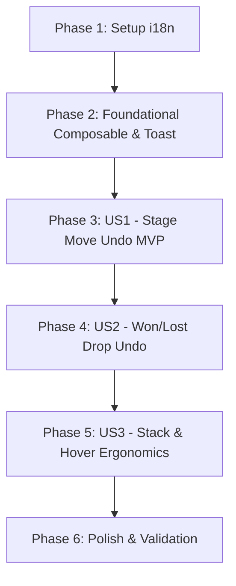

# Tasks: Kanban Drag Undo Toast

**Input**: Design documents from `specs/041-kanban-drag-undo-toast/`  
**Prerequisites**: `plan.md`, `spec.md`, `data-model.md`, `contracts/`, `research.md`, `quickstart.md`  

## Format: `- [ ] [ID] [P?] [Story?] Description with file path`

- **[P]**: Can run in parallel (different files, no blocking dependencies)
- **[Story]**: User story identifier (`[US1]`, `[US2]`, `[US3]`)
- Every task includes explicit file paths

---

## Phase 1: Setup (Shared Infrastructure)

**Purpose**: Localization strings and base setup for the Undo Toast feature.

- [x] T001 Add undo localization keys (`MOVED_TO_STAGE`, `MARKED_AS_WON`, `MARKED_AS_LOST`, `ACTION`) in `app/javascript/dashboard/i18n/locale/en/opportunities.json`
- [x] T002 [P] Add undo localization keys (`MOVED_TO_STAGE`, `MARKED_AS_WON`, `MARKED_AS_LOST`, `ACTION`) in `app/javascript/dashboard/i18n/locale/pt_BR/opportunities.json`

---

## Phase 2: Foundational (Blocking Prerequisites)

**Purpose**: Core composable and UI toast component required by all user stories.

**⚠️ CRITICAL**: Must complete before user story board integrations begin.

- [x] T003 Create `useKanbanUndoStack.js` composable with reactive `toasts` array, `pushToast`, `undoToast`, `dismissToast`, `pauseAll`, `resumeAll`, `clearAll`, 3-item FIFO cap, and wall-clock `remainingTime` tracking in `app/javascript/dashboard/components-next/Opportunities/composables/useKanbanUndoStack.js`
- [x] T004 [P] Create Vitest unit tests for `useKanbanUndoStack.js` covering push, 5s auto-dismiss, hover pause/resume, FIFO eviction at capacity 3, and unmount teardown in `app/javascript/dashboard/components-next/Opportunities/composables/specs/useKanbanUndoStack.spec.js`
- [x] T005 Create `KanbanUndoToast.vue` UI component with ARIA attributes (`role="status"`, `aria-live="polite"`), Tailwind styling, and `@mouseenter` / `@mouseleave` handlers in `app/javascript/dashboard/components-next/Opportunities/KanbanUndoToast.vue`

**Checkpoint**: Composable and UI toast component ready and independently unit-tested.

---

## Phase 3: User Story 1 - Undoing Stage-to-Stage Drag Moves (Priority: P1) 🎯 MVP

**Goal**: Allow users to undo accidental stage moves with exact stage and column position (`fromIndex`) restoration.

**Independent Test**: Drag an opportunity card from Stage A to Stage B; click "Undo" on the toast; verify the card returns to Stage A at its exact previous index.

### Implementation for User Story 1

- [x] T006 [P] [US1] Update `KanbanColumn.vue`'s `onChange` to include `fromIndex: event.removed.oldIndex` in `cardRemoved` event emit in `app/javascript/dashboard/components-next/Opportunities/KanbanColumn.vue`
- [x] T007 [US1] Update `KanbanBoard.vue` to capture `fromIndex` in `onCardRemoved` and store in `pendingMove` state in `app/javascript/dashboard/components-next/Opportunities/KanbanBoard.vue`
- [x] T008 [US1] Update `KanbanBoard.vue`'s `executeMoveCard` to push an undo toast upon successful move with an undo callback re-dispatching `opportunities/moveCard` with `fromStageId`/`toStageId` swapped and `toIndex: fromIndex` in `app/javascript/dashboard/components-next/Opportunities/KanbanBoard.vue`
- [x] T009 [US1] Mount `KanbanUndoToast.vue` in `KanbanBoard.vue` template, connecting toasts and undo/pause handlers from `useKanbanUndoStack` in `app/javascript/dashboard/components-next/Opportunities/KanbanBoard.vue`

**Checkpoint**: User Story 1 is fully functional — stage moves can be undone with 1 click.

---

## Phase 4: User Story 2 - Undoing Terminal Status Drops (Won/Lost) (Priority: P2)

**Goal**: Allow users to undo accidental drops onto the bottom Won or Lost status bar, reopening the opportunity to `status: 'open'`.

**Independent Test**: Drag an open card onto Won or Lost status drop zone; click "Undo"; verify the opportunity status returns to "open".

### Implementation for User Story 2

- [x] T010 [US2] Update `KanbanBoard.vue`'s `onStatusChanged` to push an undo toast upon successful status update with an undo callback re-dispatching `opportunities/setStatus` with `status: 'open'` in `app/javascript/dashboard/components-next/Opportunities/KanbanBoard.vue`

**Checkpoint**: User Stories 1 and 2 are functional — both stage moves and Won/Lost status drops can be undone.

---

## Phase 5: User Story 3 - Toast Stack Management, Pause on Hover & Auto-Dismiss (Priority: P3)

**Goal**: Ensure smooth multi-toast stacking (up to 3 items), pause-on-hover ergonomics, and clean unmount teardown.

**Independent Test**: Trigger 4 rapid card moves (verify oldest toast is evicted); hover cursor over toast stack (verify 5s countdown pauses and resumes accurately upon leave).

### Implementation for User Story 3

- [x] T011 [US3] Verify and wire `@mouseenter="pauseAll"` and `@mouseleave="resumeAll"` events on `KanbanUndoToast.vue` container in `app/javascript/dashboard/components-next/Opportunities/KanbanUndoToast.vue`
- [x] T012 [US3] Register `onBeforeUnmount` in `KanbanBoard.vue` / `useKanbanUndoStack.js` to ensure all active timer handles are cleared upon route change

**Checkpoint**: All 3 user stories are complete and tested.

---

## Phase 6: Polish & Cross-Cutting Concerns

**Purpose**: Validation, linting, test suite execution, and documentation verification.

- [x] T013 [P] Run Vitest unit tests via `docker compose exec vite pnpm test app/javascript/dashboard/components-next/Opportunities/composables/specs/useKanbanUndoStack.spec.js`
- [x] T014 [P] Run ESLint on modified frontend files via `docker compose exec vite pnpm eslint`
- [x] T015 Execute end-to-end quickstart validation scenarios per `specs/041-kanban-drag-undo-toast/quickstart.md`

---

## Dependencies & Execution Order

### Phase Dependencies

- **Setup (Phase 1)**: Can start immediately.
- **Foundational (Phase 2)**: Depends on Phase 1. BLOCKS all User Stories.
- **User Story 1 (Phase 3)**: Depends on Phase 2. Delivers MVP.
- **User Story 2 (Phase 4)**: Depends on Phase 2 & Phase 3.
- **User Story 3 (Phase 5)**: Depends on Phase 3 & Phase 4.
- **Polish (Phase 6)**: Depends on all user story implementations being complete.

---

## Parallel Opportunities

- **Setup**: `T001` (en i18n) and `T002` (pt_BR i18n) can run in parallel.
- **Foundational**: `T004` (Vitest tests) can run in parallel with `T003`/`T005` (composable & component).
- **User Story 1**: `T006` (`KanbanColumn.vue`) can run in parallel with `T007`/`T008` preparation.
- **Polish**: `T013` (Vitest) and `T014` (ESLint) can run in parallel.

---

## Implementation Strategy

### MVP First (User Story 1 Only)
1. Execute Phase 1 (i18n setup).
2. Execute Phase 2 (Foundational composable & toast component).
3. Execute Phase 3 (US1: `fromIndex` threading, board stage move undo toast).
4. **Validate MVP**: Drag card between columns and verify undo restores exact stage and position.

### Incremental Enhancements
1. Add User Story 2 (Won/Lost drop undo).
2. Add User Story 3 (Stack management & hover pause refinements).
3. Run Polish checks (Vitest unit tests, ESLint, and manual quickstart scenarios).
