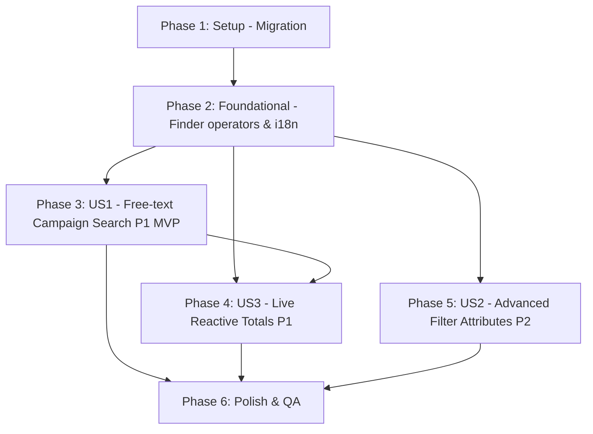

# Tasks: Funnel Search Filters and Live Totals

**Input**: Design documents from `specs/042-funnel-search-filters-and-live-totals/`  
**Prerequisites**: `plan.md`, `spec.md`, `data-model.md`, `contracts/`, `research.md`, `quickstart.md`  

## Format: `- [ ] [ID] [P?] [Story?] Description with file path`

- **[P]**: Can run in parallel (different files, no blocking dependencies)
- **[Story]**: User story identifier (`[US1]`, `[US2]`, `[US3]`)
- Every task includes explicit file paths

---

## Phase 1: Setup (Shared Infrastructure & Migration)

**Purpose**: Database migration creating the trigram GIN index on `ichatr_opportunities`.

- [x] T001 Create GIN trigram index migration `index_ichatr_opportunities_on_title_and_campaign_trgm` on columns `(title, campaign_name, campaign_adset_name, campaign_ad_name)` in `db/migrate/21260902000000_add_trigram_search_index_to_ichatr_opportunities.rb`

---

## Phase 2: Foundational (Blocking Prerequisites)

**Purpose**: Core finder operators and localization strings required by User Stories.

**⚠️ CRITICAL**: Must complete before user story filter configurations and UI updates begin.

- [x] T002 Add `contains` and `does_not_contain` operators with `apply_contains_filter` helper using `sanitize_sql_like` to `apply_standard_column_filter` in `app/finders/opportunities_filter.rb`
- [x] T003 [P] Add filter attribute translation keys (`OPPORTUNITY_CAMPAIGN_NAME`, `OPPORTUNITY_CAMPAIGN_ADSET_NAME`, `OPPORTUNITY_CAMPAIGN_AD_NAME`, `OPPORTUNITY_CAMPAIGN_PLATFORM`, `OPPORTUNITY_CREATED_AT`, `OPPORTUNITY_UPDATED_AT`) in `app/javascript/dashboard/i18n/locale/en/advancedFilters.json`
- [x] T004 [P] Add Portuguese filter attribute translation keys (`OPPORTUNITY_CAMPAIGN_NAME`, `OPPORTUNITY_CAMPAIGN_ADSET_NAME`, `OPPORTUNITY_CAMPAIGN_AD_NAME`, `OPPORTUNITY_CAMPAIGN_PLATFORM`, `OPPORTUNITY_CREATED_AT`, `OPPORTUNITY_UPDATED_AT`) in `app/javascript/dashboard/i18n/locale/pt_BR/advancedFilters.json`

**Checkpoint**: Foundational finder operators and i18n keys in place.

---

## Phase 3: User Story 1 - Find opportunities by campaign via search (Priority: P1) 🎯 MVP

**Goal**: Allow operators to find opportunities by typing campaign name, ad group, ad name, or platform into the Kanban search box.

**Independent Test**: Create an opportunity with campaign attribution data (`campaign_name`, `campaign_adset_name`, `campaign_ad_name`, `campaign_platform`); type partial strings into the Kanban search input or `GET /api/v1/accounts/{account_id}/opportunities?q=...`; verify the matching opportunity is returned case-insensitively while title/contact search remains functional.

### Implementation for User Story 1

- [x] T005 [US1] Update `apply_search` in `app/finders/opportunities_filter.rb` to search across `title`, `contacts.name`, `campaign_name`, `campaign_adset_name`, `campaign_ad_name`, and `campaign_platform` with `ILIKE`
- [x] T006 [P] [US1] Create RSpec unit tests covering free-text search across title, contact name, campaign name, adset name, ad name, and platform in `spec/finders/opportunities_filter_spec.rb`, including a regression assertion that a representative search's query plan (`explain`) uses a `Bitmap Index Scan` on `index_ichatr_opportunities_on_title_and_campaign_trgm` (guards the SC-003 <1s target against the index being dropped or misapplied)

**Checkpoint**: User Story 1 is functional — free-text search matches all campaign attribution fields with high performance.

---

## Phase 4: User Story 3 - Totals stay accurate as search, filters, and status change (Priority: P1)

**Goal**: Ensure header total counts/values and per-column badges accurately reflect the currently visible search term, advanced filters, and status scope (open/won/lost/all) in real time.

**Independent Test**: Load the Kanban board, note totals; switch status view to Won/Lost/All, type a search query, or apply a filter; verify header total lead count and value, as well as each column's badge, update immediately without reloading the page.

### Implementation for User Story 3

- [x] T007 [US3] Refactor `PipelineStageAggregatesController#index` in `custom/app/controllers/api/v1/accounts/pipeline_stage_aggregates_controller.rb` to execute `OpportunitiesFilter.new(Current.account.opportunities.where(pipeline_stage_id: stage_ids), params).perform.reorder(nil)`, group counts and value sums by `pipeline_stage_id`, and return `{ pipeline_stage_id, count, value_sum }`
- [x] T008 [P] [US3] Create RSpec request spec testing `GET /api/v1/accounts/{account_id}/pipeline_stage_aggregates` with default open scope, `q` search param, `status` param (`won`/`lost`/`all`), `payload` filters, and 422 on blank `stage_ids` in `spec/requests/api/v1/accounts/pipeline_stage_aggregates_controller_spec.rb`
- [x] T009 [US3] Update `get(stageIds, filters)` in `app/javascript/dashboard/api/pipelineStageAggregates.js` to serialize `q`, `status`, `payload`, and `custom_attributes` query params alongside `stage_ids[]`
- [x] T010 [US3] Update `fetchAggregates` action in `app/javascript/dashboard/store/modules/pipelineStages/actions.js` to pass `filters` to `pipelineStageAggregatesAPI.get` and map response `count` / `value_sum` to `SET_STAGE_AGGREGATES`
- [x] T011 [US3] Update `SET_STAGE_AGGREGATES` mutation in `app/javascript/dashboard/store/modules/pipelineStages/mutations.js` to store `count` and `value_sum` on `state.byId[stageId]` (renamed from `open_count` / `open_value_sum`)
- [x] T012 [P] [US3] Update `displayTotal` computed property in `app/javascript/dashboard/components-next/Opportunities/KanbanColumn.vue` to read `stage.count` and `stage.value_sum`
- [x] T013 [P] [US3] Update `totalLeadCount` and `totalValue` computed properties in `app/javascript/dashboard/routes/dashboard/opportunities/components/OpportunitiesViewBar.vue` to calculate sums using `stage.count` and `stage.value_sum`
- [x] T014 [US3] Add reactive `watch(filters, ...)` in `app/javascript/dashboard/routes/dashboard/opportunities/Index.vue` to re-dispatch `pipelineStages/fetchAggregates` whenever `filters` change

**Checkpoint**: User Story 3 is complete — Kanban header and column totals reactively update across search, filter, and status scope changes.

---

## Phase 5: User Story 2 - Filter opportunities by campaign attribution and date (Priority: P2)

**Goal**: Expose campaign text fields (`contains`/`does_not_contain`), platform dropdown (`equal_to`/`not_equal_to`), and creation/update dates in the advanced filter builder.

**Independent Test**: Open the advanced filter modal on the Kanban board; add filter conditions for campaign name (contains), platform (equals Facebook/Instagram), or created_at (is greater than); verify results and aggregates filter correctly.

### Implementation for User Story 2

- [x] T015 [US2] Register `campaign_name`, `campaign_adset_name`, `campaign_ad_name` (plainText with containmentOperators), `campaign_platform` (searchSelect with Facebook/Instagram options and equalityOperators), `created_at`, and `updated_at` (date with dateOperators) in `app/javascript/dashboard/components-next/filter/opportunityProvider.js`
- [x] T016 [US2] Add RSpec test cases for standard column `contains`/`does_not_contain` filter operators, platform equality, and `created_at`/`updated_at` date comparisons in `spec/finders/opportunities_filter_spec.rb`

**Checkpoint**: All user stories (US1, US2, US3) are fully implemented and unit/request tested. This phase only depends on Phase 2 (T002's `contains`/`does_not_contain` operator) — it does not require Phase 3 or Phase 4 and can be built/delivered in parallel with either.

---

## Phase 6: Polish & Cross-Cutting Concerns

**Purpose**: Full automated verification, linting, and regression checks.

- [x] T017 [P] Run backend RSpec test suite via `docker compose exec rails env -u FRONTEND_URL RAILS_ENV=test bundle exec rspec spec/finders/opportunities_filter_spec.rb spec/requests/api/v1/accounts/pipeline_stage_aggregates_controller_spec.rb`
- [x] T018 [P] Run backend RuboCop check via `docker compose exec rails bundle exec rubocop`
- [x] T019 [P] Run frontend test suite via `docker compose exec vite pnpm test`
- [x] T020 [P] Run frontend ESLint check via `docker compose exec vite pnpm eslint`
- [x] T021 Execute quickstart verification scenarios per `specs/042-funnel-search-filters-and-live-totals/quickstart.md`

---

## Dependencies & Execution Order

### Phase Dependencies

- **Phase 1 (Setup)**: Can start immediately.
- **Phase 2 (Foundational)**: Depends on Phase 1. BLOCKS all User Stories.
- **Phase 3 (User Story 1 - P1 MVP)**: Depends on Phase 1 & Phase 2.
- **Phase 4 (User Story 3 - P1 Totals)**: Depends on Phase 2 & Phase 3 (benefits from search finder extensions).
- **Phase 5 (User Story 2 - P2 Filters)**: Depends on Phase 2 only — independently testable from search (US1) or totals refresh (US3), per spec.md's Independent Test for this story. Sequenced after US1/US3 above purely by priority (P1 > P2), not by a technical dependency; it may be built/delivered in parallel with either.
- **Phase 6 (Polish)**: Depends on Phases 1–5.

### User Story Dependency Graph

---

## Parallel Execution Opportunities

### Per-Story Parallelism

- **Phase 1 & 2**:
  - T003 (`en/advancedFilters.json`) and T004 (`pt_BR/advancedFilters.json`) can be executed in parallel.
- **Phase 3 (US1)**:
  - T005 (`opportunities_filter.rb`) and T006 (`opportunities_filter_spec.rb`) can be developed concurrently / in TDD workflow.
- **Phase 4 (US3)**:
  - T007 (`pipeline_stage_aggregates_controller.rb`) and T008 (`pipeline_stage_aggregates_controller_spec.rb`) can be developed concurrently.
  - T012 (`KanbanColumn.vue`) and T013 (`OpportunitiesViewBar.vue`) can be updated in parallel once store mutations (T011) are defined.
- **Phase 5 (US2)**: Only depends on Phase 2 (T002) — can be developed in parallel with Phase 3 and/or Phase 4 by a separate contributor, not just after them.
- **Phase 6 (Polish)**:
  - T017 (RSpec), T018 (RuboCop), T019 (Jest/Vitest), and T020 (ESLint) can be executed in parallel.

---

## Implementation Strategy & MVP

- **MVP Scope**: **Phase 1 (Setup) + Phase 2 (Foundational) + Phase 3 (User Story 1)** delivers the top-requested feature: instant free-text search across Meta campaign attribution columns backed by the new GIN trigram index.
- **Incremental Delivery**:
  1. Deliver MVP (US1: Campaign Search) with index migration.
  2. Deliver US3 (Live Reactive Totals) to fix stale aggregate badges and align with search/filter/status updates.
  3. Deliver US2 (Advanced Filter Attributes) to enable precise filtering on ad groups, platform, and date ranges.
  4. Final Polish, linting, and regression testing.
