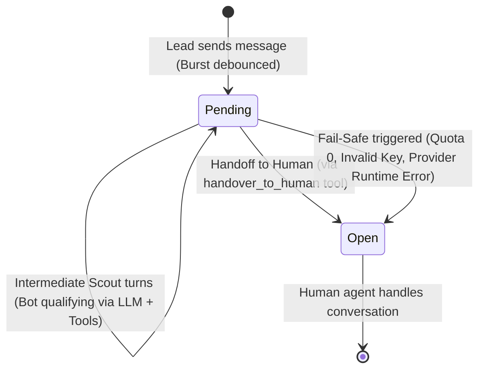

# Data Model: Scout Native Tools & Message Pipeline

**Branch**: `043-scout-native-tools-pipeline` | **Date**: 2026-08-19 | **Spec**: [spec.md](file:///home/matias/dev/chatwoot/specs/043-scout-native-tools-pipeline/spec.md)

## Entities

### 1. Scout (Extended)

Account-scoped AI agent configuration. Table: `ichatr_scouts`.

| Field | Type | Modifiers / Default | Description |
|-------|------|---------------------|-------------|
| `id` | bigint | PK, auto-increment | |
| `account_id` | bigint | FK → `accounts`, NOT NULL | Account ownership (indexed) |
| `name` | string | NOT NULL | Human-readable Scout name |
| `persona` | text | nullable | System prompt instructions / persona guidelines (aliased as `system_prompt`) |
| `provider` | integer | NOT NULL, enum | `enum :provider, { gemini: 0, openai: 1, anthropic: 2 }` |
| `model_name` | string | NOT NULL | LLM model identifier (e.g. `gemini-2.0-flash`, `gpt-4o-mini`) |
| `api_key_override` | text | encrypted, nullable | BYOK API key (encrypted with `encrypts`) |
| `default_pipeline_stage_id` | bigint | FK → `ichatr_pipeline_stages`, nullable | Default triage stage for new opportunities |
| `qualified_stage_id` | bigint | FK → `ichatr_pipeline_stages`, nullable | Stage destination when lead is qualified |
| `unqualified_stage_id` | bigint | FK → `ichatr_pipeline_stages`, nullable | Stage destination when lead is disqualified/lost |
| `handover_team_id` | bigint | FK → `teams`, nullable | Default team for human handoff |
| `debounce_delay_seconds` | integer | NOT NULL, default: `5` | Sliding debounce delay in seconds |
| `product_catalog` | jsonb | NOT NULL, default: `{}` | Structured products, offers, pricing data |
| `knowledge_sources` | jsonb | NOT NULL, default: `{}` | FAQs, links, documentation metadata |
| `responses_quota` | integer | NOT NULL, default: `-1` | `-1` = unlimited quota, `>= 0` = quota limit |
| `responses_consumed` | integer | NOT NULL, default: `0` | Counter of bot turns consumed |
| `enabled` | boolean | NOT NULL, default: `true` | Active toggle |
| `feature_memory` | boolean | NOT NULL, default: `true` | When true, generates summarizing contact notes on handoff |
| `created_at` / `updated_at` | timestamps | NOT NULL | |

#### Validations
- `account_id`, `name`, `provider`, `model_name` presence.
- `debounce_delay_seconds`: integer, `>= 1`.
- `responses_quota`: integer, `>= -1`.
- `responses_consumed`: integer, `>= 0`.

#### Associations
- `belongs_to :account`
- `belongs_to :default_pipeline_stage, class_name: 'PipelineStage', optional: true`
- `belongs_to :qualified_stage, class_name: 'PipelineStage', optional: true`
- `belongs_to :unqualified_stage, class_name: 'PipelineStage', optional: true`
- `belongs_to :handover_team, class_name: 'Team', optional: true`
- `has_many :scout_inboxes, class_name: 'ScoutInbox', dependent: :destroy`
- `has_many :inboxes, through: :scout_inboxes`

#### Key Methods
- `quota_available?`: `responses_quota == -1 || responses_consumed < responses_quota`
- `system_prompt`: alias for `persona`
- `llm_chat`: returns configured `RubyLLM` chat context.

---

### 2. ScoutInbox (Pivot Entity, Existing)

Table: `ichatr_scout_inboxes`. Links an `Inbox` to a single `Scout`.

| Field | Type | Modifiers / Default | Description |
|-------|------|---------------------|-------------|
| `id` | bigint | PK, auto-increment | |
| `scout_id` | bigint | FK → `ichatr_scouts`, NOT NULL | `on_delete: :cascade` |
| `inbox_id` | bigint | FK → `inboxes`, NOT NULL, UNIQUE | One Scout per Inbox |
| `created_at` / `updated_at` | timestamps | NOT NULL | |

#### Associations
- `belongs_to :scout`
- `belongs_to :inbox`

---

### 3. Opportunity (Referral Attributed, Existing)

Table: `ichatr_opportunities`.

| Field | Type | Description |
|-------|------|-------------|
| `id` | bigint | PK |
| `account_id` | bigint | FK → `accounts` |
| `contact_id` | bigint | FK → `contacts` |
| `pipeline_stage_id` | bigint | FK → `ichatr_pipeline_stages` |
| `origin_conversation_id` | bigint | FK → `conversations` (links Opportunity to qualifying conversation) |
| `title` | string | Opportunity title |
| `value` | numeric | Estimated deal value |
| `status` | integer | `open: 0`, `won: 1`, `lost: 2` |
| `lost_reason` | string | Disqualification reason populated by `move_opportunity_stage` |
| `campaign_platform` | string | e.g. `'facebook'`, `'instagram'` (populated from referral message) |
| `campaign_source_id` | string | Ad / Post ID |
| `campaign_headline` | string | Ad creative headline |
| `campaign_body` | string | Ad creative body |
| `campaign_thumbnail_url`| string | Creative thumbnail URL |
| `custom_attributes` | jsonb | Qualification metadata (budget, pain, timing, etc.) |

---

## In-Memory / Transient State (Redis Buffer)

| Key Pattern | Type | TTL | Purpose |
|-------------|------|-----|---------|
| `scout:debounce:conversation:<id>:last_message_at` | string (float timestamp) | 1 hour | Stores epoch timestamp of the most recent incoming message in the burst. |
| `scout:debounce:conversation:<id>:enqueued` | boolean | 1 hour | NX lock ensuring only one `ProcessMessageJob` is actively scheduled for the burst. |

---

## State Transition Rules

### Conversation Status Flow

1. **Intermediate Qualifying Turn**:
   - `conversation.status` remains `:pending`.
   - Outgoing message created.
   - `scout.responses_consumed` incremented by 1.
   - `feature_memory` contact note is **NOT** created.
2. **Human Handoff Turn (`handover_to_human`)**:
   - `conversation.status` transitions from `:pending` to `:open` via `conversation.bot_handoff!`.
   - `conversation.assignee_id` / `conversation.team_id` updated if provided.
   - If `scout.feature_memory` is true: `Captain::Llm::ContactNotesService` generates and writes contact notes.
3. **Fail-Safe Handoff Turn**:
   - Triggered on pre-call quota/API-key check failure or unhandled runtime error.
   - Verified `conversation.pending?`.
   - `conversation.status` transitions to `:open` via `conversation.bot_handoff!`.
   - Private alert note created.
   - If `scout.feature_memory` is true: `Captain::Llm::ContactNotesService` generates and writes contact notes.
