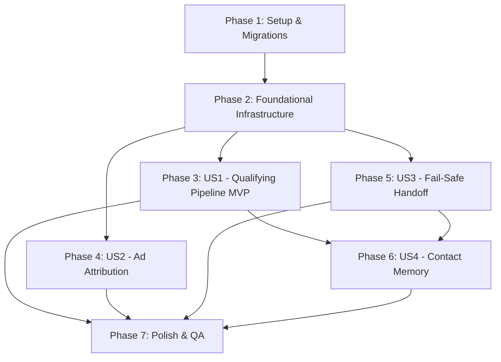

# Tasks: Scout Native Tools & Message Pipeline

**Input**: Design documents from `/specs/043-scout-native-tools-pipeline/` (`plan.md`, `spec.md`, `research.md`, `data-model.md`, `contracts/`, `quickstart.md`)  
**Feature Branch**: `043-scout-native-tools-pipeline`  
**Prerequisites**: Phase 1 (`specs/042-scout-core-data-model/`) complete

---

## Phase 1: Setup & Migrations (Shared Infrastructure)

**Purpose**: Database schema extensions and core model associations for the Scout pipeline.

- [x] T001 Create migration `db/migrate/21260819000005_add_pipeline_fields_to_ichatr_scouts.rb` with `debounce_delay_seconds`, `feature_memory`, `qualified_stage_id`, `unqualified_stage_id`, `handover_team_id`, `product_catalog`, and `knowledge_sources`
- [x] T002 Execute database migration in container environment via `db/migrate/21260819000005_add_pipeline_fields_to_ichatr_scouts.rb`
- [x] T003 [P] Update Scout model in `custom/app/models/scout.rb` with associations (`qualified_stage`, `unqualified_stage`, `handover_team`), `system_prompt` alias, and numericality validation for `debounce_delay_seconds`
- [x] T004 [P] Create custom Inbox concern in `custom/app/models/custom/concerns/inbox.rb` with `has_one :scout_inbox` and `has_one :scout, through: :scout_inbox`

---

## Phase 2: Foundational Infrastructure (Blocking Prerequisites)

**Purpose**: Core base tool DSL, sliding debounce buffer, and event listener dispatcher wiring.

- [x] T005 [P] Implement base tool class `custom/app/services/custom/scout/tools/base_tool.rb` inheriting from `RubyLLM::Tool` with `scout`, `conversation`, `account`, and `contact` accessors
- [x] T006 [P] Implement message event listener `custom/app/listeners/custom/scout_listener.rb` to handle `message_created` events for WhatsApp inboxes with enabled Scouts and pending conversations
- [x] T007 Hook `Custom::ScoutListener` into dispatcher in `custom/app/dispatchers/custom/async_dispatcher.rb`
- [x] T008 Implement sliding debounce job `custom/app/jobs/custom/scout/process_message_job.rb` with Redis timestamp check (`last_message_at`), NX lock (`enqueued`), and automatic Sidekiq rescheduling

**Checkpoint**: Foundational pipeline ready — user story implementations can now begin.

---

## Phase 3: User Story 1 - Qualifying Conversation Flows End-to-End (Priority: P1) 🎯 MVP

**Goal**: Incoming WhatsApp message bursts are debounced, turn context is assembled with multimodal/out-of-office awareness, native tools execute actions, bot replies are sent, and `responses_consumed` is incremented.

**Independent Test**: Send a burst of WhatsApp messages to a Scout-enabled inbox; verify sliding debounce fires once after the burst, builds context, executes enabled native tools, posts one outgoing reply, and increments `responses_consumed`.

- [x] T009 [P] [US1] Implement private note native tool in `custom/app/services/custom/scout/tools/create_private_note.rb` (`create_private_note`)
- [x] T010 [P] [US1] Implement contact update native tool in `custom/app/services/custom/scout/tools/update_contact.rb` (`update_contact`)
- [x] T011 [P] [US1] Implement stage move native tool in `custom/app/services/custom/scout/tools/move_opportunity_stage.rb` (`move_opportunity_stage` with `lost_reason` persistence and graceful not-found handling)
- [x] T012 [P] [US1] Implement human handoff native tool in `custom/app/services/custom/scout/tools/handover_to_human.rb` (`handover_to_human` with team fallback, `bot_handoff!`, and bot response suppression)
- [x] T013 [US1] Implement agent turn runner `custom/app/services/custom/scout/agent_runner.rb` with context building (persona/catalog/knowledge/contact notes), out-of-office prompt injection, multimodal attachment extraction, `RubyLLM` chat execution with tools, outgoing reply dispatch via `Messages::MessageBuilder`, and `responses_consumed` counter increment
- [x] T014 [US1] Connect `Custom::Scout::ProcessMessageJob` in `custom/app/jobs/custom/scout/process_message_job.rb` to trigger `Custom::Scout::AgentRunner#perform` when debounce window closes

**Checkpoint**: At this point, User Story 1 is fully functional and testable as an MVP.

---

## Phase 4: User Story 2 - Ad Attribution Preservation (Meta CTWA / Referral) (Priority: P1)

**Goal**: Opportunities created or updated by Scout derive campaign attribution (platform, source ID, headline, body, thumbnail) from the conversation's first referral message and preserve it across subsequent qualification turns.

**Independent Test**: Send an incoming message carrying a CTWA referral payload, trigger `manage_opportunity`, and verify the resulting Opportunity has matching campaign attribution fields that remain untouched on later updates.

- [x] T015 [US2] Implement opportunity management native tool in `custom/app/services/custom/scout/tools/manage_opportunity.rb` (`manage_opportunity`) with `create` and `update` actions, delegating attribution to `Custom::ReferralAttributionService.process` on create and performing non-destructive custom attributes merging on update
- [x] T016 [US2] Register `ManageOpportunity` in `Custom::Scout::AgentRunner#build_tools` in `custom/app/services/custom/scout/agent_runner.rb`

**Checkpoint**: User Stories 1 and 2 are fully integrated and independently verified.

---

## Phase 5: User Story 3 - Fail-Safe Handoff Guarantee (Priority: P1)

**Goal**: Guarantee that no conversation remains stuck in `pending` when quota is exhausted, API keys fail, or runtime provider errors occur, by transitioning to `open` and posting an alert private note.

**Independent Test**: Force `responses_quota: 0`, provide an invalid API key, or mock an LLM 500 error; verify the conversation transitions to `open`, a yellow alert note is posted, and the LLM call is safely bypassed or rescued.

- [x] T017 [US3] Implement pre-call check gate (`scout.quota_available?` and API key presence) in `custom/app/services/custom/scout/agent_runner.rb`
- [x] T018 [US3] Implement `perform_fail_safe_handoff` in `custom/app/services/custom/scout/agent_runner.rb` (verifies `conversation.pending?`, invokes `conversation.bot_handoff!`, posts alert private note via `Messages::MessageBuilder`, and captures exception in `ChatwootExceptionTracker`)
- [x] T019 [US3] Wrap LLM response generation in `rescue StandardError => e` inside `custom/app/services/custom/scout/agent_runner.rb` to execute `perform_fail_safe_handoff` on any provider/network/runtime error

**Checkpoint**: Fail-Safe guarantee active across pre-call checks and runtime error paths.

---

## Phase 6: User Story 4 - Contact Memory Generation at Handoff (Priority: P2)

**Goal**: Summarize qualification context and persist contact notes at handoff when `feature_memory: true`, omitting them when disabled or on intermediate turns.

**Independent Test**: Execute a handoff (via tool or Fail-Safe) with `feature_memory: true` and verify a new note is created on `contact.notes`; repeat with `feature_memory: false` and verify no note is created.

- [x] T020 [US4] Implement contact memory generator `custom/app/services/custom/scout/contact_notes_service.rb` (formats prompt using `contact.to_llm_text` and `conversation.to_llm_text`, queries `scout.llm_chat` for structured JSON notes, and writes `contact.notes.create!`)
- [x] T021 [US4] Trigger `Custom::Scout::ContactNotesService` conditionally when `scout.feature_memory?` in `custom/app/services/custom/scout/tools/handover_to_human.rb` and `custom/app/services/custom/scout/agent_runner.rb#perform_fail_safe_handoff`
- [x] T022 [US4] Verify intermediate qualifying turns in `custom/app/services/custom/scout/agent_runner.rb` skip contact note generation

**Checkpoint**: All 4 user stories are functional and meet acceptance criteria.

---

## Phase 7: Polish & Cross-Cutting Quality Assurance

**Purpose**: Test coverage, lint compliance, hook synchronization, and quickstart validation.

- [x] T023 [P] Create unit specs for extended Scout model in `custom/spec/models/scout_spec.rb` and `custom/spec/models/scout_inbox_spec.rb`
- [x] T024 [P] Create unit specs for native tools in `custom/spec/services/custom/scout/tools/manage_opportunity_spec.rb`, `move_opportunity_stage_spec.rb`, `update_contact_spec.rb`, `create_private_note_spec.rb`, and `handover_to_human_spec.rb`
- [x] T025 [P] Create unit specs for `custom/spec/services/custom/scout/agent_runner_spec.rb`, `custom/spec/services/custom/scout/contact_notes_service_spec.rb`, and `custom/spec/jobs/custom/scout/process_message_job_spec.rb`
- [x] T026 [P] Create listener spec in `custom/spec/listeners/custom/scout_listener_spec.rb`
- [x] T027 Validate module wiring with `bin/sync-custom-module-hooks --check && bin/sync-custom-module-hooks --audit`
- [x] T028 Run RuboCop auto-formatting and validation on custom codebase via `bundle exec rubocop custom/`
- [x] T029 Execute end-to-end quickstart validation scenarios from `specs/043-scout-native-tools-pipeline/quickstart.md`

---

## Dependencies & Execution Order

### Phase Dependencies

### User Story Dependencies

1. **Foundational (Phase 2)**: Blocks all user stories.
2. **User Story 1 (P1 - MVP)**: Depends only on Foundational (Phase 2).
3. **User Story 2 (P1)**: Depends on Foundational; integrates with `AgentRunner` from US1.
4. **User Story 3 (P1)**: Depends on Foundational and `AgentRunner` from US1.
5. **User Story 4 (P2)**: Depends on `HandoverToHuman` (US1) and Fail-Safe (US3).
6. **Polish (Phase 7)**: Depends on all user stories being complete.

---

## Parallel Execution Opportunities

- **Phase 1**: `T003` (Scout model) and `T004` (Inbox concern) can run in parallel.
- **Phase 2**: `T005` (BaseTool) and `T006` (ScoutListener) can run in parallel.
- **Phase 3**: `T009` (PrivateNote), `T010` (UpdateContact), `T011` (MoveStage), and `T012` (Handover) can all be implemented in parallel.
- **Phase 7**: `T023`, `T024`, `T025`, and `T026` test suites can be written in parallel.

---

## Implementation Strategy

### MVP Milestone (User Story 1)
1. Complete Phase 1 (Migrations & Model attributes).
2. Complete Phase 2 (Foundational listener, debounce job, and base tool).
3. Complete Phase 3 (Native tools and AgentRunner).
4. **Validate MVP**: Test message burst debounce, tool execution, and outgoing reply.

### Incremental Delivery (Stories 2, 3, 4)
1. Add US2: Campaign Attribution Preservation (`manage_opportunity` ad fields).
2. Add US3: Fail-Safe Guarantee (pre-call checks + runtime exception wrapper).
3. Add US4: Contact Memory Generation on Handoff (`Custom::Scout::ContactNotesService`).
4. Complete Phase 7: RSpec test suite, RuboCop clean pass, and quickstart execution.

---

## Phase 8: Convergence

- [ ] T030 Fix `custom/spec/services/custom/scout/agent_runner_spec.rb` to configure `ActiveRecord::Encryption` test keys (mirroring the working `before` block in `custom/spec/models/scout_spec.rb`) so its 4 examples covering response dispatch, fail-safe quota/runtime-error handoff, and memory generation on handoff actually run instead of erroring with `ActiveRecord::Encryption::Errors::Configuration` per plan: Testing (RSpec) (partial)
- [ ] T031 Surface `scout.qualified_stage_id`/`scout.unqualified_stage_id` (as names/IDs) in `Custom::Scout::AgentRunner#build_system_instructions` or as tool parameter guidance so the LLM has a basis for choosing the correct `stage_id` when calling `move_opportunity_stage`/`manage_opportunity` for qualified/unqualified outcomes per FR-018 (partial)

---

## Phase 9: Convergence

- [ ] T032 Surface `scout.qualified_stage`/`scout.unqualified_stage` (names/IDs) in `Custom::Scout::AgentRunner#build_system_instructions` so the LLM has a basis for choosing the correct `stage_id` when calling `move_opportunity_stage`/`manage_opportunity` for qualified/unqualified outcomes per FR-018 (partial)
