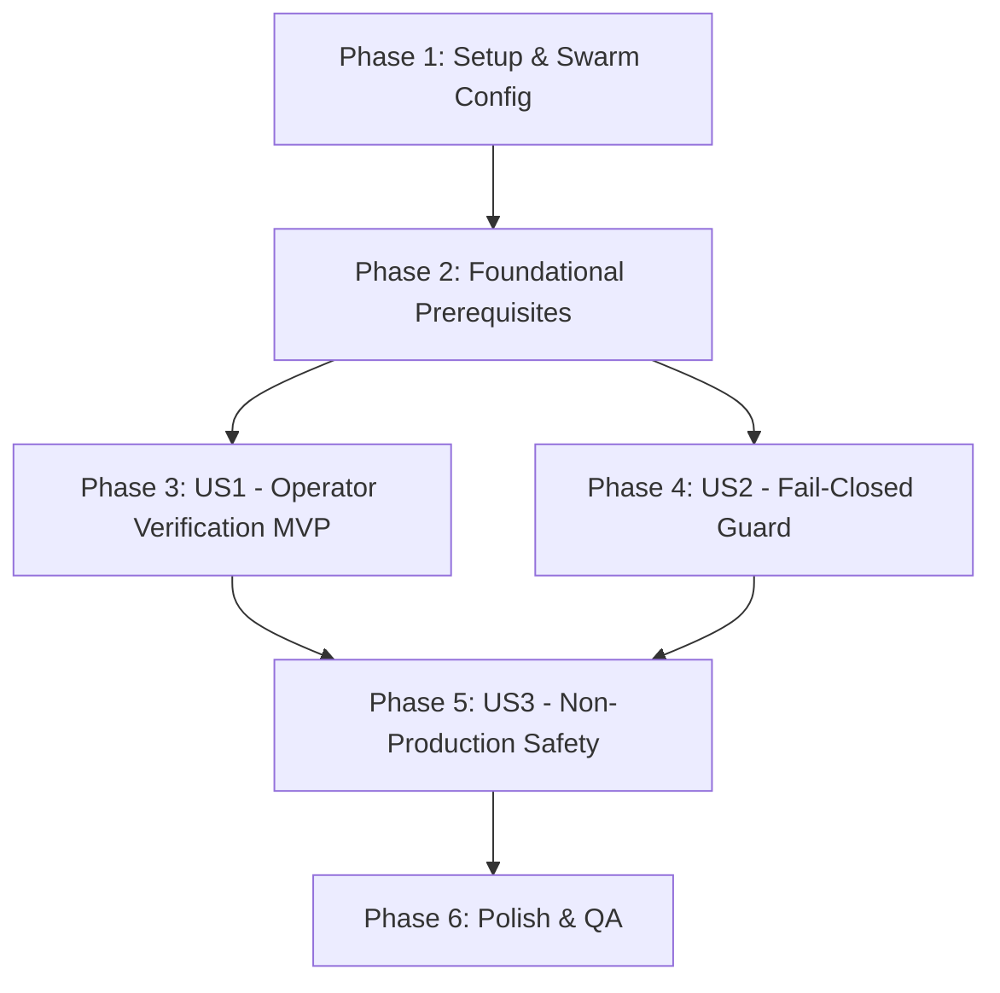

# Tasks: Scout Production Encryption Hardening

**Input**: Design documents from `/specs/044-scout-production-encryption-hardening/` (`spec.md`, `plan.md`, `research.md`, `data-model.md`, `quickstart.md`)  
**Feature Branch**: `044-scout-production-encryption-hardening`  
**Prerequisites**: Phase 1 (`specs/042-scout-core-data-model/`) and Phase 2 (`specs/043-scout-native-tools-pipeline/`) complete

---

## Phase 1: Setup (Deployment Configuration & Environment)

**Purpose**: Update production Swarm stack template with explicit `ActiveRecord::Encryption` key configuration placeholders.

- [x] T001 Add `ACTIVE_RECORD_ENCRYPTION_*` environment placeholders to `rails` service in `docker-compose.production.yaml` per FR-001 (values generated via `bin/rails db:encryption:init`, documented in `quickstart.md` §1)
- [x] T002 Add `ACTIVE_RECORD_ENCRYPTION_*` environment placeholders to `sidekiq` service in `docker-compose.production.yaml` per FR-001

---

## Phase 2: Foundational (Blocking Prerequisites)

**Purpose**: Verify framework encryption initialization and predicate as single source of truth.

**⚠️ CRITICAL**: Foundational verification must be satisfied before user story validation.

- [x] T003 Verify `Chatwoot.encryption_configured?` predicate and `ActiveRecord::Encryption` railtie initialization in `config/application.rb` per FR-007 (expected: the three-env-var conditional at `config/application.rb:~106` gates the same `ACTIVE_RECORD_ENCRYPTION_*` keys the predicate checks — no code change required)

**Checkpoint**: Foundation verified — user story validation can now begin.

---

## Phase 3: User Story 1 - Operator Confirms Production Encryption is Active (Priority: P1) 🎯 MVP

**Goal**: An operator deploying Docker Swarm can confirm that encryption keys are loaded and verify round-trip encryption of sensitive Scout credentials.

**Independent Test**: Execute `Chatwoot.encryption_configured?` and round-trip smoke test via `bin/rails runner` in `quickstart.md` §§3-4; verify `raw != decrypted` and `decrypted == original`.

- [x] T004 [US1] Document and validate operator encryption configuration verification command (`Chatwoot.encryption_configured?`) in `specs/044-scout-production-encryption-hardening/quickstart.md`
- [x] T005 [US1] Document and validate operator Scout credential round-trip verification command in `specs/044-scout-production-encryption-hardening/quickstart.md`

**Checkpoint**: At this point, User Story 1 operator verification is complete and testable independently.

---

## Phase 4: User Story 2 - System Refuses to Store Secrets in Plaintext When Missing (Priority: P1)

**Goal**: Guarantee that `Scout` (`api_key_override`) and `ScoutTool` (`auth_headers`) fail closed on save when encryption keys are missing in production.

**Independent Test**: Run automated fail-closed specs in `custom/spec/models/scout_spec.rb` and `custom/spec/models/scout_tool_spec.rb` asserting `ActiveRecord::Encryption::Errors::Configuration` on missing keys.

- [x] T006 [P] [US2] Verify `Scout` model fail-closed encryption specification in `custom/spec/models/scout_spec.rb`
- [x] T007 [P] [US2] Verify `ScoutTool` model fail-closed encryption specification in `custom/spec/models/scout_tool_spec.rb`

**Checkpoint**: User Stories 1 and 2 safety guarantees are confirmed and verified.

---

## Phase 5: User Story 3 - Non-Production Environments Remain Unaffected (Priority: P2)

**Goal**: Ensure developers and test suites outside production can create `Scout` and `ScoutTool` records without explicit production key configuration.

**Independent Test**: Run standard model specs in `RAILS_ENV=test` and confirm records with sensitive fields are created successfully.

- [x] T008 [US3] Verify non-production environment Scout model test execution in `custom/spec/models/scout_spec.rb` and `custom/spec/models/scout_tool_spec.rb`

**Checkpoint**: All 3 user stories verified without breaking non-production developer workflows.

---

## Phase 6: Polish & Cross-Cutting Quality Assurance

**Purpose**: End-to-end runbook verification, lint compliance, and module hook validation.

- [x] T009 Run quickstart operator validation workflow from `specs/044-scout-production-encryption-hardening/quickstart.md`
- [x] T010 Validate module wiring with `bin/sync-custom-module-hooks --check && bin/sync-custom-module-hooks --audit`
- [x] T011 Run RuboCop validation across `custom/` codebase via `bundle exec rubocop custom/`

---

## Dependencies & Execution Order

### Phase Dependencies

### User Story Dependencies

1. **Foundational (Phase 2)**: Blocks all user stories.
2. **User Story 1 (P1 - MVP)**: Can start after Phase 2; validates operator production check.
3. **User Story 2 (P1)**: Can start after Phase 2 in parallel with US1; validates model fail-closed behavior.
4. **User Story 3 (P2)**: Validates non-production environments after US1/US2.
5. **Polish (Phase 6)**: Runs after all user stories are verified.

---

## Parallel Execution Opportunities

- **Phase 1**: `T001` (rails service) and `T002` (sidekiq service) can be written in parallel.
- **Phase 4**: `T006` (`scout_spec.rb`) and `T007` (`scout_tool_spec.rb`) can be verified in parallel.

---

## Implementation Strategy

### MVP Milestone (User Story 1)
1. Complete Phase 1 (`docker-compose.production.yaml` environment entries).
2. Complete Phase 2 (Foundational check).
3. Complete Phase 3 (US1 operator verification runbook).
4. **Validate MVP**: Test operator verification commands against container environment.

### Incremental Delivery (Stories 2 & 3)
1. Verify US2: Fail-closed guard (`scout_spec.rb` and `scout_tool_spec.rb`).
2. Verify US3: Non-production compatibility.
3. Complete Phase 6: Sync hooks check, RuboCop audit, and full quickstart execution.
