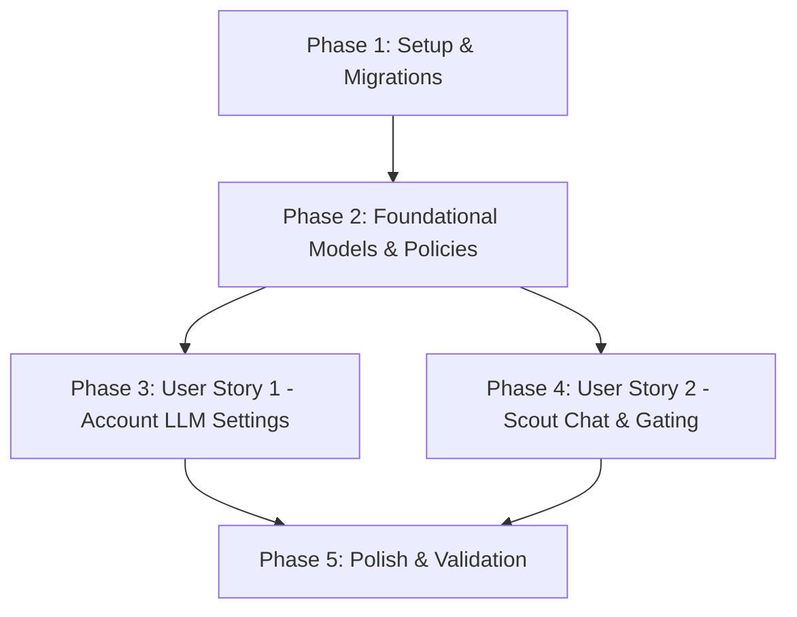

# Tasks: Account-Level LLM Configuration

**Feature**: Account-Level LLM Configuration
**Branch**: `047-account-llm-config`
**Specification**: [spec.md](spec.md) | **Plan**: [plan.md](plan.md) | **Data Model**: [data-model.md](data-model.md) | **Contracts**: [contracts/scout-account-config-api.md](contracts/scout-account-config-api.md)

---

## Phase 1: Setup (Database & Migrations)

**Purpose**: Establish the database schema for account-level LLM configuration and drop obsolete columns.

- [x] T001 Create migration for `ichatr_scout_account_configs` table and remove `provider`, `model_name`, `api_key_override` from `ichatr_scouts` in `db/migrate/21260821000001_create_ichatr_scout_account_configs.rb`
- [x] T002 Run database migrations inside Rails container (`docker compose exec rails bundle exec rails db:migrate`)

---

## Phase 2: Foundational (Blocking Prerequisites)

**Purpose**: Core backend model, policy, and route configuration required by all user stories.

**⚠️ CRITICAL**: No user story frontend or controller work can begin until this phase is complete.

- [x] T003 [P] Implement `ScoutAccountConfig` model with `provider` enum, unconditional `encrypts :api_key`, validations, and `validate_credentials!` in `custom/app/models/scout_account_config.rb`
- [x] T004 [P] Implement `ScoutAccountConfigPolicy` with administrator-only `show?` and `update?` rules in `custom/app/policies/scout_account_config_policy.rb`
- [x] T005 Register singular `resource :scout_account_config, only: [:show, :update]` in `config/routes.rb`

**Checkpoint**: Core data model and authorization policy ready.

---

## Phase 3: User Story 1 - Configure Account LLM Provider (Priority: P1) 🎯 MVP

**Goal**: Administrators can configure and save the account-level LLM provider (Gemini, OpenAI, Anthropic), model name, and API key from a dedicated Scout settings page, with automatic connection validation on save.

**Independent Test**: Log in as an administrator, navigate to **Scout > Configurações**, fill in provider, model, and API key, click save, and verify successful persistence and key validation.

### Implementation for User Story 1

- [x] T006 [US1] Create `Api::V1::Accounts::ScoutAccountConfigsController` with `show` and `update` actions (including auto-verification on save) in `custom/app/controllers/api/v1/accounts/scout_account_configs_controller.rb`
- [x] T007 [P] [US1] Add `getAccountConfig()` and `updateAccountConfig(data)` API methods in `app/javascript/dashboard/api/scout.js`
- [x] T008 [P] [US1] Create `ScoutSettings.vue` settings form page with provider `Select`, model `Input`, write-only `api_key` `Input`, and save feedback in `app/javascript/dashboard/routes/dashboard/scout/pages/ScoutSettings.vue`
- [x] T009 [US1] Add `scout_settings` route definition with `permissions: ['administrator']` and `featureFlag: FEATURE_FLAGS.SCOUT` in `app/javascript/dashboard/routes/dashboard/scout/scout.routes.js`
- [x] T010 [US1] Update `Sidebar.vue` to make the top-level **Scout** entry an expandable menu with children **Agentes** (`scouts_index`), **Configurações** (`scout_settings`), and **Ferramentas** (`scout_tools`) in `app/javascript/dashboard/components-next/sidebar/Sidebar.vue`
- [x] T011 [P] [US1] Update English and Portuguese i18n files synchronously with new sidebar and settings keys in `app/javascript/dashboard/i18n/locale/en/scout.json` and `app/javascript/dashboard/i18n/locale/pt_BR/scout.json`
- [x] T012 [US1] Remove obsolete route file `app/javascript/dashboard/routes/dashboard/settings/scout/scout.routes.js` and component `app/javascript/dashboard/routes/dashboard/settings/scout/Index.vue`

**Checkpoint**: User Story 1 is fully functional. Administrators can manage account LLM settings and navigate via the Scout sidebar submenu.

---

## Phase 4: User Story 2 - Create/Edit Scout & Account Gating (Priority: P2)

**Goal**: Scouts inherit the account-level LLM credentials for chat execution, creating/editing a Scout drops per-scout LLM inputs, and unconfigured accounts are gated from Scout creation.

**Independent Test**: Open the create Scout dialog in `ScoutList.vue` and verify absence of provider/model/key fields; verify that attempting to create a Scout on an unconfigured account displays a gating prompt.

### Implementation for User Story 2

- [x] T013 [US2] Refactor `Scout` model (`custom/app/models/scout.rb`) to remove `provider`, `model_name`, `api_key_override` columns/enums/validations and update `#llm_chat` to fetch `ScoutAccountConfig.find_by(account_id: account_id)`
- [x] T014 [US2] Update `ScoutsController` (`custom/app/controllers/api/v1/accounts/scouts_controller.rb`) removing provider/model/key from `scout_params` and gating `#create` if `ScoutAccountConfig` is not configured
- [x] T015 [US2] Update `AgentRunner` (`custom/app/services/custom/scout/agent_runner.rb`) to verify `ScoutAccountConfig` presence in `pre_call_checks_pass?`
- [x] T016 [P] [US2] Update `ScoutList.vue` (`app/javascript/dashboard/routes/dashboard/scout/pages/ScoutList.vue`) removing provider/model/key fields from create dialog, removing header tools button, and adding unconfigured gating empty state
- [x] T017 [P] [US2] Remove obsolete `custom/app/controllers/api/v1/accounts/scouts/provider_settings_controller.rb` and remove `provider_settings?` actions from `custom/app/policies/scout_policy.rb`

**Checkpoint**: User Stories 1 and 2 are fully integrated. Scouts execute chat using account-level LLM configuration, and unconfigured accounts are safely gated.

---

## Phase 5: Polish, Testing & Validation

**Purpose**: Automated test suite updates, code style verification, and quickstart scenario validation.

- [x] T018 [P] Update unit and model specs for `Scout` and `ScoutAccountConfig` in `custom/spec/models/scout_spec.rb` and `custom/spec/models/scout_account_config_spec.rb`
- [x] T019 [P] Add request specs for `ScoutAccountConfigsController` in `custom/spec/controllers/api/v1/accounts/scout_account_configs_controller_spec.rb`
- [x] T020 [P] Run RuboCop auto-fix and verify 0 offenses across backend: `docker compose exec rails bundle exec rubocop`
- [x] T021 [P] Run frontend ESLint and verify 0 errors: `docker compose exec vite pnpm eslint`
- [x] T022 [P] Run frontend test suite: `docker compose exec vite pnpm test`
- [x] T023 Run targeted RSpec test suite: `docker compose exec rails env -u FRONTEND_URL RAILS_ENV=test bundle exec rspec custom/spec/models/scout_spec.rb custom/spec/models/scout_account_config_spec.rb custom/spec/controllers/api/v1/accounts/scout_account_configs_controller_spec.rb`
- [x] T024 Validate all manual scenarios in `specs/047-account-llm-config/quickstart.md`

---

## Dependencies & Execution Order

### Phase Dependencies

### User Story Dependencies

- **User Story 1 (P1 - MVP)**: Depends on Phase 1 & 2. Delivers standalone account configuration screen and API.
- **User Story 2 (P2)**: Depends on Phase 1 & 2. Refactors Scout model and integrates chat execution with `ScoutAccountConfig`.
- **Phase 5 (Polish)**: Runs after User Stories 1 & 2 are complete.

### Parallel Opportunities

- **Phase 2**: T003 (`ScoutAccountConfig`) and T004 (`ScoutAccountConfigPolicy`) can run in parallel.
- **Phase 3 (US1)**: T007 (`api/scout.js`), T008 (`ScoutSettings.vue`), and T011 (`i18n`) can be built in parallel.
- **Phase 4 (US2)**: T016 (`ScoutList.vue`) and T017 (controller cleanup) can run in parallel with backend service updates.
- **Phase 5**: T018, T019, T020, T021 can be executed in parallel.

---

## Implementation Strategy

### MVP Delivery (User Story 1)
1. Execute Phase 1 (migration) & Phase 2 (model/policy).
2. Execute Phase 3 (User Story 1 - Account LLM Config settings page + API).
3. Validate independent operation: administrators can configure and verify API keys at the account level.

### Complete Feature Delivery (User Story 2)
4. Execute Phase 4 (Scout model refactor, `Scout#llm_chat`, gating, dialog cleanup).
5. Execute Phase 5 (specs, RuboCop, ESLint, quickstart validation).
