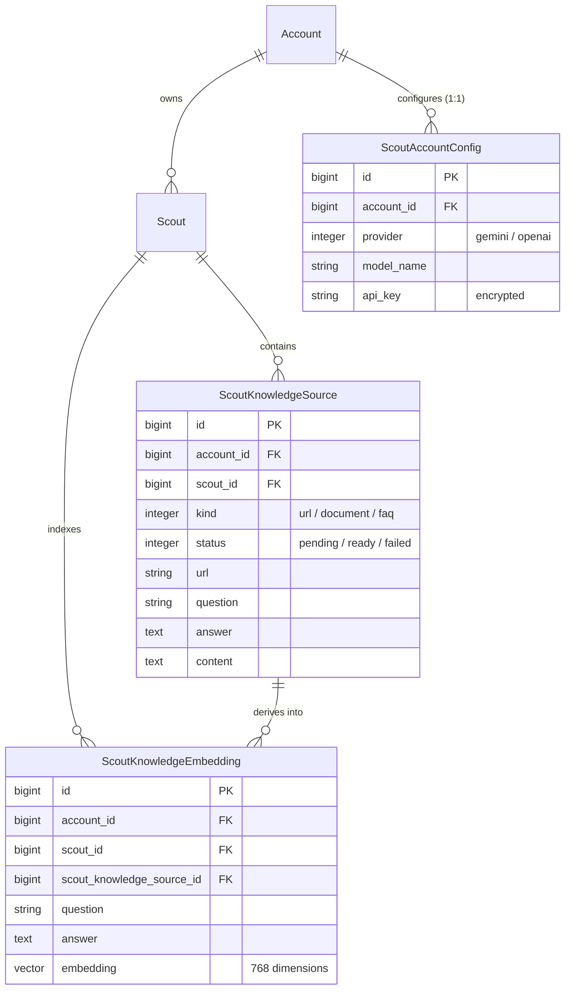

# Data Model: Scout RAG Knowledge Search (Embeddings)

## New Tables & Entities

### `ichatr_scout_knowledge_embeddings`

Represents an individual searchable question-and-answer pair synthesized or extracted from a `ScoutKnowledgeSource`, along with its normalized vector embedding for semantic similarity querying.

#### Schema

| Column | Type | Nullable | Default | Description |
|---|---|---|---|---|
| `id` | `bigint` | No | Auto (PK) | Primary Key |
| `account_id` | `bigint` | No | - | Foreign key referencing `accounts.id` (tenancy, `on_delete: :cascade`) |
| `scout_id` | `bigint` | No | - | Foreign key referencing `ichatr_scouts.id` (`on_delete: :cascade`) |
| `scout_knowledge_source_id` | `bigint` | No | - | Foreign key referencing `ichatr_scout_knowledge_sources.id` (`on_delete: :cascade`) |
| `question` | `string` | No | - | Synthesized or structured question text |
| `answer` | `text` | No | - | Answer snippet / factual explanation |
| `embedding` | `vector(768)` | Yes | `nil` | 768-dimensional normalized embedding vector |
| `created_at` | `datetime` | No | - | Timestamp |
| `updated_at` | `datetime` | No | - | Timestamp |

#### Indexes

- `index_ichatr_scout_knowledge_embeddings_on_account_id` (`account_id`)
- `index_ichatr_scout_knowledge_embeddings_on_scout_id` (`scout_id`)
- `index_ichatr_scout_knowledge_embeddings_on_source_id` (`scout_knowledge_source_id`)
- `idx_scout_knowledge_embeddings_hnsw` (`embedding`) USING `hnsw`, `opclass: :vector_cosine_ops`

#### Model Definition: `ScoutKnowledgeEmbedding` (`custom/app/models/scout_knowledge_embedding.rb`)

```ruby
# frozen_string_literal: true

class ScoutKnowledgeEmbedding < ApplicationRecord
  self.table_name = 'ichatr_scout_knowledge_embeddings'

  belongs_to :account
  belongs_to :scout
  belongs_to :scout_knowledge_source

  has_neighbors :embedding, normalize: true

  validates :question, :answer, presence: true

  before_validation :set_account_and_scout_from_source
  after_commit :enqueue_embed_job, on: :create

  private

  def set_account_and_scout_from_source
    return unless scout_knowledge_source

    self.account_id ||= scout_knowledge_source.account_id
    self.scout_id ||= scout_knowledge_source.scout_id
  end

  def enqueue_embed_job
    Custom::Scout::KnowledgeSources::EmbedEntryJob.perform_later(id)
  end
end
```

---

## Entity Relationship Diagram



---

## Model Modifications

### 1. `ScoutKnowledgeSource` (`custom/app/models/scout_knowledge_source.rb`)
- Adds association: `has_many :scout_knowledge_embeddings, class_name: 'ScoutKnowledgeEmbedding', dependent: :destroy`
- Updates `#reprocess!`:
  ```ruby
  def reprocess!
    scout_knowledge_embeddings.destroy_all
    update!(status: :pending, error_message: nil)
    enqueue_processing_job
  end
  ```

### 2. `Scout` (`custom/app/models/scout.rb`)
- Adds association: `has_many :scout_knowledge_embeddings, class_name: 'ScoutKnowledgeEmbedding', dependent: :destroy`

### 3. `ScoutAccountConfig` (`custom/app/models/scout_account_config.rb`)
- Updates provider enum: `enum provider: { gemini: 0, openai: 1 }` (drops `anthropic`)
