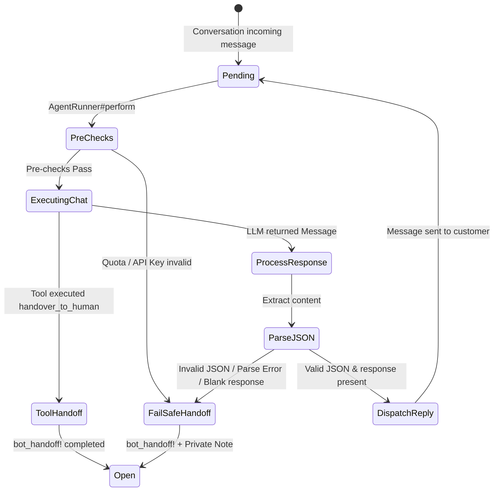

# Data Model: Scout System Prompt Guardrails Architecture

**Feature**: Scout System Prompt Guardrails Architecture (`049-scout-system-prompt-guardrails`)  
**Date**: 2026-08-21  

---

## 1. Overview

This feature operates purely in the application and service layer without introducing new database tables or schema migrations. It standardizes the prompt structure, the in-flight runtime payload between LLM and `AgentRunner`, and the state transition during execution.

---

## 2. In-Memory Entities & Schemas

### 2.1 System Prompt Context Assembly (`Custom::Scout::SystemPromptsService`)

Input parameters for prompt generation:

| Parameter | Type | Required | Description |
| :--- | :--- | :---: | :--- |
| `scout` | `Scout` model instance | Yes | Scout agent definition (provides `name`, `system_prompt`, `product_catalog`, `scout_knowledge_sources`). |
| `contact` | `Contact` model instance | No | Current conversation contact (provides attributes and `to_llm_text`). |
| `inbox` | `Inbox` model instance | No | Conversation inbox (provides `out_of_office?` status). |
| `catalog_instructions` | `String` / `nil` | No | Pre-formatted catalog JSON context if products exist. |
| `knowledge_available` | `Boolean` | No | True if active/ready knowledge sources exist for the agent. |

### 2.2 Structured LLM Response Schema

The model is instructed to return a JSON object with the following schema:

```json
{
  "type": "object",
  "properties": {
    "reasoning": {
      "type": "string",
      "description": "Short internal reasoning explaining how the answer was formulated based only on authorized context."
    },
    "response": {
      "type": "string",
      "description": "The exact customer-facing message to be delivered to the lead."
    }
  },
  "required": ["reasoning", "response"]
}
```

### 2.3 Parsed Response Hash (`AgentRunner#parse_structured_response`)

```ruby
# On successful JSON parse:
{
  response: String # non-blank text
}

# On parse failure or missing/blank response:
nil
```

---

## 3. Conversation & Message Lifecycle / State Transitions


