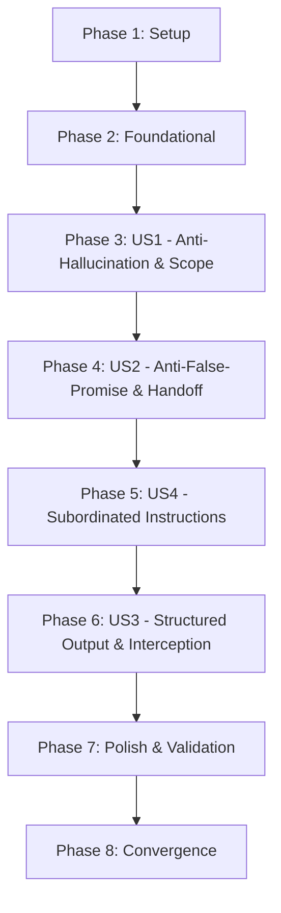

# Tasks: Scout System Prompt Guardrails Architecture

**Feature Branch**: `049-scout-system-prompt-guardrails`  
**Spec**: [`specs/049-scout-system-prompt-guardrails/spec.md`](file:///home/matias/dev/chatwoot/specs/049-scout-system-prompt-guardrails/spec.md)  
**Plan**: [`specs/049-scout-system-prompt-guardrails/plan.md`](file:///home/matias/dev/chatwoot/specs/049-scout-system-prompt-guardrails/plan.md)  

---

## Phase 1: Setup (Shared Infrastructure)

**Purpose**: Verify development test environment and prerequisites for Scout custom services.

- [x] T001 Verify RSpec test suite and Scout service dependencies in `custom/spec/services/custom/scout/agent_runner_spec.rb`

---

## Phase 2: Foundational (Blocking Prerequisites)

**Purpose**: Core class skeleton that all user stories and prompt builder components depend on.

**⚠️ CRITICAL**: Must be completed before user stories start.

- [x] T002 Create service class skeleton and method signatures in `custom/app/services/custom/scout/system_prompts_service.rb`

---

## Phase 3: User Story 1 - Protected Lead Qualification with Anti-Hallucination & Scope Bounding (Priority: P1) 🎯 MVP

**Goal**: Establish unalterable domain boundaries and anti-hallucination rules so the assistant only answers from authorized context (catalog, knowledge base, contact details) and refuses out-of-scope topics.

**Independent Test**: Execute unit tests verifying that `SystemPromptsService.build` outputs the identity header, domain restriction clauses, anti-hallucination directives, and contextual blocks.

### Tests for User Story 1

- [x] T003 [P] [US1] Unit spec for identity, domain scope bounding, and anti-hallucination directives in `custom/spec/services/custom/scout/system_prompts_service_spec.rb`

### Implementation for User Story 1

- [x] T004 [US1] Implement identity, domain boundary, anti-hallucination, catalog, contact, and out-of-office prompt builders in `custom/app/services/custom/scout/system_prompts_service.rb`

**Checkpoint**: User Story 1 prompt template sections are fully functional and verifiable independently.

---

## Phase 4: User Story 2 - Anti-False-Promise & Structured Human Escalation (Priority: P1)

**Goal**: Prevent unfulfillable future commitments (e.g. promising to email later or check after the chat) and instruct fallback to human handoff (`handover_to_human`) when context is insufficient.

**Independent Test**: Verify prompt template output contains explicit anti-false-promise rules and fallback escalation guidance to `handover_to_human`.

### Tests for User Story 2

- [x] T005 [P] [US2] Unit spec for anti-false-promise directives and human escalation fallback in `custom/spec/services/custom/scout/system_prompts_service_spec.rb`

### Implementation for User Story 2

- [x] T006 [US2] Implement anti-false-promise rules and human handover instructions in `custom/app/services/custom/scout/system_prompts_service.rb`

**Checkpoint**: User Stories 1 and 2 guardrails are completely integrated in the prompt builder.

---

## Phase 5: User Story 4 - Subordinated Operator Custom Instructions (Priority: P2)

**Goal**: Safely wrap operator-configured business instructions in `<account_custom_instructions>` tags with explicit subordination so custom text cannot override safety guardrails or response formats.

**Independent Test**: Verify prompt template encloses `Scout#system_prompt` within designated XML tags preceded by subordinate compliance rules, and handles nil/blank prompts gracefully.

### Tests for User Story 4

- [x] T007 [P] [US4] Unit spec for subordinated custom instructions wrapping and blank handling in `custom/spec/services/custom/scout/system_prompts_service_spec.rb`

### Implementation for User Story 4

- [x] T008 [US4] Implement subordinated operator instructions section builder in `custom/app/services/custom/scout/system_prompts_service.rb`

**Checkpoint**: Operator custom instructions are safely isolated and subordinated to guardrails.

---

## Phase 6: User Story 3 - Structured Output Parsing & Fail-Closed Delivery (Priority: P2)

**Goal**: Instruct the model to return structured JSON (`{"reasoning", "response"}`), parse responses with markdown-fence sanitization, log internal reasoning, route output through a single interception point (`process_response`), and trigger fail-closed human handoff on parse errors.

**Independent Test**: Verify through specs that valid JSON replies are parsed and dispatched, fence-wrapped JSON is sanitized, reasoning is logged, and malformed/blank output triggers fail-safe handoff without leaking tokens.

### Tests for User Story 3

- [x] T009 [P] [US3] Unit and integration specs for JSON parsing, markdown-fence stripping, reasoning logging, and fail-closed handoff in `custom/spec/services/custom/scout/agent_runner_spec.rb`

### Implementation for User Story 3

- [x] T010 [US3] Implement JSON response schema instructions in `custom/app/services/custom/scout/system_prompts_service.rb`
- [x] T011 [US3] Refactor `Custom::Scout::AgentRunner#build_system_instructions` to delegate to `Custom::Scout::SystemPromptsService.build` in `custom/app/services/custom/scout/agent_runner.rb`
- [x] T012 [US3] Implement `process_response`, `parse_structured_response`, and updated `dispatch_outgoing_reply` in `custom/app/services/custom/scout/agent_runner.rb`

**Checkpoint**: End-to-end response interception, parsing, and fail-closed handoff fully operational.

---

## Phase 7: Polish & Cross-Cutting Concerns

**Purpose**: Verify code quality, linting standards, and execute complete test suite.

- [x] T013 [P] Execute full custom Scout test suite in `custom/spec/services/custom/scout/`
- [x] T014 Run RuboCop static analysis across all modified files
- [x] T015 Run quickstart validation scenarios defined in `specs/049-scout-system-prompt-guardrails/quickstart.md`

---

## Phase 8: Convergence

- [x] T016 Make `perform_fail_safe_handoff` in `custom/app/services/custom/scout/agent_runner.rb` use its `reason` argument in the private note content instead of always posting the hardcoded quota/API-limit message, so the diagnostic note reflects the actual failure cause at each call site per FR-009 (partial)
- [x] T017 Add a `Rails.logger` call for the failure paths of `parse_structured_response` in `custom/app/services/custom/scout/agent_runner.rb` (blank/missing-key return and `rescue JSON::ParserError`) capturing the unparseable content, per FR-009 / Edge Case "Malformed Structured Output" (missing)

---

## Dependencies & Execution Order

### Phase Dependencies

### Parallel Opportunities

- **T003**, **T005**, **T007**, **T009**: Specs across `system_prompts_service_spec.rb` and `agent_runner_spec.rb` can be designed concurrently.
- **T013**, **T014**: Test execution and RuboCop linting can run in sequence or parallel once implementation is complete.

---

## Implementation Strategy

### Incremental Delivery (MVP First)

1. **Step 1 (Foundation & US1 MVP)**: Implement `SystemPromptsService` core with identity and anti-hallucination bounds (`T001-T004`).
2. **Step 2 (US2 & US4)**: Add anti-false-promise rules, human fallback, and subordinated `<account_custom_instructions>` (`T005-T008`).
3. **Step 3 (US3 Delivery)**: Add JSON instructions, wire `AgentRunner` to `SystemPromptsService`, and implement single interception with fail-closed parsing (`T009-T012`).
4. **Step 4 (Validation)**: Run full test suite, verify RuboCop compliance, and execute quickstart scenarios (`T013-T015`).
5. **Step 5 (Convergence Polish)**: Implement dynamic handoff reason diagnostic note and parser failure warning logs (`T016-T017`).
