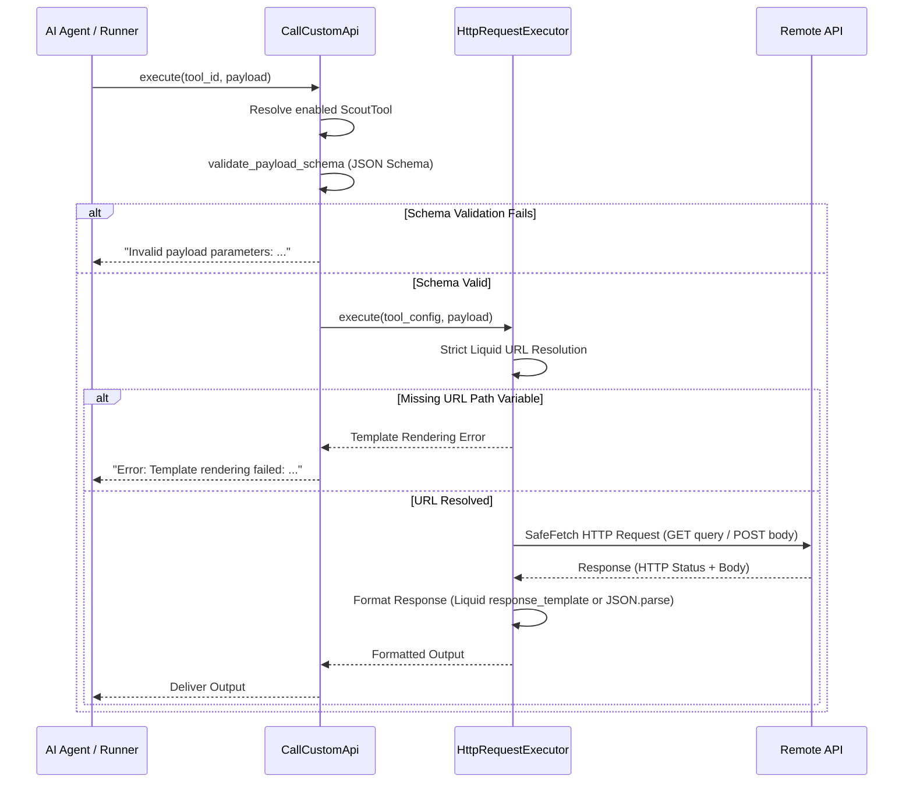
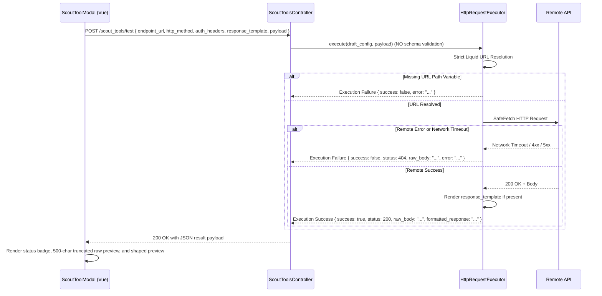

# Data Model: Scout External Tool Testing & Response Shaping

## Entities and Schemas

### 1. ScoutTool (`ScoutTool`, table: `ichatr_scout_tools`)

Persistent model representing an external REST API or webhook tool configured for an account.

| Column | Type | Nullable | Default | Description |
| :--- | :--- | :--- | :--- | :--- |
| `id` | `bigint` | No | Auto | Primary key |
| `account_id` | `bigint` | No | - | Foreign key referencing `accounts.id` (ON DELETE CASCADE) |
| `name` | `string` | No | - | Machine-readable identifier for LLM invocation |
| `description` | `text` | No | - | Plain-text explanation of tool purpose and usage for the agent |
| `endpoint_url` | `text` | No | - | Target URL, optionally containing dynamic Liquid path templates (e.g. `https://api.example.com/orders/{{id}}`) |
| `http_method` | `string` | No | `'POST'` | HTTP verb (`GET`, `POST`, `PUT`, `PATCH`, `DELETE`) |
| `auth_headers` | `text` | Yes | `nil` | Encrypted authentication headers (JSON, YAML, or raw Authorization string) |
| `parameter_schema` | `jsonb` | Yes | `{}` | JSON Schema defining the expected parameter types and required fields for LLM execution |
| `enabled` | `boolean` | No | `true` | Active toggle controlling whether the tool is exposed in the agent catalog |
| `response_template` | `text` | Yes | `nil` | **[NEW]** Liquid template for response shaping and filtering before passing output to LLM |
| `created_at` | `datetime` | No | Auto | Record creation timestamp |
| `updated_at` | `datetime` | No | Auto | Record last updated timestamp |

#### Indexes & Constraints
- Index: `index_ichatr_scout_tools_on_account_id` on `(account_id)`
- Foreign Key: `fk_rails_...` referencing `accounts(id)` ON DELETE CASCADE
- Active Record Encryption: `encrypts :auth_headers`

#### Validations
- `validates :account_id, :name, :description, :endpoint_url, :http_method, presence: true`

---

### 2. ToolTestRequest (Transient Data Structure)

In-memory data representation used by the `POST /api/v1/accounts/:account_id/scout_tools/test` controller action.

| Field | Type | Required | Description |
| :--- | :--- | :--- | :--- |
| `endpoint_url` | `String` | Yes | Candidate URL with optional Liquid placeholders |
| `http_method` | `String` | Yes | HTTP method (`GET`, `POST`, `PUT`, `PATCH`, `DELETE`) |
| `auth_headers` | `String` / `Hash` | No | Candidate authentication headers |
| `response_template` | `String` | No | Candidate Liquid response shaping template |
| `payload` | `Hash` / `String` | No | Candidate sample JSON payload |

---

### 3. ToolExecutionResult (Transient Service Output)

Returned by `Custom::Scout::Tools::HttpRequestExecutor.execute`.

| Attribute | Type | Description |
| :--- | :--- | :--- |
| `success` | `Boolean` | `true` if HTTP status is 2xx and template rendered without error; `false` otherwise |
| `status` | `Integer` / `nil` | Remote HTTP status code (e.g. `200`, `404`, `500`), or `nil` on DNS/network timeout |
| `raw_body` | `String` | Unmodified response body returned by the remote endpoint (truncated to 500 chars in test previews) |
| `formatted_response` | `String` / `Object` / `nil` | Shaped output rendered via `response_template`, or parsed JSON / raw body when template is absent |
| `error` | `String` / `nil` | Error diagnostic if network, HTTP, or template rendering failed |

---

## State Transitions and Execution Flows

### Execution Flow: Live Agent Call (`CallCustomApi`)

### Execution Flow: Modal Test Playground (`ScoutToolsController#test`)

