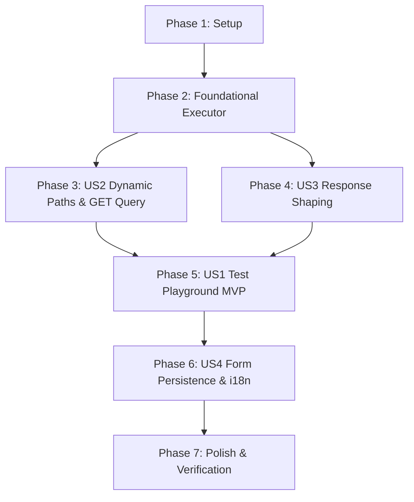

# Tasks: Scout External Tool Testing & Response Shaping

**Feature Branch**: `050-scout-tool-testing-response`  
**Input**: Feature specification from [`specs/050-scout-tool-testing-response/spec.md`](file:///home/matias/dev/chatwoot/specs/050-scout-tool-testing-response/spec.md) and Implementation Plan from [`specs/050-scout-tool-testing-response/plan.md`](file:///home/matias/dev/chatwoot/specs/050-scout-tool-testing-response/plan.md)

---

## Phase 1: Setup (Shared Infrastructure)

**Purpose**: Database migration and routing configuration for external tool testing and response shaping.

- [X] T001 [P] Create database migration in `db/migrate/21260821120000_add_response_template_to_ichatr_scout_tools.rb` to add nullable `response_template` text column to `ichatr_scout_tools`
- [X] T002 [P] Add route `post :test, on: :collection` to `resources :scout_tools` in `config/routes.rb`

---

## Phase 2: Foundational (Shared Executor Core)

**Purpose**: Core execution service skeleton that decouples HTTP dispatch and SafeFetch execution from RubyLLM/conversation context. URL templating, query/body serialization, and response template rendering are implemented incrementally in Phases 3-4 (US2/US3), not here — see those phases for that logic.

**⚠️ CRITICAL**: Must be completed before user story integrations.

- [X] T003 Implement `Custom::Scout::Tools::HttpRequestExecutor` service skeleton in `custom/app/services/custom/scout/tools/http_request_executor.rb` with an `execute(tool_config, payload)` entrypoint, authentication header parsing, and SafeFetch dispatch/error handling — URL templating, query/body serialization, and response template rendering are added by T005/T006/T009, not here
- [X] T004 Refactor `Custom::Scout::Tools::CallCustomApi` in `custom/app/services/custom/scout/tools/call_custom_api.rb` to delegate network execution and response formatting to `Custom::Scout::Tools::HttpRequestExecutor` while preserving JSON schema validation

**Checkpoint**: Foundation ready — shared HTTP executor and tool delegation in place.

---

## Phase 3: User Story 2 - Dynamic URL Path Parameters and Query String Handling (Priority: P1)

**Goal**: Support dynamic Liquid path placeholders (e.g. `{{order_id}}`) in endpoint URLs with strict variable validation, and serialize unconsumed payload parameters into query strings for `GET` requests (with JSON stringification for nested values).

**Independent Test**: Execute `HttpRequestExecutor` and `CallCustomApi` with templated URLs (`/orders/{{order_id}}`) and `GET` payloads containing unconsumed keys; verify path substitution, strict failure on missing variables, and automatic `?key=value` query string construction.

### Implementation for User Story 2

- [X] T005 [US2] Implement strict Liquid path placeholder resolution and consumed key extraction via regex identifier scanning in `custom/app/services/custom/scout/tools/http_request_executor.rb`
- [X] T006 [US2] Implement query string serialization for `GET` requests and JSON body serialization for non-`GET` requests (`POST`/`PUT`/`PATCH`) in `custom/app/services/custom/scout/tools/http_request_executor.rb` (converting scalar values to URL-encoded strings, JSON-stringifying Array and Hash values for query strings, and handling URLs with existing query parameters)
- [X] T007 [US2] Add unit specs in `custom/spec/services/custom/scout/tools/http_request_executor_spec.rb` and update `custom/spec/services/custom/scout/tools/call_custom_api_spec.rb` to verify path substitution, missing placeholder errors, `GET` query serialization, and non-`GET` body serialization

**Checkpoint**: User Story 2 fully functional — dynamic URL paths and `GET` query strings operate reliably under strict evaluation.

---

## Phase 4: User Story 3 - Response Shaping and Filtering for Agent Context (Priority: P2)

**Goal**: Allow operators to configure an optional Liquid `response_template` on tools to extract only necessary fields from verbose external API responses before passing context to LLM agents.

**Independent Test**: Configure a `response_template` (e.g. `"Order {{ r.id }} status: {{ r.status }}"`) and execute a request against a mock API returning verbose JSON; verify the output is transformed to the shaped string, that blank templates return default JSON, and that missing fields raise strict template errors.

### Implementation for User Story 3

- [X] T008 [US3] Update `ScoutTool` model in `custom/app/models/scout_tool.rb` to support the `response_template` attribute and provide response formatting helpers
- [X] T009 [US3] Implement strict Liquid response template rendering with `response` and `r` aliases, handling JSON payloads, empty bodies, and non-JSON responses gracefully in `custom/app/services/custom/scout/tools/http_request_executor.rb`
- [X] T010 [US3] Add unit specs in `custom/spec/models/scout_tool_spec.rb` and `custom/spec/services/custom/scout/tools/http_request_executor_spec.rb` verifying response template rendering, missing field errors, and fallback to raw/parsed JSON when template is blank

**Checkpoint**: User Story 3 fully functional — response shaping reduces payload noise for AI agent context.

---

## Phase 5: User Story 1 - Test External Tool Configurations on Drafts Directly in UI (Priority: P1) 🎯 MVP

**Goal**: Allow operators to test draft tool configurations (URL, method, headers, response template, sample payload) directly from the management modal without persisting to the database or enforcing schema validation.

**Independent Test**: Send test requests to `POST /api/v1/accounts/:account_id/scout_tools/test` with sample payloads; verify the endpoint returns HTTP 200 with truncated raw response body (500 chars max), shaped preview, and clean error diagnostics for timeouts/remote errors.

### Implementation for User Story 1

- [X] T011 [P] [US1] Add `test?` authorization policy rule to `ScoutToolPolicy` in `custom/app/policies/scout_tool_policy.rb`
- [X] T012 [US1] Implement `test` action in `Api::V1::Accounts::ScoutToolsController` in `custom/app/controllers/api/v1/accounts/scout_tools_controller.rb` accepting draft parameters and sample payload, executing `HttpRequestExecutor`, truncating `raw_body` to 500 characters, and returning structured JSON result
- [X] T013 [P] [US1] Add controller request specs for `POST /api/v1/accounts/:account_id/scout_tools/test` in `custom/spec/controllers/api/v1/accounts/scout_tools_controller_spec.rb`
- [X] T014 [P] [US1] Add `testTool(data)` API method to `ScoutAPI` in `app/javascript/dashboard/api/scout.js`
- [X] T015 [US1] Implement interactive Test playground in `ScoutToolModal.vue` (`app/javascript/dashboard/components-next/Scout/pageComponents/ScoutToolModal.vue`) with sample JSON payload editor, "Test" trigger button (`variant="faded" color="slate" icon="i-lucide-play"`), loading state, HTTP status badge, 500-char truncated raw preview, and shaped response preview

**Checkpoint**: User Story 1 fully functional — operators can test draft tools interactively from the web UI.

---

## Phase 6: User Story 4 - Consistent Form Field Persistence & UI Refinement (Priority: P2)

**Goal**: Fix parameter name discrepancies in `ScoutToolModal.vue` (`url` → `endpoint_url`, `headers` → `auth_headers`), add the `response_template` textarea, and ensure all fields persist and prefill accurately across create and edit operations.

**Independent Test**: Create and update a tool with URL, authentication headers, and response template in the UI; refresh the page and verify that all configuration fields load and persist accurately without data loss.

### Implementation for User Story 4

- [X] T016 [US4] Update `tool_params` in `Api::V1::Accounts::ScoutToolsController` in `custom/app/controllers/api/v1/accounts/scout_tools_controller.rb` to permit `:response_template` and ensure JSON serialization includes `:response_template`
- [X] T017 [US4] Update `ScoutToolModal.vue` (`app/javascript/dashboard/components-next/Scout/pageComponents/ScoutToolModal.vue`) to map `endpoint_url`, `auth_headers`, and `response_template` correctly on create, edit, prefill, and save
- [X] T018 [P] [US4] Add synchronous i18n translation keys in `app/javascript/dashboard/i18n/locale/en/scout.json` and `app/javascript/dashboard/i18n/locale/pt_BR/scout.json` for response template inputs, test playground controls, and status banners

**Checkpoint**: User Story 4 fully functional — tool creation and editing fields persist cleanly with complete localization.

---

## Phase 7: Polish & Cross-Cutting Concerns

**Purpose**: Database migrations, linting, test suite execution, and quickstart validation.

- [X] T019 Run database migration via `docker compose exec rails bundle exec rails db:migrate`
- [X] T020 Run backend lint and auto-fix with `docker compose exec rails bundle exec rubocop -a`
- [X] T021 Run frontend lint with `docker compose exec vite pnpm eslint:fix`
- [X] T022 Run complete test suites (`docker compose exec rails env -u FRONTEND_URL RAILS_ENV=test bundle exec rspec custom/spec/` and `docker compose exec vite pnpm test`)

---

## Dependencies & Execution Order

### Phase Dependencies

- **Phase 1 (Setup)**: Migration & routes — can start immediately.
- **Phase 2 (Foundational)**: `HttpRequestExecutor` core — blocks all user stories.
- **Phase 3 (US2 - Dynamic Paths & GET Query)** & **Phase 4 (US3 - Response Shaping)**: Build out URL resolution and response template features on the executor.
- **Phase 5 (US1 - Test Playground)**: Connects test endpoint and UI test runner with the executor.
- **Phase 6 (US4 - Form Persistence)**: Aligns form bindings, controller parameters, and translations.
- **Phase 7 (Polish)**: Migrations, lint checks, and test suite verification.

---

## Parallel Execution Opportunities

- **Setup Phase**: T001 (migration) and T002 (routes) can run in parallel.
- **User Story 1 (Phase 5)**: T011 (policy), T013 (specs), and T014 (frontend API client) can be developed in parallel.
- **User Story 4 (Phase 6)**: T016 (controller params) and T018 (translations) can run in parallel.
- **Polish Phase**: T020 (rubocop) and T021 (eslint) can run in parallel.

---

## Implementation Strategy

### MVP Scope
1. Complete **Phase 1 (Setup)** & **Phase 2 (Foundational)**.
2. Complete **Phase 3 (US2)**, **Phase 4 (US3)**, and **Phase 5 (US1)**. Phase 5's test playground requires both US2 (dynamic URLs/query strings) and US3 (shaped response preview) per its own acceptance criteria (spec.md US1 AC2), matching the `P3 --> P5` and `P4 --> P5` dependency graph above — Phase 4 cannot be deferred past MVP.
3. Validate basic draft tool testing in the UI, including the shaped response preview.

### Full Delivery
1. Add **Phase 6 (US4)** for complete form field persistence and Portuguese/English translations.
2. Execute **Phase 7 (Polish)** for full lint and spec suite verification.
