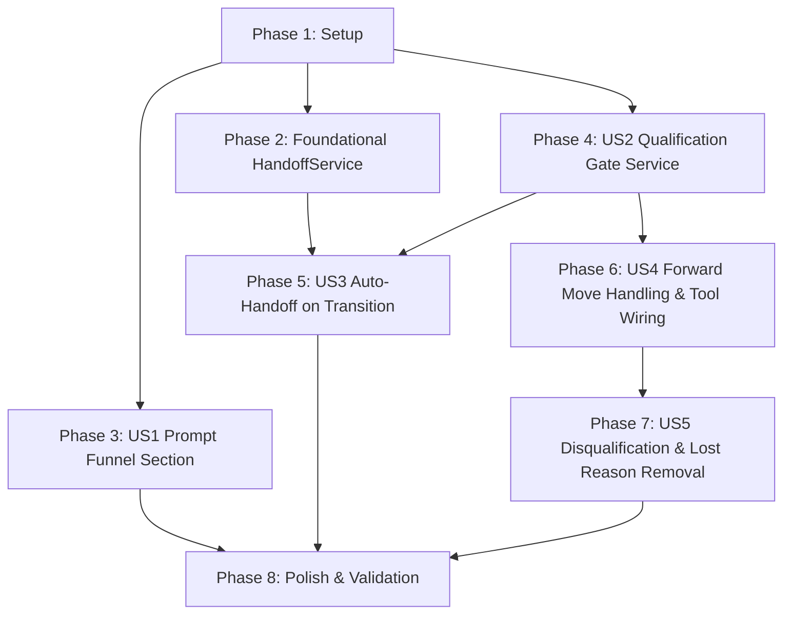

# Tasks: Scout Funnel Stage Qualification Gate

**Input**: Design documents from `/specs/052-scout-qualification-gate/` (`spec.md`, `plan.md`, `data-model.md`, `contracts/scout-tools.md`, `research.md`, `quickstart.md`)

**Prerequisites**: `plan.md`, `spec.md`, `research.md`, `data-model.md`, `contracts/scout-tools.md`

**Organization**: Tasks are grouped by user story to enable independent implementation and testing of each story.

## Format: `- [ ] [ID] [P?] [Story?] Description with file path`

- **[P]**: Can run in parallel (different files, no dependencies on incomplete tasks)
- **[Story]**: Which user story this task belongs to (`[US1]`, `[US2]`, `[US3]`, `[US4]`, `[US5]`)
- Exact file paths are included in all task descriptions

---

## Phase 1: Setup (Shared Infrastructure)

**Purpose**: Verify development environment and baseline test suite for Scout services

- [x] T001 Verify existing test suite and development environment for Scout services in custom/spec/services/custom/scout/

---

## Phase 2: Foundational (Blocking Prerequisites)

**Purpose**: Extract reusable handoff logic into `Custom::Scout::HandoffService` so it can be called by both `HandoverToHuman` and `OpportunityStageTransitionService`

**⚠️ CRITICAL**: Foundational handoff service abstraction must be complete before User Story 3 and tool delegations begin

- [x] T002 [P] Create HandoffService unit spec in custom/spec/services/custom/scout/handoff_service_spec.rb
- [x] T003 Implement Custom::Scout::HandoffService in custom/app/services/custom/scout/handoff_service.rb
- [x] T004 [P] Update HandoverToHuman tool spec in custom/spec/services/custom/scout/tools/handover_to_human_spec.rb
- [x] T005 Refactor HandoverToHuman tool to delegate to Custom::Scout::HandoffService in custom/app/services/custom/scout/tools/handover_to_human.rb

**Checkpoint**: `Custom::Scout::HandoffService` is extracted, tested, and active in `HandoverToHuman`. User story implementations can proceed.

---

## Phase 3: User Story 1 - Scout Agent Understands the Funnel It's Operating In (Priority: P1) 🎯 MVP

**Goal**: Expose funnel stage catalog (names, roles, purpose descriptions), stage-specific required attributes (display names, types, allowed values, semantic descriptions), and Scout global qualification requirements in the system prompt via `funnel_section`, omitting cleanly when unconfigured.

**Independent Test**: Run `SystemPromptsService` specs and inspect generated system prompt to confirm stages, purpose descriptions, required attribute definitions, and operational guidance are present when configured, and omitted cleanly when unconfigured.

### Tests for User Story 1

- [x] T006 [P] [US1] Add unit tests for funnel_section (stages, descriptions, stage-required attributes, global qualification requirements, empty omission, and the FR-004/FR-005 operational guidance text — auto-handoff-on-qualify and disqualify-is-review-not-loss) in custom/spec/services/custom/scout/system_prompts_service_spec.rb

### Implementation for User Story 1

- [x] T007 [US1] Implement funnel_section, attribute formatting helpers, and the FR-004/FR-005 operational guidance text (instructing the agent that moving to the qualified stage auto-triggers handoff — do not call handover_to_human separately — and that moving to the unqualified stage is a human-review queue to be explained via create_private_note, not a lost-deal reason) in custom/app/services/custom/scout/system_prompts_service.rb

**Checkpoint**: At this point, User Story 1 is fully functional and testable independently. Scout prompt carries complete funnel knowledge.

---

## Phase 4: User Story 2 - Qualification Cannot Happen Without Required Data (Priority: P1)

**Goal**: Ensure Scout cannot move an opportunity into the qualified stage when global qualification requirements are missing, returning a descriptive message with missing attribute display names.

**Independent Test**: Call `OpportunityStageTransitionService` attempting to move an opportunity into the qualified stage with missing vs satisfied global qualification attributes, verifying rejection with attribute display names and successful save when satisfied.

### Tests for User Story 2

- [x] T008 [P] [US2] Add unit tests for global qualification requirement enforcement and invalid stage rejection in custom/spec/services/custom/scout/opportunity_stage_transition_service_spec.rb

### Implementation for User Story 2

- [x] T009 [US2] Implement Custom::Scout::OpportunityStageTransitionService core (invalid stage_id handling, the FR-006 global-qualification-requirements gate, and its missing-attributes message — distinct from the FR-007 post-save missing-fields message added later in T013) in custom/app/services/custom/scout/opportunity_stage_transition_service.rb

**Checkpoint**: At this point, User Stories 1 and 2 are functional. Opportunities cannot enter the qualified stage without required global qualification attributes.

---

## Phase 5: User Story 3 - Qualified Leads Are Handed Off Automatically (Priority: P2)

**Goal**: Automatically trigger one-time handoff to the designated sales team when an opportunity transitions into the qualified stage, without re-triggering on redundant calls.

**Independent Test**: Move an opportunity to the qualified stage and verify automatic team assignment, `bot_handoff!`, and context preservation occur. Call stage move again targeting the same qualified stage and verify no duplicate handoff runs.

### Tests for User Story 3

- [x] T010 [P] [US3] Add unit tests for automatic one-time handoff on transition to qualified stage and no duplicate handoff on redundant moves in custom/spec/services/custom/scout/opportunity_stage_transition_service_spec.rb

### Implementation for User Story 3

- [x] T011 [US3] Integrate Custom::Scout::HandoffService into Custom::Scout::OpportunityStageTransitionService for qualified stage transition in custom/app/services/custom/scout/opportunity_stage_transition_service.rb

**Checkpoint**: Opportunities reaching the qualified stage are automatically handed off to the sales team exactly once.

---

## Phase 6: User Story 4 - Forward Stage-Move Violations Give the Agent Something to Act On (Priority: P2)

**Goal**: Handle forward stage move validation failures gracefully without raising exceptions, returning descriptive missing attribute messages, and wiring both `move_opportunity_stage` and `manage_opportunity` to use `OpportunityStageTransitionService`.

**Independent Test**: Trigger forward stage moves with unmet stage-specific requirements via both `move_opportunity_stage` and `manage_opportunity(action: 'update')` and confirm neither raises `ActiveRecord::RecordInvalid`, both return descriptive messages, and backward/lateral moves succeed as before.

### Tests for User Story 4

- [x] T012 [P] [US4] Add unit tests for model forward-move validation handling in custom/spec/services/custom/scout/opportunity_stage_transition_service_spec.rb
- [x] T014 [P] [US4] Update tool specs for MoveOpportunityStage to test transition service delegation and graceful error returns in custom/spec/services/custom/scout/tools/move_opportunity_stage_spec.rb
- [x] T016 [P] [US4] Update tool specs for ManageOpportunity to test update stage transitions delegation and atomic saving in custom/spec/services/custom/scout/tools/manage_opportunity_spec.rb

### Implementation for User Story 4

- [x] T013 [US4] Update Custom::Scout::OpportunityStageTransitionService to catch validation failure on save and format missing_required_fields message in custom/app/services/custom/scout/opportunity_stage_transition_service.rb
- [x] T015 [US4] Refactor MoveOpportunityStage tool to delegate stage transitions to Custom::Scout::OpportunityStageTransitionService in custom/app/services/custom/scout/tools/move_opportunity_stage.rb
- [x] T017 [US4] Refactor ManageOpportunity tool update action to delegate stage transitions to Custom::Scout::OpportunityStageTransitionService in custom/app/services/custom/scout/tools/manage_opportunity.rb

**Checkpoint**: Forward stage move failures return actionable messages across both tools without crashing the conversation.

---

## Phase 7: User Story 5 - Unqualified Leads Go to Human Review, Not to a Dead End (Priority: P3)

**Goal**: Treat disqualification as routing to a human review stage without marking the opportunity as won/lost, and remove `lost_reason` parameter from `move_opportunity_stage`.

**Independent Test**: Move an opportunity to the unqualified stage and verify `status` remains `open`, no handoff is triggered, and `lost_reason` is no longer a supported tool parameter.

### Tests for User Story 5

- [x] T018 [P] [US5] Update MoveOpportunityStage specs to verify lost_reason parameter is removed and status remains open on disqualification in custom/spec/services/custom/scout/tools/move_opportunity_stage_spec.rb

### Implementation for User Story 5

- [x] T019 [US5] Remove lost_reason parameter and status modification logic from MoveOpportunityStage tool in custom/app/services/custom/scout/tools/move_opportunity_stage.rb

**Checkpoint**: All user stories (US1 through US5) are fully functional and integrated.

---

## Phase 8: Polish & Cross-Cutting Concerns

**Purpose**: Full test suite validation, lint checks, and manual quickstart verification

- [x] T020 [P] Run full test suite for custom scout services and tools in custom/spec/services/custom/scout/
- [x] T021 [P] Run RuboCop linter and auto-fix across all modified files in custom/app/services/custom/scout/ and custom/spec/services/custom/scout/
- [x] T022 Validate end-to-end manual scenarios against specs/052-scout-qualification-gate/quickstart.md

---

## Dependencies & Execution Order

### Phase Dependencies

- **Setup (Phase 1)**: No dependencies — can start immediately
- **Foundational (Phase 2)**: Depends on Phase 1 — BLOCKS User Story 3 (`HandoffService`) and tool refactoring
- **User Stories (Phases 3 to 7)**:
  - **User Story 1 (P1)**: Depends on Phase 1 — Independent of other stories, can start immediately after Setup
  - **User Story 2 (P1)**: Depends on Phase 1 — Establishes `OpportunityStageTransitionService`
  - **User Story 3 (P2)**: Depends on Phase 2 (`HandoffService`) and Phase 4 (`OpportunityStageTransitionService`)
  - **User Story 4 (P2)**: Depends on Phase 4 (`OpportunityStageTransitionService`)
  - **User Story 5 (P3)**: Depends on Phase 6 (tool refactoring)
- **Polish (Phase 8)**: Depends on all user stories being complete

### User Story Dependencies



### Within Each User Story

- Tests written first, verified to fail before implementation
- Service / core logic before tool integrations
- Story complete and independently testable before progressing to next priority

### Parallel Opportunities

- **Phase 2**: `T002` (spec) and `T004` (spec) can be written in parallel
- **Phase 3**: `T006` (spec) can run in parallel with Foundational work
- **Phase 6**: `T012`, `T014`, and `T016` (specs) can run in parallel
- **Phase 8**: `T020` (RSpec suite) and `T021` (RuboCop) can run in parallel

---

## Parallel Example: User Story 4

```bash
# Launch all test preparations for User Story 4 together:
Task: "Add unit tests for model forward-move validation handling in custom/spec/services/custom/scout/opportunity_stage_transition_service_spec.rb"
Task: "Update tool specs for MoveOpportunityStage to test transition service delegation and graceful error returns in custom/spec/services/custom/scout/tools/move_opportunity_stage_spec.rb"
Task: "Update tool specs for ManageOpportunity to test update stage transitions delegation and atomic saving in custom/spec/services/custom/scout/tools/manage_opportunity_spec.rb"
```

---

## Implementation Strategy

### MVP First (User Story 1 Only)

1. Complete Phase 1: Setup (`T001`)
2. Complete Phase 3: User Story 1 (`T006`, `T007`)
3. **STOP and VALIDATE**: Test prompt funnel section independently (`docker compose exec rails env -u FRONTEND_URL RAILS_ENV=test bundle exec rspec custom/spec/services/custom/scout/system_prompts_service_spec.rb`)
4. Scout now understands account funnel stages and qualification requirements

### Incremental Delivery

1. **Increment 1 (MVP)**: Prompt funnel intelligence (US1) → Scout knows stages & requirements
2. **Increment 2**: Qualification gate service (US2) → Hard block against entering qualified stage without required data
3. **Increment 3**: Automatic handoff (US3 + Foundational) → Seamless transfer to sales team upon qualification
4. **Increment 4**: Non-crashing forward move handling across tools (US4) → Graceful missing attribute feedback
5. **Increment 5**: Disqualification human review & lost_reason removal (US5) → Integrity of deal outcomes preserved
6. **Increment 6**: Full regression test suite and lint audit (Polish)

---

## Notes

- `[P]` tasks = different files, no dependencies
- `[Story]` label maps task to specific user story for traceability
- Each user story is independently completable and testable
- All tasks follow strict format: `- [ ] [TaskID] [P?] [Story?] Description with file path`
