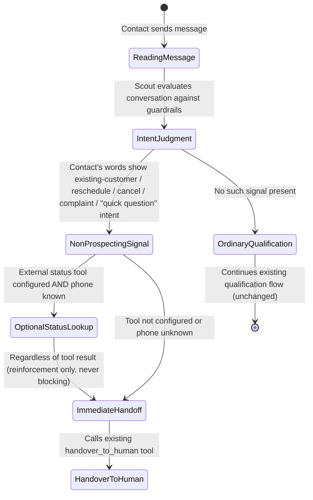

# Data Model: Non-Sales Intent Recognition and Immediate Handoff

**Feature**: Non-Sales Intent Recognition and Immediate Handoff (`063-non-sales-intent-handoff`)
**Date**: 2026-09-10

---

## 1. Overview

This feature introduces no database table, migration, or persisted model. It adds one static text
bullet to an existing in-memory prompt-assembly method
(`Custom::Scout::SystemPromptsService#guardrails_section`). The only "shape" worth documenting is
the guardrail text itself and the runtime decision it drives inside the already-existing Scout
turn lifecycle — both captured below for traceability, not as new schemas.

---

## 2. Guardrail Text Artifact

| Property | Value |
| :--- | :--- |
| Owner | `Custom::Scout::SystemPromptsService#guardrails_section` |
| Insertion point | Immediately after the existing `- Fallback para humano: ...` bullet |
| Content | Static string (no interpolation, no per-account variation) — instructs the model to call `handover_to_human` immediately upon recognizing a clear non-prospecting signal in the contact's own words, and describes the optional, non-blocking reinforcement lookup via any account-configured external status tool |
| Triggers referenced (examples only, not an enum enforced in code) | "already a customer", "treatment in progress", "reschedule", "cancel", "complaint", "just a quick question" (in response to a Scout-initiated triage question) |
| Non-triggers (explicitly excluded from this bullet's intent) | A returning customer expressing new purchase interest — remains ordinary qualification, not covered by this guardrail |

This is prompt guidance, not a parsed/validated schema — the LLM's judgment call, not a code-level
classifier, decides whether a given conversation matches the pattern.

## 3. Optional External Reinforcement Signal

| Property | Value |
| :--- | :--- |
| Mechanism | Existing `Custom::Scout::Tools::CallCustomApi` / operator-configured `ScoutTool` (Fase 04) — no new code |
| Precondition to be consultable | A status-check `ScoutTool` is configured for the account **and** the contact's phone number is already known |
| Effect on handoff decision | Reinforcing only — a positive result strengthens confidence in an already-suggested handoff; absence of the tool, an error, or a non-positive result MUST NOT block or delay the handoff |
| Persisted state | None — the lookup, if it happens, is a single in-turn tool call with no new stored field |

## 4. Turn Decision Flow (existing lifecycle, guardrail's decision point highlighted)

No new states are added to the broader Scout turn/response lifecycle (structured JSON response,
fail-closed parsing, etc., documented in `specs/049-scout-system-prompt-guardrails/data-model.md`)
— this feature only changes which conversations enter the existing `handover_to_human` path, and
how early they do so.
