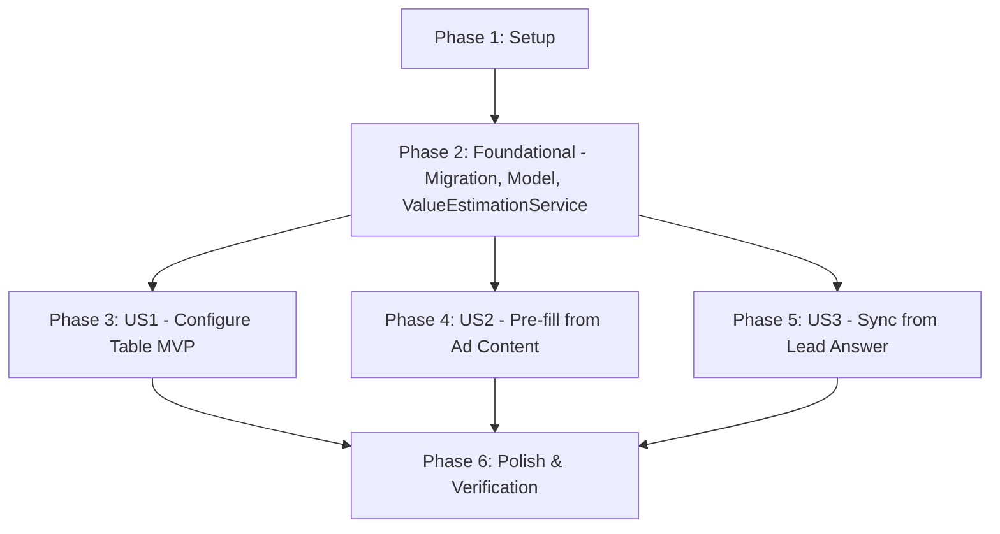

# Tasks: Scout Opportunity Value Estimation

**Input**: Design documents from `/specs/070-scout-opportunity-value-estimation/` (`plan.md`, `spec.md`, `data-model.md`, `research.md`, `contracts/scouts-api.md`, `quickstart.md`)

**Prerequisites**: `plan.md`, `spec.md`, `data-model.md`, `research.md`, `contracts/scouts-api.md`, `quickstart.md`

**Tests**: Backend RSpec automated tests are included as planned in `plan.md` and `quickstart.md`.

**Organization**: Tasks are grouped by user story to enable independent implementation and testing of each story.

## Format: `[ID] [P?] [Story] Description`

- **[P]**: Can run in parallel (different files, no dependencies)
- **[Story]**: Which user story this task belongs to (`[US1]`, `[US2]`, `[US3]`)
- Every task includes exact file paths in its description

---

## Phase 1: Setup (Shared Infrastructure)

**Purpose**: Verify dependencies, schema conventions, and containerized environment

- [X] T001 Verify runtime environment, RubyLLM 1.15.0 / ruby_llm-schema 0.3.0 dependencies, and database connection via `docker compose exec rails bundle exec rails runner "puts ActiveRecord::Base.connection.active?"`

---

## Phase 2: Foundational (Blocking Prerequisites)

**Purpose**: Core database schema, model association/validation, and the deterministic value-lookup
service that BOTH later user stories (US2 and US3) share — kept here, not inside either story's
phase, precisely so each story remains independently buildable and testable after this phase.

**⚠️ CRITICAL**: No user story work can begin until this phase is complete

- [X] T002 Create migration in `db/migrate/21260911140000_add_value_estimation_to_ichatr_scouts.rb` using `ActiveRecord::Migration[7.0]` and the two-statement foreign-key idiom, adding `interest_attribute_definition_id` ("bigint, nullable, FK → custom_attribute_definitions.id, on_delete: :nullify") with index `index_ichatr_scouts_on_interest_attribute_definition_id`, separate `add_foreign_key :ichatr_scouts, :custom_attribute_definitions, column: :interest_attribute_definition_id, on_delete: :nullify`, and `value_by_interest` ("jsonb, NOT NULL DEFAULT '{}', shape { '<interest option string>' => <number> }")
- [X] T003 Execute the database migration in the container environment via `docker compose exec rails bundle exec rails db:migrate`
- [X] T004 In `custom/app/models/scout.rb`, add `belongs_to :interest_attribute_definition, class_name: 'CustomAttributeDefinition', optional: true` and a model validation rejecting an assigned `interest_attribute_definition` whose `attribute_display_type` is not `'list'` (server-side enforcement of spec FR-001's "MUST NOT be selectable" for non-list attributes — the config UI filter alone only prevents this through the dashboard, not through direct API calls)
- [X] T005 Implement deterministic value table lookup service `Custom::Scout::ValueEstimationService` in `custom/app/services/custom/scout/value_estimation_service.rb` with `#sync!(opportunity)` that looks up `scout.value_by_interest[option]` and sets `opportunity.value = mapped_amount`, leaving `opportunity.value` untouched if option is absent or unpriced. Placed here (Foundational), not under a specific user story, because both US2 (auto-classification) and US3 (lead's own answer) call it identically — keeping it here lets either story be implemented and tested without requiring the other.

**Checkpoint**: Foundation ready — database columns, model association/validation, and the shared value-lookup service all exist; user story implementation can now begin, and US2/US3 can proceed fully in parallel from here.

---

## Phase 3: User Story 1 - Configure the interest-to-value table (Priority: P1) 🎯 MVP

**Goal**: Allow an admin to designate an existing list-type qualification attribute as the Scout's "interest" attribute and assign monetary values to its options via API and the Scout Funnel settings tab.

**Independent Test**: Configure a Scout's interest attribute and a value for one or more of its options via API or Rails console, and verify the configuration is saved and readable back without changing any other Scout behavior.

### Tests for User Story 1

- [X] T006 [P] [US1] Add unit spec examples in `custom/spec/models/scout_spec.rb` asserting: `belongs_to :interest_attribute_definition` association; persistence of `value_by_interest` defaulting to `{}`; the model validation rejects assigning an `interest_attribute_definition` whose `attribute_display_type` is not `list` and accepts one that is

### Implementation for User Story 1

- [X] T007 [P] [US1] Update `custom/app/controllers/api/v1/accounts/scouts_controller.rb` to permit `:interest_attribute_definition_id` and `value_by_interest: {}` in `scout_params`, eager load `:interest_attribute_definition` in `index`, and include `interest_attribute_definition: { only: %i[id attribute_key attribute_display_name attribute_display_type attribute_model attribute_values] }` in `include_associations` (the existing `render json: { error: @scout.errors.full_messages.join(', ') }` failure path already surfaces the T004 validation error — no controller-level validation logic needed)
- [X] T008 [P] [US1] Add English i18n keys for interest attribute selection and option value estimation table in `app/javascript/dashboard/i18n/locale/en/scout.json` under `SCOUT.FUNNEL`
- [X] T009 [P] [US1] Add Portuguese (pt-BR) i18n keys for interest attribute selection and option value estimation table in `app/javascript/dashboard/i18n/locale/pt_BR/scout.json` under `SCOUT.FUNNEL`
- [X] T010 [US1] Extend `app/javascript/dashboard/components-next/Scout/pageComponents/ScoutFunnelTab.vue` with interactive single-select chips for the interest attribute (filtered strictly to `attribute_display_type === 'list'` and `attribute_model === 'opportunity_attribute'`, matching the visual pattern of qualification chips), an editable monetary input per option in `attribute_values` to populate `value_by_interest`, and integrate into `handleSave` payload

**Checkpoint**: At this point, User Story 1 is fully functional and independently testable as an MVP. Admins can configure and save interest attributes and their option-value tables.

---

## Phase 4: User Story 2 - Opportunity value pre-filled from ad content before the lead replies (Priority: P2)

**Goal**: Automatically classify incoming paid-ad referral content against the Scout's configured interest options, set the matched interest option on `opportunity.custom_attributes`, and populate `opportunity.value` from the configured value table (via the shared `ValueEstimationService` from Phase 2) at Opportunity creation time.

**Independent Test**: Create an Opportunity from a referral message whose ad content clearly matches a configured interest option, and verify the Opportunity is created with both the interest custom attribute and its mapped monetary value pre-filled before the lead replies. Requires only Phase 2 — no dependency on User Story 3.

### Tests for User Story 2

- [X] T011 [P] [US2] Add unit specs in `custom/spec/services/custom/scout/referral_interest_classifier_service_spec.rb` testing dynamic schema generation, successful option classification, ambiguous ad handling returning `nil`, and silent exception rescue returning `nil`
- [X] T012 [US2] Add spec examples in `custom/spec/services/custom/scout/tools/manage_opportunity_spec.rb` asserting Opportunity creation from a paid referral sets classified interest and mapped `value`, leaves unmapped options with `nil` value (never 0), and skips classification for organic conversations

### Implementation for User Story 2

- [X] T013 [P] [US2] Implement dynamic schema class factory `Custom::Scout::ReferralInterestClassifierSchema.for_options(options)` in `custom/app/services/custom/scout/referral_interest_classifier_schema.rb` creating an anonymous `RubyLLM::Schema` subclass with explicit `name: 'ReferralInterestClassifierSchema'` and `any_of :interest` (string enum of `options` or `null`)
- [X] T014 [US2] Implement ad-content classifier service `Custom::Scout::ReferralInterestClassifierService` in `custom/app/services/custom/scout/referral_interest_classifier_service.rb` with `include Integrations::LlmInstrumentation`, concatenating referral fields (`campaign_headline`, `campaign_body`, `campaign_name`, `campaign_ad_name`, `campaign_adset_name`), calling `llm_chat(temperature: 0.0)` with `ReferralInterestClassifierSchema.for_options(options)`, and rescuing `StandardError` with `ChatwootExceptionTracker` returning `nil`
- [X] T015 [US2] Integrate referral classification and value lookup into `create_opportunity` in `custom/app/services/custom/scout/tools/manage_opportunity.rb` right after `Custom::ReferralAttributionService.process`, setting `opp.custom_attributes[interest_key] = option`, invoking `ValueEstimationService#sync!(opp)`, and persisting before returning

**Checkpoint**: At this point, User Stories 1 AND 2 work independently. Opportunities created from paid ads have their value pre-filled before the lead replies.

---

## Phase 5: User Story 3 - Opportunity value stays in sync with the lead's own answer (Priority: P3)

**Goal**: Automatically update `Opportunity#value` when a lead provides or updates their interest qualification answer during the conversation, looking up the configured value table (via the shared `ValueEstimationService` from Phase 2) and overriding any earlier ad-based guess.

**Independent Test**: Update an existing Opportunity's interest custom attribute via `manage_opportunity(action: 'update')` and verify `Opportunity#value` updates to the mapped amount for the lead's answer, while setting an unmapped option leaves the existing value untouched. Requires only Phase 2 — buildable and testable without doing any User Story 2 work (no ad-content classification involved).

### Tests for User Story 3

- [X] T016 [P] [US3] Add unit specs in `custom/spec/services/custom/scout/value_estimation_service_spec.rb` testing `#sync!` when option is mapped, when option is unmapped (preserves existing value), when interest key is absent, and when Scout has no table configured
- [X] T017 [US3] Add spec examples in `custom/spec/services/custom/scout/tools/manage_opportunity_spec.rb` asserting `update_opportunity` calls `ValueEstimationService#sync!` and updates `Opportunity#value` when the lead's answer changes the interest custom attribute

### Implementation for User Story 3

- [X] T018 [US3] Integrate `Custom::Scout::ValueEstimationService.new(scout: scout).sync!(opp)` into `update_opportunity` in `custom/app/services/custom/scout/tools/manage_opportunity.rb` immediately after `apply_opportunity_fields(opp, params)` and prior to `opp.save!`

**Checkpoint**: All three user stories are functional and independently testable. Values stay synchronized whether originating from ad content or the lead's explicit response.

---

## Phase 6: Polish & Cross-Cutting Concerns

**Purpose**: End-to-end verification, reporting integrity, and linting compliance across modified components

- [X] T019 [P] Verify sales forecasting calculation with populated opportunity values per `quickstart.md` using `docker compose exec rails bundle exec rails runner "puts Reports::SalesForecastCalculator"`
- [X] T020 Run the full test suite for modified modules using `docker compose exec rails env -u FRONTEND_URL RAILS_ENV=test bundle exec rspec custom/spec/models/scout_spec.rb custom/spec/services/custom/scout/referral_interest_classifier_service_spec.rb custom/spec/services/custom/scout/value_estimation_service_spec.rb custom/spec/services/custom/scout/tools/manage_opportunity_spec.rb`
- [X] T021 [P] Run global backend RuboCop check on modified files using `docker compose exec rails bundle exec rubocop custom/app/services/custom/scout custom/app/models/scout.rb custom/app/controllers/api/v1/accounts/scouts_controller.rb db/migrate/*value_estimation*`
- [X] T022 [P] Run frontend ESLint check on touched components using `docker compose exec vite pnpm eslint app/javascript/dashboard/components-next/Scout/pageComponents/ScoutFunnelTab.vue`

---

## Dependencies & Execution Order

### Phase Dependencies

- **Setup (Phase 1)**: No dependencies — can start immediately.
- **Foundational (Phase 2)**: Depends on Phase 1 completion — BLOCKS all user stories. Includes the migration, model association/validation, AND the shared `ValueEstimationService`, since both US2 and US3 call it identically — keeping it here (not inside either story) is what makes US2 and US3 independently buildable.
- **User Stories (Phase 3+)**: All depend on Phase 2 (Foundational) completion, and only on Phase 2.
  - **User Story 1 (Phase 3, P1)**: Can proceed immediately after Foundational. Delivers MVP (configuration of interest attribute and value table).
  - **User Story 2 (Phase 4, P2)**: Depends only on Foundational. Uses the table configured in US1 at runtime, but does not need US1's code to be built first to be implemented/tested (a value table can be seeded directly for testing). Fully independent of US3.
  - **User Story 3 (Phase 5, P3)**: Depends only on Foundational (specifically the `ValueEstimationService` built there). Fully independent of US2 — does not require the ad-content classifier to exist or run.
- **Polish (Phase 6)**: Depends on completion of all desired user stories.

### User Story Dependencies



- **User Story 1 (P1)**: Independent of other stories; requires only Phase 2 database columns and association.
- **User Story 2 (P2)**: Independent of US3; requires only Phase 2, including the shared `ValueEstimationService` (T005). Adds `ReferralInterestClassifierService`/`Schema` (T013/T014) to pre-fill values at creation time.
- **User Story 3 (P3)**: Independent of US2; reuses `ValueEstimationService` (T005) inside `update_opportunity` to keep values synchronized with direct answers — no ad-classification code involved.

### Within Each User Story

- Tests written first, verifying failure prior to implementation.
- Model associations before controllers and UI.
- Services and schemas before tool integration call sites.
- Independent verification before moving to next priority.

### Parallel Opportunities

- **Foundational Phase**: Migration file creation (T002) and model association/validation (T004) can be prepared in parallel before migration execution (T003); `ValueEstimationService` (T005) has no dependency on the migration content and can be written in parallel with T002–T004.
- **User Story 1**: Model spec (T006), Controller params (T007), English i18n (T008), and Portuguese i18n (T009) can all run in parallel. Frontend UI (T010) connects after i18n keys and controller endpoints are ready.
- **User Story 2**: Classifier schema (T013) can be implemented in parallel with the classifier unit spec (T011).
- **User Story 3**: Unit test for ValueEstimationService (T016) can run in parallel with tool update integration (T018).
- **Cross-story**: Once Phase 2 is complete, User Story 2 (Phase 4) and User Story 3 (Phase 5) can be developed fully in parallel by different people — neither reads the other's code.
- **Polish Phase**: Forecast check (T019), RuboCop (T021), and ESLint (T022) can all run in parallel.

---

## Parallel Example: User Story 1

```bash
# Launch independent tasks for User Story 1 in parallel:
Task: "Add unit spec examples in custom/spec/models/scout_spec.rb"
Task: "Update custom/app/controllers/api/v1/accounts/scouts_controller.rb"
Task: "Add English i18n keys in app/javascript/dashboard/i18n/locale/en/scout.json"
Task: "Add Portuguese (pt-BR) i18n keys in app/javascript/dashboard/i18n/locale/pt_BR/scout.json"
```

## Parallel Example: User Story 2 and User Story 3 (cross-story, after Phase 2)

```bash
# Once Phase 2 is complete, an entire story can run in parallel with the other:
Task: "Implement User Story 2 (T011-T015): ad-content classification and value pre-fill"
Task: "Implement User Story 3 (T016-T018): value sync from the lead's own answer"
```

---

## Implementation Strategy

### MVP First (User Story 1 Only)

1. Complete Phase 1: Setup (T001)
2. Complete Phase 2: Foundational (T002–T005)
3. Complete Phase 3: User Story 1 (T006–T010)
4. **STOP and VALIDATE**: Configure an interest attribute and options in the Scout Funnel UI, verify persistence in DB and reload in UI, and confirm assigning a non-list attribute via the API is rejected by the T004 validation.
5. Deployable MVP! Admins can now build and maintain their interest-to-value tables.

### Incremental Delivery

1. **Increment 1 (MVP)**: US1 enables admins to define interest attributes and assign monetary amounts to list options.
2. **Increment 2**: US2 adds automatic ad-content classification on paid referral leads, instantly populating `Opportunity#value` and interest custom attributes before the lead's first message. Independent of US3 — can be built in either order relative to it.
3. **Increment 3**: US3 hooks into `update_opportunity`, ensuring any direct qualification response or correction from the lead immediately synchronizes the deal's value. Independent of US2 — can be built before, after, or in parallel with it.
4. **Increment 4**: Full automated verification, RuboCop, and ESLint sweeps to ensure 100% compliance.

---

## Notes

- `[P]` tasks = different files, no dependencies on incomplete tasks.
- `[Story]` label maps each task directly to `[US1]`, `[US2]`, or `[US3]` for full traceability to `spec.md`. Foundational tasks (T001–T005) carry no `[Story]` label because they are shared prerequisites, not story-specific work.
- Unpriced options in `value_by_interest` are intentionally absent and must NEVER be defaulted to `0` (spec FR-007).
- Ad-content classification failures are caught silently and treated as "not identified" (returning `nil`), never interrupting the conversation or bubbling errors to the user (spec FR-005a).
- `interest_attribute_definition` is validated server-side (T004) to be list-type only — this is the system-of-record enforcement of spec FR-001; the Scout Funnel dropdown filter (T010) is a UX convenience on top of it, not the only guard.
- Editing `scout.value_by_interest` never retroactively recomputes existing Opportunities' values (spec FR-009) — covered by a regression test in T016.
- Adhere strictly to the project rule: NUNCA crie commits ou envie alterações (push) para o remote antes de expressa validação/teste local pelo usuário.
