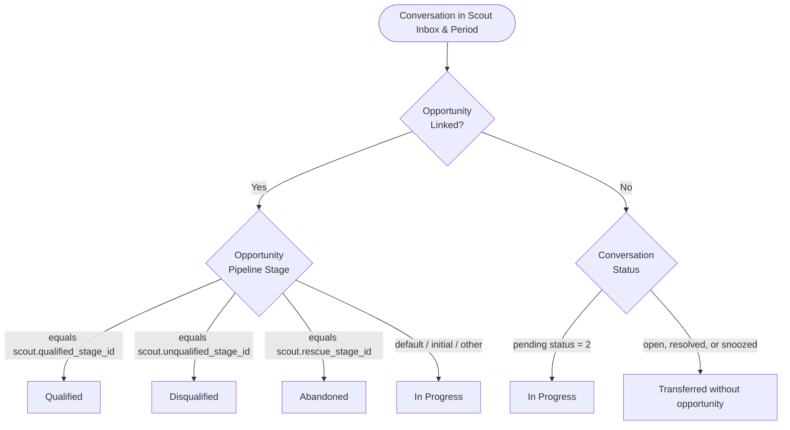

# Data Model: Scout Overview — Recent Conversations List

**Feature**: `073-scout-overview-conversations`  
**Date**: 2026-09-16  
**Status**: Completed  

---

## 1. Existing Storage Schema (Unchanged)

This feature introduces **zero new database tables or schema migrations**. It queries existing tables and relations in PostgreSQL:

```text
+---------------------+           +------------------------+
|    ichatr_scouts    | 1       * |  ichatr_scout_inboxes  |
|---------------------|-----------|------------------------|
| id                  |           | scout_id               |
| account_id          |           | inbox_id (unique)      |
| qualified_stage_id  |           +------------------------+
| unqualified_stage_id|                       |
| rescue_stage_id     |                       | 1
| ...                 |                       v
+---------------------+           +------------------------+
                                  |        inboxes         |
                                  +------------------------+
                                              |
                                              | 1
                                              v
+---------------------+           +------------------------+
|      contacts       | 1       * |     conversations      |
|---------------------|-----------|------------------------|
| id                  |           | id                     |
| name                |           | display_id             |
| identifier          |           | account_id             |
| email               |           | inbox_id               |
| phone_number        |           | contact_id             |
+---------------------+           | status (enum: 0..3)    |
                                  | created_at             |
                                  +------------------------+
                                         |            |
                     1                   |            | 1
        +--------------------------------+            |
        | *                                           | *
+-----------------------------------+       +-----------------------+
| ichatr_opportunity_conversations  |       |       messages        |
|-----------------------------------|       |-----------------------|
| opportunity_id                    |       | id                    |
| conversation_id                   |       | conversation_id       |
+-----------------------------------+       | message_type (0, 1)   |
        | *                                 | created_at            |
        |                                   +-----------------------+
        v 1
+-----------------------------------+
|       ichatr_opportunities        |
|-----------------------------------|
| id                                |
| title                             |
| pipeline_stage_id                 |
| updated_at                        |
+-----------------------------------+
```

---

## 2. Virtual Entity: `ScoutHandledConversation`

This entity is a read-only projection assembled dynamically by `Reports::ScoutOverviewConversationsBuilder` for each item in the paginated response.

### Fields

| Field | Type | Description |
|---|---|---|
| `id` | Integer | Chatwoot internal conversation primary key |
| `display_id` | Integer | Human-readable conversation number |
| `contact` | Object | Summary contact identity |
| `contact.id` | Integer | Contact record ID |
| `contact.name` | String | Contact display name or handle |
| `contact.identifier` | String \| null | External identity identifier |
| `contact.email` | String \| null | Contact email address |
| `contact.phone_number` | String \| null | Contact phone number |
| `contact.thumbnail` | String \| null | Avatar/thumbnail URL |
| `inbox` | Object | Origin inbox information |
| `inbox.id` | Integer | Inbox ID |
| `inbox.name` | String | Inbox display name |
| `inbox.channel_type` | String | E.g. `Channel::Whatsapp`, `Channel::Api` |
| `start_at` | Integer | Unix epoch timestamp of conversation start (`created_at`) |
| `duration_seconds` | Integer \| null | Elapsed seconds between first and last message; `null` if message count <= 1 |
| `messages_count` | Integer | Total count of incoming and outgoing messages |
| `status` | String (Enum) | Funnel disposition: `qualified`, `disqualified`, `abandoned`, `in_progress`, `transferred_without_opportunity` |
| `opportunity` | Object \| null | Associated commercial opportunity if present (`id`, `title`, `stage_id`) |

---

## 3. Funnel Outcome Status Taxonomy

Every handled conversation resolves to **exactly one** of five mutually exclusive statuses:



### Outcome Mapping Rules

| Status Key | Visual Treatment | Trigger Condition |
|---|---|---|
| `qualified` | Positive (Teal/Green) | Conversation is linked to an `Opportunity` whose `pipeline_stage_id == scout.qualified_stage_id`. |
| `disqualified` | Negative (Ruby/Red) | Conversation is linked to an `Opportunity` whose `pipeline_stage_id == scout.unqualified_stage_id`. |
| `abandoned` | Warning (Amber/Yellow) | Conversation is linked to an `Opportunity` whose `pipeline_stage_id == scout.rescue_stage_id`. |
| `in_progress` | Informational (Blue) | Either: (a) Linked opportunity is in an intermediate/default stage; OR (b) No opportunity has been linked yet and the conversation remains actively handled by Scout (`status = pending`). |
| `transferred_without_opportunity` | Neutral (Slate/Gray) | No opportunity was linked to the conversation, and the conversation underwent handoff to a human queue (`status != pending`). |

---

## 4. Query Projection & Aggregation

### 1. Base Scope
```ruby
inbox_ids = scout.inboxes.select(:id)
base_conversations = account.conversations
                           .where(inbox_id: inbox_ids)
                           .where(created_at: resolved_range)
```

### 2. Lateral Join for Latest Opportunity
```sql
LEFT JOIN LATERAL (
  SELECT opp.id, opp.title, opp.pipeline_stage_id
  FROM ichatr_opportunities opp
  JOIN ichatr_opportunity_conversations oc ON oc.opportunity_id = opp.id
  WHERE oc.conversation_id = conversations.id
  ORDER BY opp.updated_at DESC
  LIMIT 1
) latest_opp ON true
```

### 3. Status Classification SQL Expression
```sql
CASE
  WHEN latest_opp.id IS NOT NULL THEN
    CASE
      WHEN latest_opp.pipeline_stage_id = :qualified_stage_id THEN 'qualified'
      WHEN latest_opp.pipeline_stage_id = :unqualified_stage_id THEN 'disqualified'
      WHEN latest_opp.pipeline_stage_id = :rescue_stage_id THEN 'abandoned'
      ELSE 'in_progress'
    END
  ELSE
    CASE
      WHEN conversations.status = 2 THEN 'in_progress'
      ELSE 'transferred_without_opportunity'
    END
END AS outcome_status
```

### 4. Page Message Metrics Query
For the 25 `conversation_id`s on the current page:
```sql
SELECT
  conversation_id,
  COUNT(*) AS msg_count,
  MIN(created_at) AS first_msg_at,
  MAX(created_at) AS last_msg_at
FROM messages
WHERE conversation_id IN (:page_conversation_ids)
  AND message_type IN (0, 1)
GROUP BY conversation_id
```

---

## 5. Validation Rules & Constraints

1. **Scout Ownership**: `scout_id` MUST exist and belong to `Current.account`.
2. **Range Constraint**: `range` MUST be one of `ALLOWED_RANGES`: `7`, `30`, `this_month`, `last_month`.
3. **Status Filter Constraint**: `status` if present MUST be one of `'all'`, `'qualified'`, `'disqualified'`, `'abandoned'`, `'in_progress'`, `'transferred_without_opportunity'`.
4. **Pagination Bounds**: `page` MUST be an integer >= 1; `per_page` defaults to 25 with a maximum limit of 100.
5. **Authorization**: Caller MUST satisfy `ScoutPolicy#show?` (authenticated member: agent or administrator).
